# Evaluación de modelos


El ciclo de vida de un modelo empieza con su propia definición, pasando por la extracción y tratamiento de los datos y la evaluación, tanto antes de ponerlo en producción, como en la monitorización de su calidad predictiva.


<!-- El ciclo de vida de un modelo en el entorno empresarial trae un concepto fundamental: **Gobernanza**. -->

<!-- Gobernanza es el conjunto de procedimientos y herramientas que minimizan errores y facilitan el -->
<!-- control de cada fase del ciclo, y la coexistencia pacífica de diferentes modelos en el ecosistema. -->

La diagnosis o evaluación es la clave para lograr un ecosistema de modelos que impacte en la organización. Hay muchas métricas para evaluar como de bien o de mal funciona un modelo o algoritmo. Para determinar cuáles usar en un problema particular, necesitamos formas sistemáticas de evaluar cómo funcionan los diferentes métodos y comparar uno con otro. La evaluación no es tan simple como podría parecer a primera vista.


<div class="rmdcomment">
La diagnosis de los modelos puede  realizarse desde dos perspectivas: 

  - **Negocio** y 
  - **Estadística**. 

Ambas pueden ser utilizadas para monitorizar la calidad de los modelos en producción. La frecuencia de análisis depende del tipo de modelo.
</div>


 * **Diagnosis de Negocio**: Se refiere a la utilización de métricas que indican si se cumplen las hipótesis sobre las cuales se ha construido el modelo, además de evaluar su calidad predictiva. Ejemplo de estas métricas son: R2, MAPE, AUC, LIFT, etc
 
 * **Diagnosis Estadística**: Se refiere a la discusión del significado de los resultados, teniendo en cuenta el sentido del negocio. Elementos susceptibles de esta interpretación son: parámetros, análisis decom, due-to, etc.


## Diagnosis de Negocio


 * Los **parámetros** de los modelos estadisticos sirven para cuantificar el efecto de las palancas. Su interpretación depende de la propia especificación del modelo. Los principales tipos de parámetros son:  elasticidad, semi-elasticidad, _piecewise_, _yes/no_. Si el output es 0-1, la interpretación de los parámetros depende de la función enlace utilizada (_logit_ o _probit_).

 
 * Análisis de **Descomposición**. Mide el efecto de cada _input_ o _driver_ sobre el _output_ de un periodo

 * Análisis de **due-to**. Compara el efecto de los _inputs_ o _drivers_ en  el _output_ entre dos periodos


## Evaluación en Respuesta Binaria


No todos los problemas son iguales, con lo que no todos los problemas pueden usar las mismas métricas de evaluación. En esta sección veremos las métricas más usuales para los tipos de problemas que nos podemos encontrar. Si nos centramos en modelos supervisados, nos encontramos básicamente dos problemas distintos: clasificación y regresión.


### Clasificación

En los problemas de clasificación tenemos la variable objetivo que son las clases o etiquetas que debemos predecir y una serie de variables que son los predictores. Es decir, usando los predictores obtenemos una etiqueta. Nos podemos encontrar con problemas de clasificación binaria (dos clases) o múltiple (más de dos clases).

Para simplificar nos centraremos en la clasificación binaria, pero lo podemos trasladar a los problemas de clasificación múltiple. 


#### Confusion matrix

La confusion matrix o matriz de confusión muestra el número de predicciones correctas e incorrectas hechas por el modelo de clasificación en comparación con los resultados reales en los datos. La matriz de confusión es una matriz $n \times n$, dónde $n$ es el número de clases. La siguiente tabla muestra una matriz de confusión de $2x2$ para dos clases (positiva y negativa).


* **Accuracy**: la proporción del número total de predicciones correctas.

$$ACC = \frac{TP+TN}{TP+TN+FP+FN}$$

* **Positive Predictive Value or Precision**: la proporción de casos positivos que fueron identificados correctamente.

$$PPV = \frac{TP}{TP+FP}$$

* **Negative Predictive Value**: la proporción de casos negativos que fueron identificados correctamente.

$$ 
NPV = \frac{TN}{TN+FN}
$$ 


* **Sensitivity or Recall**: la proporción de casos positivos reales que están correctamente identificados.

$$TPR = \frac{TP}{TP+FN}$$

* **Specificity**: la proporción de casos negativos reales que están correctamente identificados.

$$TNR = \frac{TN}{TN+FP}$$


#### Log-Loss

La log-loss o pérdida logarítmica entra en los detalles más finos de un clasificador. En particular, si la salida bruta del clasificador es una probabilidad numérica en lugar de una etiqueta de clase de $0$ o $1$, se puede usar la log-loss. La probabilidad se puede entender como un indicador de confianza. Si la etiqueta es $0$ pero el clasificador cree que pertenece a la clase $1$ con probabilidad de $0,51$. Aunque el clasificador estaría cometiendo un error de clasificación, el error se comente por poco, ya que la probabilidad está muy cerca del punto de corte de $0.5$. La log-loss es una medición de precisión que incorpora esta idea de confianza probabilística.

La log-loss para un clasificador binario es

$$LogLoss = - \frac{1}{n} \sum_{i=1}^{n} y_i \log p_i + (1-y_i) \log (1-p_i)$$

donde $n$ es el número de registros, $y_i$ es la etiqueta de la muestra $i$, y $p_i$ es la probabilidad del obtenida en el modelo.


#### Curvas ROC

Para los modelos de clasificación obtenidos a partir de una probabilidad se suelen usar las curvas ROC. Una curva ROC (acrónimo de Receiver Operating Characteristic, o Característica Operativa del Receptor) es una representación gráfica de la sensitivity (TPR) frente a la specificity (TNR) para un sistema clasificador binario según se varía el umbral de discriminación. 

La curva ROC se puede usar para generar estadísticos que resumen el rendimiento (o la efectividad, en su más amplio sentido) del clasificador. A continuación se proporcionan algunos:

 * El punto de inserción de la curva ROC con la línea convexa a la línea de discriminación.
 * El área entre la curva ROC y la línea de convexo-paralela discriminación.
 * El área bajo la curva ROC, llamada comúnmente AUC (area under curve).

El indicador más utilizado en muchos contextos es el área bajo la curva ROC o AUC. Este índice se puede interpretar como la probabilidad de que un clasificador ordenará o puntuará una instancia positiva elegida aleatoriamente más alta que una negativa.

En la figura abajo se muestran tres ejemplos de curvas ROC. La gráfica de la izquierda es la curva de un modelo perfecto, la del medio es la de un caso real con una $AUC = 0.8$ y la de la derecha es la gráfico de un modelo no informativo.


#### Gráficos de ganancia y elevación (Gain and Lift Charts)

La ganancia o la elevación es una medida de la efectividad de un modelo de clasificación calculado como la relación entre los resultados obtenidos con y sin el modelo. Los gráficos de ganancia y elevación son ayudas visuales para evaluar el rendimiento de los modelos de clasificación. Sin embargo, en contraste con la matriz de confusión que evalúa los modelos en toda la población, los gráficos de ganancia o elevación evalúan el modelo en una porción de la población.

Para crear estos gráficos es necesario crear un ranking basado en la creabilidad de la predicción hecha por el modelo.

En la figura  tenemos un ejemplo de como obtener los puntos de las curvas de ganancia y elevación, y sus correspondientes gráficos. 


Igual que las curvas ROC, se busca el mayor AUC en las curvas de ganancia. Mientras que para los gráficos de elevación el modelo perfecto es el que la diferencia entre la línea azul y roja es nula. En otras palabras queremos una AUC mínima del gráfico de elevación.


### Medidas de desigualdad


#### El coeficiente de Gini

El coeficiente de Gini es una medida de la desigualdad ideada por el estadístico italiano Corrado Gini. El coeficiente de Gini es un número entre $0$ y $1$, en donde $0$ se corresponde con la perfecta igualdad y donde el valor $1$ se corresponde con la perfecta desigualdad.

El coeficiente de Gini se calcula como una proporción de las áreas en el diagrama de la curva de Lorenz. De forma resumida, la Curva de Lorenz es una gráfica de concentración acumulada de la distribución superpuesta a la curva de la distribución de frecuencias de los individuos, y su expresión en porcentajes es el índice de Gini. El coeficiente de Gini puede obtener mediante la siguiente fórmula:

$$G = \left| 1-\sum_{k=1}^{n-1} (X_{k+1}-X_k)(Y_{k+1}+Y_k) \right|$$

donde $X$ es la proporción acumulada de la variable población, $Y$ es la proporción acumulada de la variable a estudiar la desigualdad y $n$ es el número de la población.


#### Índice de entropía

El índice de entropía generalizado se ha propuesto como una medida de la desigualdad en una población. Se deriva de la teoría de la información como una medida de redundancia en los datos. En la teoría de la información, una medida de redundancia puede interpretarse como no aleatoriedad o compresión de datos; por lo tanto, esta interpretación también se aplica a este índice.

La fórmula de la entropía general para un valor real $\alpha$ es:

$$GE(\alpha) = \begin{cases}
       \frac{1}{n\alpha (\alpha -1)} \sum_{i=1}^{n} \left(\left( \frac{y_i}{\bar{y}} \right) ^{\alpha} -1\right), &\quad \alpha\neq0,1 ,\\
       \frac{1}{n} \sum_{i=1}^{n} \frac{y_i}{\bar{y}} \ln \frac{y_i}{\bar{y}} &\quad \alpha = 1 ,\\
       -\frac{1}{n} \sum_{i=1}^{n} \ln \frac{y_i}{\bar{y}} &\quad \alpha = 0 .\\
     \end{cases}$$

donde $n$ el número de muestras y $y$ es la medida de desigualdad.


## Evaluación en Respuesta Continúa


### Modelos de Regresión

En los problemas de regresión siempre tenemos una variable numérica dependiente que es la que queremos predecir y el resto son los predictores. Para evaluar los modelos de regresión tenemos varias métricas para evaluar el error cometido en al predicción:


* **RMSE** (root mean squared error) o error cuadrado medio: RMSE es la métrica más popular para medir la tasa de error de un modelo de regresión.

$$RMSE = \sqrt {\frac{\sum_{i=1}^{n} (\hat{y}_i - y_i)^2}{n}}$$

donde $n$ es el número de muestras, $\hat{y}_i$ el valor predicho de la variable objetivo y $y_i$ el valor real de la variable objetivo. 

* **MAE** (mean abosulte error) o error absoluto medio: 

$$MAE = \frac{\sum_{i=1}^{n} | \hat{y}_i - y_i |}{n}$$

donde $n$ es el número de muestras, $\hat{y}_i$ el valor predicho de la variable objetivo y $y_i$ el valor real de la variable objetivo.

* **RSE** (relative squared error) o error relativo cuadrado: 

$$RSE = \sqrt \frac{\sum_{i=1}^{n} (\hat{y}_i - y_i)^2}{\sum_{i=1}^{n} (\bar{y} - y_i)^2}$$

donde $n$ es el número de muestras, $\bar{y}$ es la media de la variable objetivo, $\hat{y}_i$ el valor predicho de la variable objetivo y $y_i$ el valor real de la variable objetivo.

* **RAE** (relative absolute error) o error relativo absoluto: 

$$RAE = \frac{\sum_{i=1}^{n} |\hat{y}_i - y_i|}{\sum_{i=1}^{n} |\bar{y} - y_i|}$$

donde $n$ es el número de muestras, $\bar{y}$ es la media de la variable objetivo, $\hat{y}_i$ el valor predicho de la variable objetivo y $y_i$ el valor real de la variable objetivo.

* **Coeficiente $R^2$**: $R^2$ resume el poder explicativo del modelo de regresión y se calcula a partir de los términos de las sumas de cuadrados. El coeficiente $R^2$ toma valores entre $0$ y $1$, si $R^2=1$ la regresión es perfecta.

$$R^2 = \frac {SSR}{SST} = 1 - \frac{SSE}{SST}, $$

donde $$SST = \sum_{i=1}^{n} (y - \bar{y})^2 ,$$

$$SSR = \sum_{i=1}^{n} (\hat{y} - \bar{\hat{y}})^2 ,$$ 

$$SSE = \sum_{i=1}^{n} (y-\hat{y})^2 .$$


### Modelos de Series temporales

Las series temporales son básicamente un problema de regresión. La diferencia es que hay una variable temporal y el objetivo es predecir el futuro dado un histórico. Por lo tanto, las métricas utilizadas son las mismas que las usadas para los problemas de regresión vistas en la sección anterior.

Otras métricas usadas frecuentemente para la evaluación de series temporales son:

<div class = info>
**MAPE**
</div>

_MAPE_ viene de _Mean Absolute Percentage Error_. Los errores porcentuales tienen la ventaja de ser independientes de la escala y, por lo tanto, se utilizan con frecuencia para comparar el rendimiento del pronóstico entre diferentes conjuntos de datos. MAPE es el más usual.

$$MAPE = \frac{1}{n} \sum_{i=1}^{n} \frac{100·|\hat{y_i}-y_i|}{y_i}$$

<div class = info>
**AIC**
</div>

_AIC_ viene de _Akaike information criterion_. Se define como 

$$AIC = 2k-2\ln (\hat{L})$$

Dado un conjunto de modelos candidatos para los datos, el modelo preferido es el que tiene el valor mínimo en el AIC. Por lo tanto AIC no sólo recompensa la bondad de ajuste, sino también incluye una penalidad, que es una función creciente del número de parámetros estimados.


<div class = info>
**BIC**
</div>

_BIC_**_ viene de _Bayesian Information Criterion_)_. Se define como

$$BIC = \ln (n) k - 2 \ln (\hat{L})$$

donde $\hat{L}$ es máximo de la función de verosimilitud, $n$ es el número de muestras, $k$ es el número de parámetros estimados por el modelo.

La fórmula del BIC es similar a la fórmula del AIC, pero con una penalización distinta que varia según el número de muestras de los datos.


## Evaluación en _Clustering_


El _Clustering_ es una forma de tratar los datos para los que no se conocen o no están definidos los grupos. Por tanto, tenemos que **conceptualizar** los grupos. Este hecho dificultad evaluar la calidad de los clasificación obtenida.


### Silueta

El coeficiente silueta proporciona una representación gráfica del grado de integración de un objeto en su cluster. El coeficiente silueta de un objeto $i$  se define como:

$$s_i=\dfrac{b_i -a_i}{max(b_i -a_i)}$$

donde $a_i$ denota la distancia media entre el objeto $i$  y todos los otros objetos de su cluster y $b_i$ denota la distancia media mínima entre $i$  y los objetos de otros clusters.
Los objetos con un coeficiente de silueta $s_i$ alto están bien integrados en su cluster; aquéllos con un si bajo tienden a estar entre clusters.


## Métodos de re-muestreo 


### Training & testing

Lo primero que debemos hacer para conseguir una buena evaluación es dividir los datos en dos subconjuntos. Uno para entrenar el modelo (training) y otro para evaluar el modelo (testing). El partición entre estos dos subconjuntos suele hacerse de forma aleatoria, aunque según el problema podemos usar otros criterios. Por ejemplo, si los datos que tenemos son una serie temporal, entonces podemos dividirlos a partir de un cierto tiempo. Es decir, coger como test los datos más recientes.

La razón de hacer esta división es usar los datos del subconjunto training para entrenar el modelo y luego evaluar los datos del testing. De esta manera simulamos correctamente una evaluación, ya que no podemos evaluar unos datos si hemos entrenado con ellos. Por lo tanto, los datos de testing no deben ser observados por el algoritmo.


### Cross validation

El procedimiento que se suele usar para evaluar un modelo es cross validation o validación cruzada. La idea básica de cross validation consiste en dividir los datos en $k$ subconjuntos. Cada subconjunto se predice mediante un modelo entrenado con el resto. De esta manera podemos hacer una evaluación sobre todos los datos y evitamos el problema de obtener una muestra sesgada si sólo lo hiciéramos una vez.  


<!-- ============================================ -->


## Práctica en R


<div class="info">
Evaluaremos la calidad predictiva de dos modelos:

 * Cuando la variable respuesta es binaria.
 * Cuando la variable respuesta es contínua.

</div>


### Preparación de los datos


 > Definimos el Entorno de Trabajo 


El primer paso es crear una carpeta con nuestros modelos y resultados dentro de nuestro espacio de trabajo (proyecto).

 - Obtenemos la ruta completa del directorio de trabajo^[Si queremos cambiar la ruta, podemos hacer 'myWd <- setwd("Ruta y Nombre de la carpeta")'.].

```r
myWD <- getwd() 
```

 - Elegimos un nombre para nuestra carpeta con resultados

```r
myWorkingFolderName <- 'ModelResults' 
```

 - Creamos la carpeta donde guardaremos nuestros resultados y ficheros

```r
dir.create( paste0(getwd(),"/",myWorkingFolderName))
```

 
 > Accedemos a los datos originales
 
 - Cargamos la librería `insuranceData` que contiene los datos que utilizaremos^[https://CRAN.R-project.org/package=insuranceData]

```r
if (!require(insuranceData)) install.packages('insuranceData')
library(insuranceData)
```

 - Para ver los contenidos de la librería `insuranceData` ejecutamos:

```r
data(package='insuranceData')
```

 - Vemos que hay 10 datasets. Trabajaremos con el primero: `AutoBi` (_Automobile Bodily Injury Claims_^[https://www.rdocumentation.org/packages/insuranceData/versions/1.0/topics/AutoBi]).
 
 - Cargamos el conjunto de datos seleccionado: **pérdidas en accidentes de coches**

```r
data("AutoBi")
```

- Descripción de las 8 variables del conjunto de datos (_tabla_) 'AutoBi': 
  
  1. `Casenum`. Identificador de la reclamación (esta variable no se utiliza en los modelos)
  1. `Attorney`.  Indica si el reclamante está representado por un **abogado** (1= Sí, 2 = No)
  1. `Clmsex`.  **Sexo** del reclamante (1 = Hombre, 2 = Mujer)
  1. `Marital`.  **Estado Civil** del reclamante (1 = Casado, 2 = Soltero, 3 = Viudo, 4 = divorciado/separado)
  1. `Clminsur`.  Indica si el conductor del vehículo del reclamante estaba o no **asegurado** (1 = Si, 2 = No, 3 = No aplica)
  1. `Seatbelt`.  Si el reclamante llevaba o no un **cinturón** de seguridad en el asiento infantil (1 = Si, 2 = No, 3 = No Aplica)
  1. `Clmage`.  **Edad** del reclamante.
  1. `Loss (*)`.  La **pérdida económica** total del reclamante (en miles). Esta es la variable objetivo o dependiente del conjunto de datos.
  
 - Revisamos el contenido de la tabla y el tipo de datos que contiene

```r
str(AutoBi)
```

```
FALSE 'data.frame':	1340 obs. of  8 variables:
FALSE  $ CASENUM : int  5 13 66 71 96 97 120 136 152 155 ...
FALSE  $ ATTORNEY: int  1 2 2 1 2 1 1 1 2 2 ...
FALSE  $ CLMSEX  : int  1 2 1 1 1 2 1 2 2 1 ...
FALSE  $ MARITAL : int  NA 2 2 1 4 1 2 2 2 2 ...
FALSE  $ CLMINSUR: int  2 1 2 2 2 2 2 2 2 2 ...
FALSE  $ SEATBELT: int  1 1 1 2 1 1 1 1 1 1 ...
FALSE  $ CLMAGE  : int  50 28 5 32 30 35 19 34 61 NA ...
FALSE  $ LOSS    : num  34.94 10.892 0.33 11.037 0.138 ...
```

 - Exploramos el contenido con estadísticos descriptivos básicos

```r
summary(AutoBi)
```

```
FALSE     CASENUM         ATTORNEY         CLMSEX         MARITAL     
FALSE  Min.   :    5   Min.   :1.000   Min.   :1.000   Min.   :1.000  
FALSE  1st Qu.: 8579   1st Qu.:1.000   1st Qu.:1.000   1st Qu.:1.000  
FALSE  Median :17453   Median :1.000   Median :2.000   Median :2.000  
FALSE  Mean   :17213   Mean   :1.489   Mean   :1.559   Mean   :1.593  
FALSE  3rd Qu.:25703   3rd Qu.:2.000   3rd Qu.:2.000   3rd Qu.:2.000  
FALSE  Max.   :34253   Max.   :2.000   Max.   :2.000   Max.   :4.000  
FALSE                                  NA's   :12      NA's   :16     
FALSE     CLMINSUR        SEATBELT         CLMAGE           LOSS         
FALSE  Min.   :1.000   Min.   :1.000   Min.   : 0.00   Min.   :   0.005  
FALSE  1st Qu.:2.000   1st Qu.:1.000   1st Qu.:19.00   1st Qu.:   0.640  
FALSE  Median :2.000   Median :1.000   Median :31.00   Median :   2.331  
FALSE  Mean   :1.908   Mean   :1.017   Mean   :32.53   Mean   :   5.954  
FALSE  3rd Qu.:2.000   3rd Qu.:1.000   3rd Qu.:43.00   3rd Qu.:   3.995  
FALSE  Max.   :2.000   Max.   :2.000   Max.   :95.00   Max.   :1067.697  
FALSE  NA's   :41      NA's   :48      NA's   :189
```

 - Para llamar directamente a las variables por sus nombres en la tabla AutoBi utilizamos el comando `attach`

```r
attach(AutoBi)
```

 > Exploramos la variable objetivo


<div class="info">
 LOSS es la **variable objetivo** una variable altamente asimétrica (con posibles outliers a la derecha o pérdida muy severa)^[A loss is the injury or damage sustained by the insured in consequence of the happening of one or more of the accidents or misfortunes against which the insurer, in consideration of the premium, has undertaken to indemnify the insured.]. 
</div>

 - Analizamos la variable target


```r
summary(LOSS)
```

```
FALSE     Min.  1st Qu.   Median     Mean  3rd Qu.     Max. 
FALSE    0.005    0.640    2.331    5.954    3.995 1067.697
```

 - Analizamos la distribución de la variable target


```r
hist(LOSS, breaks=300 , probability = T)
lines(density(LOSS), col="red",main="Loss distribution")
```

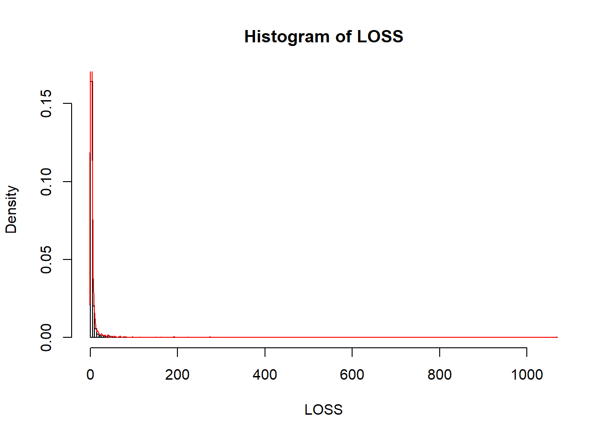

 - Utilizamos una medida _robusta_ (depende de la mediana y del IQR^[The interquartile range of an observation variable is the difference of its upper and lower quartiles. It is a measure of how far apart the middle portion of data spreads in value]) para segmentar los datos en dos clases: 
  * `1` si las pérdidas son atípicamente altas o 
  * `0` si no lo son.

```r
lsup <- median(LOSS) + 1.5*IQR(LOSS) # Criterio basado en estadisticos robustos
sum(LOSS>=lsup) # 153 datos de perdidas atipicamente altas
```

```
FALSE [1] 153
```

 - (Opcional) Guardamos el gráfico del histograma de las **pérdidas no severas**

```r
  Path_to_graphics <- paste0(getwd(),"/","Graphics")
  dir.create(Path_to_graphics)
  png(paste0(Path_to_graphics,"/histograma.png"))
  hist(LOSS[LOSS<lsup], breaks = 100, probability = T, xlab="loss (pérdida en miles US $)", main="Pérdida no severa")
  lines(density(LOSS[LOSS<lsup]),col="red")
  dev.off()
```

```
FALSE png 
FALSE   2
```


 > Creamos el _dataset_ de trabajo.

 - Creamos un dataset o tabla de trabajo eliminando la variable CASENUM (id) y filtrando por la variable LOSS y el valor lsup= 72.22587 (miles).

```r
df_autobi <- AutoBi[ , -match("CASENUM", colnames(AutoBi)) ] 
```

 - Fijamos los predictores categóricos como factores:

   * Representado por un abogado: '1' = representado por letrado y '2' = no representado

```r
  df_autobi$ATTORNEY <- ordered(df_autobi$ATTORNEY, levels = 1:2) 
```

   * Sexo: '1' = hombre y '2' = mujer

```r
  df_autobi$CLMSEX   <- ordered(df_autobi$CLMSEX  , levels = 1:2)
```

   * Estado civil: '1' = casado, '2' = soltero, '3' = viudo y '4' = divorciado / separado


```r
  df_autobi$MARITAL  <- ordered(df_autobi$MARITAL , levels = 1:4)
```

   * Vehículo asegurado:  '1' = vehículo estaba asegurado y '2'= no lo estaba

```r
  df_autobi$CLMINSUR <- ordered(df_autobi$CLMINSUR, levels = 1:2) 
```

   * Cinturón de seguridad: '1' = llevaba cinturón abrochado y '2' = no lo llevaba

```r
  df_autobi$SEATBELT <- ordered(df_autobi$SEATBELT, levels = 1:2)
```

   * Pérdida: '1'= pérdida severa y '2'= pérdida no severa


```r
df_autobi$Y        <- ifelse(df_autobi$LOSS>= lsup,1,0)
```

 - Exploramos el _dataset_ que acabamos de crear y verificamos la proporción de casos con pérdida severa (11.42%)

```r
summary(df_autobi)
```

```
FALSE  ATTORNEY  CLMSEX    MARITAL    CLMINSUR    SEATBELT        CLMAGE     
FALSE  1:685    1   :586   1   :624   1   : 120   1   :1270   Min.   : 0.00  
FALSE  2:655    2   :742   2   :650   2   :1179   2   :  22   1st Qu.:19.00  
FALSE           NA's: 12   3   : 15   NA's:  41   NA's:  48   Median :31.00  
FALSE                      4   : 35                           Mean   :32.53  
FALSE                      NA's: 16                           3rd Qu.:43.00  
FALSE                                                         Max.   :95.00  
FALSE                                                         NA's   :189    
FALSE       LOSS                Y         
FALSE  Min.   :   0.005   Min.   :0.0000  
FALSE  1st Qu.:   0.640   1st Qu.:0.0000  
FALSE  Median :   2.331   Median :0.0000  
FALSE  Mean   :   5.954   Mean   :0.1142  
FALSE  3rd Qu.:   3.995   3rd Qu.:0.0000  
FALSE  Max.   :1067.697   Max.   :1.0000  
FALSE 
```

 - Exploramos la relación de la pérdida con los factores.


```r
agg_loss_attorney <- aggregate(LOSS, by = list(ATTORNEY) , FUN= mean , na.rm=TRUE)
  dimnames(agg_loss_attorney)[[1]] <- c("REPRESENTED","NOT REPRESENTED") ; dimnames(agg_loss_attorney)[[2]] <- c("ATTORNEY","LOSS")
  
  agg_loss_clmsex   <- aggregate(LOSS, by = list(CLMSEX)  , FUN= mean , na.rm=TRUE)
  dimnames(agg_loss_clmsex)[[1]]   <- c("MALE","FEMALE")  ; dimnames(agg_loss_clmsex)[[2]] <- c("CLMSEX","LOSS")
  
  agg_loss_marital  <- aggregate(LOSS, by = list(MARITAL) , FUN= mean , na.rm=TRUE)
  dimnames(agg_loss_marital)[[1]]  <- c("MARRIED","SINGLE","WIDOW","DIVORCED") ; dimnames(agg_loss_marital)[[2]] <- c("MARITAL","LOSS")
  
  agg_loss_clminsur <- aggregate(LOSS, by = list(CLMINSUR) , FUN= mean , na.rm=TRUE)
  dimnames(agg_loss_clminsur)[[1]] <- c("INSURED","NOT INSURED") ; dimnames(agg_loss_clminsur)[[2]] <- c("CLMINSUR","LOSS")
  
  agg_loss_seatbelt <- aggregate(LOSS, by = list(SEATBELT) , FUN= mean , na.rm=TRUE)
  dimnames(agg_loss_seatbelt)[[1]] <- c("SEATBELT","NOT SEATBELT") ; dimnames(agg_loss_seatbelt)[[2]] <- c("SEATBELT","LOSS")
```


 > Creamos los sets _train_ y _test_

 - Aleatorizamos los datos y separamos el set de datos en _train_ y _test_:

```r
N=nrow(df_autobi)
```

- Es recomendable fijar una semilla (seed) para los algoritmos de aleatorización internos de R

```r
if (!require(caret)) install.packages('caret')
library(caret)  
set.seed(123456)
inTrain  <- createDataPartition(df_autobi$Y, times = 1, p = 0.7, list = TRUE)
dt_train <- df_autobi[inTrain[[1]],]  # 938 casos
dt_test  <- df_autobi[-inTrain[[1]],] # 402 casos
  
nrow(dt_train)
```

```
FALSE [1] 938
```

```r
summary(dt_train)
```

```
FALSE  ATTORNEY  CLMSEX    MARITAL    CLMINSUR   SEATBELT       CLMAGE     
FALSE  1:471    1   :406   1   :439   1   : 77   1   :885   Min.   : 0.00  
FALSE  2:467    2   :523   2   :455   2   :833   2   : 17   1st Qu.:20.00  
FALSE           NA's:  9   3   : 10   NA's: 28   NA's: 36   Median :32.00  
FALSE                      4   : 25                         Mean   :33.06  
FALSE                      NA's:  9                         3rd Qu.:43.00  
FALSE                                                       Max.   :95.00  
FALSE                                                       NA's   :134    
FALSE       LOSS                Y         
FALSE  Min.   :  0.0050   Min.   :0.0000  
FALSE  1st Qu.:  0.7123   1st Qu.:0.0000  
FALSE  Median :  2.3645   Median :0.0000  
FALSE  Mean   :  5.4656   Mean   :0.1141  
FALSE  3rd Qu.:  4.0263   3rd Qu.:0.0000  
FALSE  Max.   :273.6040   Max.   :1.0000  
FALSE 
```

```r
nrow(dt_test)
```

```
FALSE [1] 402
```

```r
summary(dt_test)
```

```
FALSE  ATTORNEY  CLMSEX    MARITAL    CLMINSUR   SEATBELT       CLMAGE     
FALSE  1:214    1   :180   1   :185   1   : 43   1   :385   Min.   : 0.00  
FALSE  2:188    2   :219   2   :195   2   :346   2   :  5   1st Qu.:19.00  
FALSE           NA's:  3   3   :  5   NA's: 13   NA's: 12   Median :29.00  
FALSE                      4   : 10                         Mean   :31.31  
FALSE                      NA's:  7                         3rd Qu.:42.00  
FALSE                                                       Max.   :78.00  
FALSE                                                       NA's   :55     
FALSE       LOSS                 Y         
FALSE  Min.   :   0.0050   Min.   :0.0000  
FALSE  1st Qu.:   0.5175   1st Qu.:0.0000  
FALSE  Median :   2.1645   Median :0.0000  
FALSE  Mean   :   7.0917   Mean   :0.1144  
FALSE  3rd Qu.:   3.7782   3rd Qu.:0.0000  
FALSE  Max.   :1067.6970   Max.   :1.0000  
FALSE 
```

Comprobamos si se que los conjuntos train y test se han formado correctamente

```r
  length(intersect(inTrain, setdiff(1:N,inTrain)))
```

```
FALSE [1] 0
```


### Clasificación
 

<div class="info">
Vamos a construir un modelo para identificar los casos con pérdidas severas.
</div>
 
 - El primer ejemplo lo hacemos con _Random Forest_

```r
if (!require(randomForest)) install.packages('randomForest')
library(randomForest)
```

 - Creamos un objeto de clase 'formula' y se lo pasamos como argumento a la función `randomForest`^[https://www.rdocumentation.org/packages/randomForest/versions/4.6-12/topics/randomForest]

```r
set.seed(123456)
fmla.rf1 <- as.formula(paste0("Y"," ~",paste0(colnames(df_autobi[,-c(7,8)]),collapse = "+"),collapse = ""))
rf1 <- randomForest( fmla.rf1,
                       data =dt_train,
                       ntree = 5000, # se ejecuta muy rapido, podemos utilizar ntree > = 2500
                       replace =TRUE,
                       mtry=4,
                       maxnodes =50,
                       importance = TRUE,
                       proximity =   TRUE,
                       keep.forest = TRUE,
                       na.action=na.omit)
```

 -  Exploramos el objeto con los resutados

```r
rf1
```

```
FALSE 
FALSE Call:
FALSE  randomForest(formula = fmla.rf1, data = dt_train, ntree = 5000,      replace = TRUE, mtry = 4, maxnodes = 50, importance = TRUE,      proximity = TRUE, keep.forest = TRUE, na.action = na.omit) 
FALSE                Type of random forest: regression
FALSE                      Number of trees: 5000
FALSE No. of variables tried at each split: 4
FALSE 
FALSE           Mean of squared residuals: 0.1009875
FALSE                     % Var explained: 4.3
```

```r
summary(rf1)
```

```
FALSE                 Length Class  Mode     
FALSE call                11 -none- call     
FALSE type                 1 -none- character
FALSE predicted          759 -none- numeric  
FALSE mse               5000 -none- numeric  
FALSE rsq               5000 -none- numeric  
FALSE oob.times          759 -none- numeric  
FALSE importance          12 -none- numeric  
FALSE importanceSD         6 -none- numeric  
FALSE localImportance      0 -none- NULL     
FALSE proximity       576081 -none- numeric  
FALSE ntree                1 -none- numeric  
FALSE mtry                 1 -none- numeric  
FALSE forest              11 -none- list     
FALSE coefs                0 -none- NULL     
FALSE y                  759 -none- numeric  
FALSE test                 0 -none- NULL     
FALSE inbag                0 -none- NULL     
FALSE terms                3 terms  call     
FALSE na.action          179 omit   numeric
```

```r
str(rf1)
```

```
FALSE List of 19
FALSE  $ call           : language randomForest(formula = fmla.rf1, data = dt_train, ntree = 5000, replace = TRUE,      mtry = 4, maxnodes = 50, imp| __truncated__ ...
FALSE  $ type           : chr "regression"
FALSE  $ predicted      : Named num [1:759] 0.00767 0.000161 0.629748 0.008208 0.022047 ...
FALSE   ..- attr(*, "names")= chr [1:759] "2" "3" "4" "5" ...
FALSE   ..- attr(*, "na.action")= 'omit' Named int [1:179] 1 9 19 25 27 40 43 46 50 51 ...
FALSE   .. ..- attr(*, "names")= chr [1:179] "1" "10" "24" "30" ...
FALSE  $ mse            : num [1:5000] 0.102 0.129 0.121 0.115 0.113 ...
FALSE  $ rsq            : num [1:5000] 0.0302 -0.2272 -0.1473 -0.0907 -0.071 ...
FALSE  $ oob.times      : int [1:759] 1804 1942 1844 1864 1855 1780 1837 1782 1847 1807 ...
FALSE  $ importance     : num [1:6, 1:2] 0.017697 -0.001602 0.004106 0.000933 0.0009 ...
FALSE   ..- attr(*, "dimnames")=List of 2
FALSE   .. ..$ : chr [1:6] "ATTORNEY" "CLMSEX" "MARITAL" "CLMINSUR" ...
FALSE   .. ..$ : chr [1:2] "%IncMSE" "IncNodePurity"
FALSE  $ importanceSD   : Named num [1:6] 1.50e-04 8.42e-05 1.54e-04 8.18e-05 5.65e-05 ...
FALSE   ..- attr(*, "names")= chr [1:6] "ATTORNEY" "CLMSEX" "MARITAL" "CLMINSUR" ...
FALSE  $ localImportance: NULL
FALSE  $ proximity      : num [1:759, 1:759] 1 0.179 0 0.318 0 ...
FALSE   ..- attr(*, "dimnames")=List of 2
FALSE   .. ..$ : chr [1:759] "2" "3" "4" "5" ...
FALSE   .. ..$ : chr [1:759] "2" "3" "4" "5" ...
FALSE  $ ntree          : num 5000
FALSE  $ mtry           : num 4
FALSE  $ forest         :List of 11
FALSE   ..$ ndbigtree    : int [1:5000] 99 99 99 99 99 99 99 99 99 99 ...
FALSE   ..$ nodestatus   : int [1:99, 1:5000] -3 -3 -3 -3 -3 -3 -3 -3 -3 -3 ...
FALSE   ..$ leftDaughter : int [1:99, 1:5000] 2 4 6 8 10 12 14 16 18 20 ...
FALSE   ..$ rightDaughter: int [1:99, 1:5000] 3 5 7 9 11 13 15 17 19 21 ...
FALSE   ..$ nodepred     : num [1:99, 1:5000] 0.1265 0.2198 0.0363 0.0115 0.2832 ...
FALSE   ..$ bestvar      : int [1:99, 1:5000] 1 6 4 6 5 6 6 6 6 3 ...
FALSE   ..$ xbestsplit   : num [1:99, 1:5000] 1.5 20.5 1.5 15.5 1.5 27.5 34.5 0 16.5 3.5 ...
FALSE   ..$ ncat         : Named int [1:6] 1 1 1 1 1 1
FALSE   .. ..- attr(*, "names")= chr [1:6] "ATTORNEY" "CLMSEX" "MARITAL" "CLMINSUR" ...
FALSE   ..$ nrnodes      : int 99
FALSE   ..$ ntree        : num 5000
FALSE   ..$ xlevels      :List of 6
FALSE   .. ..$ ATTORNEY: num 0
FALSE   .. ..$ CLMSEX  : num 0
FALSE   .. ..$ MARITAL : num 0
FALSE   .. ..$ CLMINSUR: num 0
FALSE   .. ..$ SEATBELT: num 0
FALSE   .. ..$ CLMAGE  : num 0
FALSE  $ coefs          : NULL
FALSE  $ y              : Named num [1:759] 1 0 1 0 0 0 0 0 0 1 ...
FALSE   ..- attr(*, "na.action")= 'omit' Named int [1:179] 1 9 19 25 27 40 43 46 50 51 ...
FALSE   .. ..- attr(*, "names")= chr [1:179] "1" "10" "24" "30" ...
FALSE   ..- attr(*, "names")= chr [1:759] "2" "3" "4" "5" ...
FALSE  $ test           : NULL
FALSE  $ inbag          : NULL
FALSE  $ terms          :Classes 'terms', 'formula'  language Y ~ ATTORNEY + CLMSEX + MARITAL + CLMINSUR + SEATBELT + CLMAGE
FALSE   .. ..- attr(*, "variables")= language list(Y, ATTORNEY, CLMSEX, MARITAL, CLMINSUR, SEATBELT, CLMAGE)
FALSE   .. ..- attr(*, "factors")= int [1:7, 1:6] 0 1 0 0 0 0 0 0 0 1 ...
FALSE   .. .. ..- attr(*, "dimnames")=List of 2
FALSE   .. .. .. ..$ : chr [1:7] "Y" "ATTORNEY" "CLMSEX" "MARITAL" ...
FALSE   .. .. .. ..$ : chr [1:6] "ATTORNEY" "CLMSEX" "MARITAL" "CLMINSUR" ...
FALSE   .. ..- attr(*, "term.labels")= chr [1:6] "ATTORNEY" "CLMSEX" "MARITAL" "CLMINSUR" ...
FALSE   .. ..- attr(*, "order")= int [1:6] 1 1 1 1 1 1
FALSE   .. ..- attr(*, "intercept")= num 0
FALSE   .. ..- attr(*, "response")= int 1
FALSE   .. ..- attr(*, ".Environment")=<environment: R_GlobalEnv> 
FALSE   .. ..- attr(*, "predvars")= language list(Y, ATTORNEY, CLMSEX, MARITAL, CLMINSUR, SEATBELT, CLMAGE)
FALSE   .. ..- attr(*, "dataClasses")= Named chr [1:7] "numeric" "ordered" "ordered" "ordered" ...
FALSE   .. .. ..- attr(*, "names")= chr [1:7] "Y" "ATTORNEY" "CLMSEX" "MARITAL" ...
FALSE  $ na.action      : 'omit' Named int [1:179] 1 9 19 25 27 40 43 46 50 51 ...
FALSE   ..- attr(*, "names")= chr [1:179] "1" "10" "24" "30" ...
FALSE  - attr(*, "class")= chr [1:2] "randomForest.formula" "randomForest"
```


 > Gráfico de la importancia relativa de los predictores


```r
  varImpPlot(rf1,sort = T,main = "Variable Importance")
```

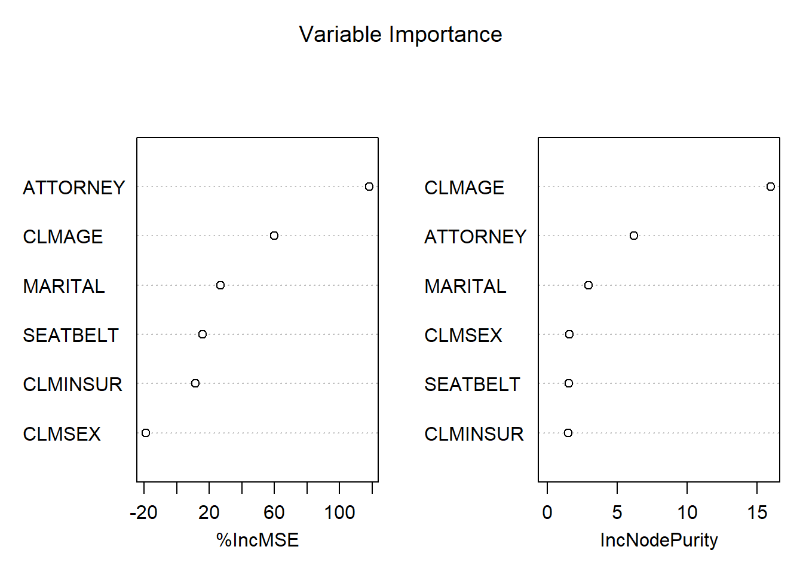

 > Gráfico del Error vs número de árboles


```r
  plot(rf1, main="Error de clasificación vs núero de  árboles") 
```

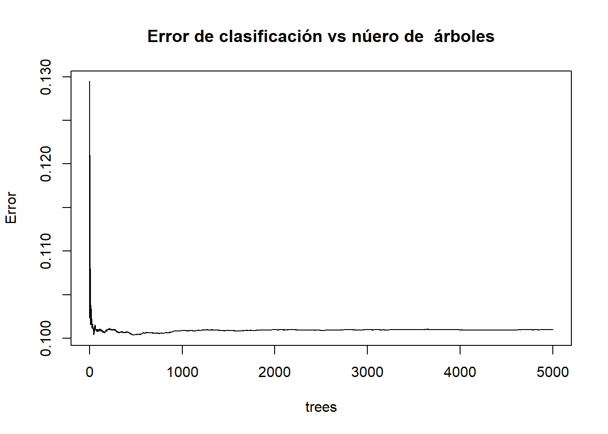

  > Gráfico de la probabilidad condicional: $P(Y=1|X_1 = ATTORNEY,\ldots,X_6=SEATBELT)$


```r
  rf1.prediction <- as.data.frame(predict(rf1, newdata = dt_train))
  summary(rf1.prediction)
```

```
##  predict(rf1, newdata = dt_train)
##  Min.   :0.00005                 
##  1st Qu.:0.00599                 
##  Median :0.03651                 
##  Mean   :0.11984                 
##  3rd Qu.:0.21024                 
##  Max.   :0.77138                 
##  NA's   :179
```

```r
  dt_train$pred_rf1 <- rf1.prediction$`predict(rf1, newdata = dt_train)` 
  head(dt_train,3)
```

```
##   ATTORNEY CLMSEX MARITAL CLMINSUR SEATBELT CLMAGE   LOSS Y     pred_rf1
## 1        1      1    <NA>        2        1     50 34.940 1           NA
## 2        2      2       2        1        1     28 10.892 1 0.3807199932
## 3        2      1       2        2        1      5  0.330 0 0.0001324938
```

```r
  tail(dt_train,3)
```

```
##      ATTORNEY CLMSEX MARITAL CLMINSUR SEATBELT CLMAGE  LOSS Y    pred_rf1
## 1335        2      2       2        2        1     26 0.161 0 0.001142849
## 1338        2      2       1        2        1     39 0.099 0 0.012354460
## 1340        2      2       2        2        1     30 0.688 0 0.002329733
```

```r
  summary(dt_train)
```

```
##  ATTORNEY  CLMSEX    MARITAL    CLMINSUR   SEATBELT       CLMAGE     
##  1:471    1   :406   1   :439   1   : 77   1   :885   Min.   : 0.00  
##  2:467    2   :523   2   :455   2   :833   2   : 17   1st Qu.:20.00  
##           NA's:  9   3   : 10   NA's: 28   NA's: 36   Median :32.00  
##                      4   : 25                         Mean   :33.06  
##                      NA's:  9                         3rd Qu.:43.00  
##                                                       Max.   :95.00  
##                                                       NA's   :134    
##       LOSS                Y             pred_rf1      
##  Min.   :  0.0050   Min.   :0.0000   Min.   :0.00005  
##  1st Qu.:  0.7123   1st Qu.:0.0000   1st Qu.:0.00599  
##  Median :  2.3645   Median :0.0000   Median :0.03651  
##  Mean   :  5.4656   Mean   :0.1141   Mean   :0.11984  
##  3rd Qu.:  4.0263   3rd Qu.:0.0000   3rd Qu.:0.21024  
##  Max.   :273.6040   Max.   :1.0000   Max.   :0.77138  
##                                      NA's   :179
```

```r
  plot(density(dt_train$pred_rf1[!is.na(dt_train$pred_rf1)]), col="red" , xlab="Probabilidad" , main="Función de densidad estimada")
```

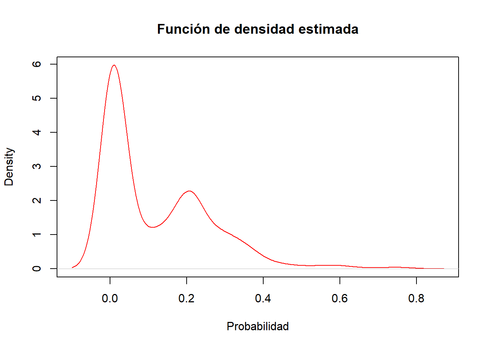

 - Vemos que hay (claramente) dos concentraciones (clases) de probabilidades de pérdida, una concentración en torno a la probabilidad de pérdida no severa ($Y=0$) y otra para la pérdida severa ($Y=1$).

 - Esto no lleva a la elección del **punto de corte óptimo** para obtener una regla de clasificación, es decir, un criterio para $Y_{predicted}=1$ (pérdida severa), o bien, para $Y_{predicted}=0$ (pérdida no severa). Una alternativa es el criterio de la **Distancia de Kolmogorov-Smirnov** (KS).


 > Métricas de evaluación del poder de clasificación


```r
if (!require(ModelMetrics)) install.packages('ModelMetrics')
library(ModelMetrics)
if (!require(ROCR)) install.packages('ROCR')
library(ROCR)
if (!require(binaryLogic)) install.packages('binaryLogic')
library(binaryLogic)
```

 - Con el train creamos un objeto de tipo 'prediction'^[https://www.r-bloggers.com/a-small-introduction-to-the-rocr-package/]


```r
  rf1.pred <- prediction(as.numeric(rf1$predicted),as.numeric(rf1$y)) 
```

 - Calculamos la Curva de ROC con la función 'performance' sobre el objeto 'rf1'

```r
  rf1.perf <- performance(rf1.pred,"tpr","fpr") 
 ## "fpr" = False positive rate. P(Yhat = + | Y = -). Estimated as: FP/N.
 ## "tpr" = True positive rate. P(Yhat = + | Y = +). Estimated as: TP/P.
 plot(rf1.perf)
```

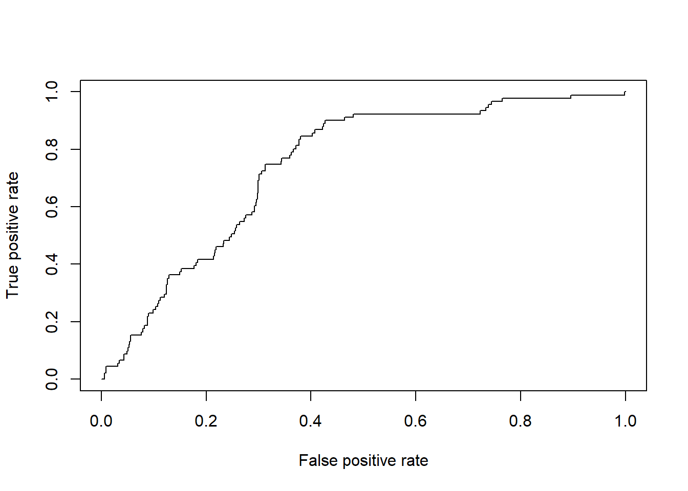


 > Elección del punto de corte: Criterio de la distancia de KS

 - La distancia KS se calcula como: KS = abs(rf1.perf@y.values[[1]]-rf1.perf@x.values[[1]])


```r
rf1.perf@alpha.values[[1]][rf1.perf@alpha.values[[1]]==Inf] <- round(max(rf1.perf@alpha.values[[1]][rf1.perf@alpha.values[[1]]!=Inf]),2)
KS.matrix= cbind(abs(rf1.perf@y.values[[1]]-rf1.perf@x.values[[1]]), rf1.perf@alpha.values[[1]])
```

 - Resumiendo


```r
colnames(KS.matrix) <- c("KS-distance","cut-point")
head(KS.matrix)
```

```
##      KS-distance cut-point
## [1,] 0.000000000 0.7800000
## [2,] 0.001497006 0.7809184
## [3,] 0.002994012 0.7353170
## [4,] 0.004491018 0.6577091
## [5,] 0.005988024 0.6481896
## [6,] 0.005000987 0.6297476
```

```r
ind.ks  <- sort( KS.matrix[,1] , index.return=TRUE )$ix[nrow(KS.matrix)] 
```

 - El punto de corte óptimo de KS:

```r
  rf1.KScutoff <- KS.matrix[ind.ks,2] # := f(rf1.KS1)
  rf1.KScutoff
```

```
##  cut-point 
## 0.06415734
```

```r
# 0.04 - 0.05 
```


> Gráfico de la Curva ROC y su métrica: Área bajo la curva ROC (AUC)


 - Cálculo de AUC mediante la función 'performance'

```r
rf1.auc1 <- performance(rf1.pred,"auc")@y.values[[1]]
rf1.auc1
```

```
FALSE [1] 0.7424327
```

 -Cálculo de la curva ROC junto con la métrica AUC 

```r
#win.graph()
plot( rf1.perf , col='red'  , lwd=2, type="l", xlab="Tasa de falsos positivos" , ylab="Tasa de verdaderos positivos", main="Curva ROC con Random Forest")
abline( 0 , 1  , col="blue" , lwd=2, lty=2)
abline( 0 , 0 , 1 , col="gray40"   , lty=3)
legend( 0.4, 0.15 , c(paste0("AUC (Random Forest)=",round(rf1.auc1,4)),"AUC (clasificacion al azar)=0.50"),lty=c(1,2), lwd=c(2,2) ,col=c("red","blue"), bty="n")
```

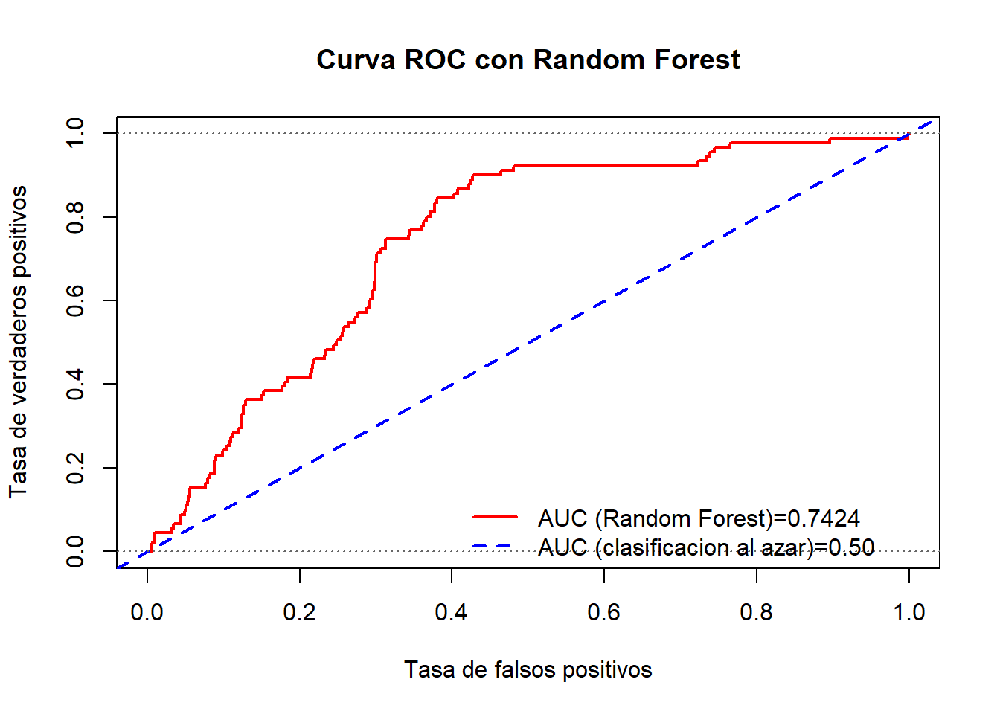

 - Se realizar el mismo gráfico de la curva ROC utilizando la librería `ggplot2`. Para ello guardamos los datos en un `data.frame`

```r
library("ggplot2")
df.perf <- data.frame(x=rf1.perf@x.values[[1]],y=rf1.perf@y.values[[1]])
```

 - Construcción del objeto gráfico con `ggplot2`

```r
#win.graph()
p <- ggplot(df.perf,aes(x=x,y=y)) + geom_path(size=1, colour="red")
p <- p + ggtitle("Curva ROC modelo Random Forest")
p <- p + theme_update(plot.title = element_text(hjust = 0.5))
p <- p + geom_segment(aes(x=0,y=0,xend=1,yend=1),colour="blue",linetype= 2)
p <- p + geom_text(aes(x=0.75 , y=0.3 , label=paste(sep ="","AUC (Random Forest) ) = ",round(rf1.auc1,4) )),colour="black",size=4)
p <- p + geom_text(aes(x=0.75 , y=0.25 , label=paste(sep ="","AUC (Coin toss) = ",round(0.50,4) )),colour="black",size=4)
p <- p + scale_x_continuous(name= "Tasa de falsos positivos")
p <- p + scale_y_continuous(name= "Tasa de verdaderos positivos")
p <- p + theme(
  plot.title   = element_text(size = 2),
  axis.text.x  = element_text(size = 10),
  axis.text.y  = element_text(size = 10),
  axis.title.x = element_text(size = 12,face = "italic"),
  axis.title.y = element_text(size = 12,face = "italic",angle=90),
  legend.title     = element_blank(), 
  panel.background = element_rect(fill = "grey"),
  panel.grid.minor = element_blank(), 
  panel.grid.major = element_line(colour='white'),
  plot.background  = element_blank()
)

p
```

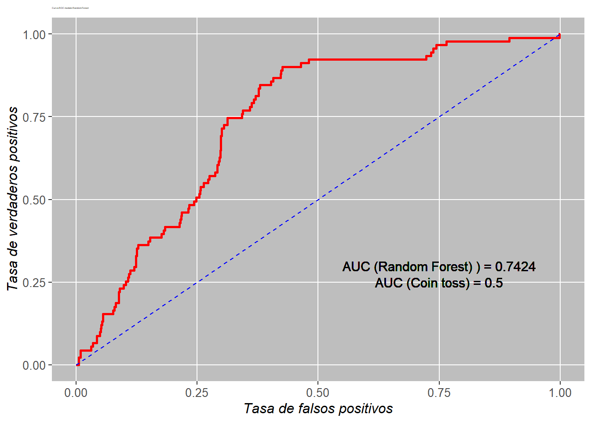

 > Métricas de evaluación del poder predictivo

 - Calculamos la predicción en el _test_ y evaluamos el poder de clasificación del modelo

```r
rf1.pred_test     <- as.data.frame(predict( rf1, newdata = dt_test))
dt_test$pred_rf1  <- rf1.pred_test$`predict(rf1, newdata = dt_test)` 
```


```r
head(dt_test,3)
```

```
##    ATTORNEY CLMSEX MARITAL CLMINSUR SEATBELT CLMAGE   LOSS Y  pred_rf1
## 6         1      2       1        2        1     35  0.309 0 0.2279703
## 12        1      1       1        2        1     42 29.620 1 0.2159590
## 18        1      1       1        2        1     58  0.758 0 0.2047155
```

```r
tail(dt_test,3)
```

```
##      ATTORNEY CLMSEX MARITAL CLMINSUR SEATBELT CLMAGE  LOSS Y    pred_rf1
## 1336        2      1       2        2        1     NA 0.576 0          NA
## 1337        1      2       1        2        1     46 3.705 0 0.349066396
## 1339        1      2       2        1        1     18 3.277 0 0.004032191
```

```r
summary(dt_test)
```

```
##  ATTORNEY  CLMSEX    MARITAL    CLMINSUR   SEATBELT       CLMAGE     
##  1:214    1   :180   1   :185   1   : 43   1   :385   Min.   : 0.00  
##  2:188    2   :219   2   :195   2   :346   2   :  5   1st Qu.:19.00  
##           NA's:  3   3   :  5   NA's: 13   NA's: 12   Median :29.00  
##                      4   : 10                         Mean   :31.31  
##                      NA's:  7                         3rd Qu.:42.00  
##                                                       Max.   :78.00  
##                                                       NA's   :55     
##       LOSS                 Y             pred_rf1      
##  Min.   :   0.0050   Min.   :0.0000   Min.   :0.00005  
##  1st Qu.:   0.5175   1st Qu.:0.0000   1st Qu.:0.00797  
##  Median :   2.1645   Median :0.0000   Median :0.03794  
##  Mean   :   7.0917   Mean   :0.1144   Mean   :0.12531  
##  3rd Qu.:   3.7782   3rd Qu.:0.0000   3rd Qu.:0.21666  
##  Max.   :1067.6970   Max.   :1.0000   Max.   :0.75036  
##                                       NA's   :70
```

 - Con el _test_ creamos un objeto de tipo 'prediction' y calculamos la curva ROC

```r
dt_test.pred  <- prediction(as.numeric(rf1.pred_test$`predict(rf1, newdata = dt_test)`),dt_test$Y) 
dt_test.perf  <- performance(dt_test.pred,"tpr","fpr") 
```

 - Evaluación del poder de clasificación del modelo RF1 vía curva ROC

```r
rf1.test.auc <- performance(dt_test.pred ,"auc")@y.values[[1]]
```

 - Gráfico de la curva ROC para el _test_ 

```r
#win.graph()
plot( dt_test.perf , col='red' , lwd=2, type="l" , main="Curva ROC modelo RF - test",xlab="Tasa de falsos positivos", ylab="Tasa de verdaderos positivos")
abline( 0 , 1  , col="blue" , lwd=2, lty=2)
abline( 0 , 0 , 1 , col="gray40"   , lty=3)
legend( 0.4, 0.2 , c(paste0("AUC (Random Forest)=",round(rf1.test.auc,4)),"AUC (Coin toss)=0.50") ,lty=c(1,2), lwd=c(2,2) ,col=c("red","blue"), bty="n")
```

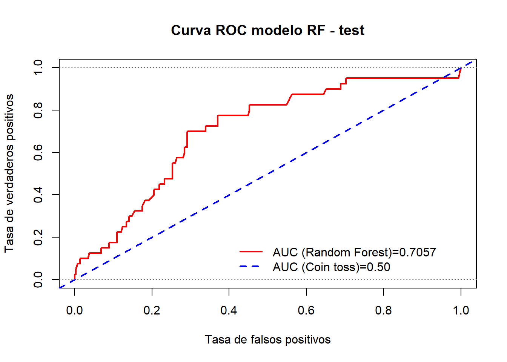


> Métrica de error del clasificador RF:

 - Error tipo I ($\alpha$): 22.50%, indica el error que se comete clasificando una pérdida 'severa' como 'no severa'
 - Error tipo II ($\beta$): 43.15%, indica el error que se comete clasificando una pérdida 'no severa' como 'severa'
 - % mala clasificación ($%mc$) : 40.66%, indica el % de veces que el modelo clasifica incorrectamente las pérdidas 
 - Accuracy = $100 - %$: 59.34%, indica el % de veces que el modelo acierta clasificando las pérdidas
 - Area bajo la curva ROC $AUC$: 0.6988, medida global del poder de clasificación del modelo
 - Finalmente calculamos la curva ROC junto con la métrica AUC


 > Resumiendo:

Una función útil para obtener rápidamente el análisis de un clasificador binario es la siguiente:


```r
metricBinaryClass = function( fitted.model , dataset , cutpoint=NULL , roc.graph=TRUE){
  
  # fitted.model : The Binary Classification model that is under evaluation. If provided, dataset contains all variables in the fitted model (target and predictors).
  # dataset      : If fitted.model is not provided, dataset should has only two columns, predictions and labels.
  # cuttpoint    : potimal cutoff or cutpoint to be used to split continuous predictions into two response categories of target variable
  # roc.graph    : If true, ROC curve graph for the model is shown 
  
  #install.packages("binaryLogic")
  library(binaryLogic)
  
  if( missing(fitted.model) | is.null(fitted.model) ){
    
    tabl  <- as.data.frame(dataset)
  } 
  
  else {
    if( class(fitted.model)[1] %in% c('glm','lm','randomForest.formula','randomForest') ){
      tabl.pred <- as.data.frame(predict( fitted.model, newdata = dataset ))
      tabl <- as.data.frame(cbind(tabl.pred[[1]], dataset[,'Y'] )) 
      tabl <- tabl[!is.na(tabl[[1]]),]
    }
    if( class(fitted.model)[1] %in% c("gbm") ){
      tabl.pred <- as.data.frame(predict.gbm( fitted.model , newdata = dataset , n.trees = 5000 , type="response" ))
      tabl <- as.data.frame(cbind(tabl.pred[[1]], dataset[,'Y'] )) 
      tabl <- tabl[!is.na(tabl[[1]]),]
    }
    if( class(fitted.model)[1] %in% c('svm.formula','svm') ){
      tabl.pred <- as.data.frame(predict( fitted.model, newdata = dataset ))
      ids_NAs <- na.index(dataset)
      tabl <- as.data.frame( cbind(tabl.pred[[1]], dataset[-ids_NAs,'Y']) ) 
      tabl <- tabl[!is.na(tabl[[1]]),]
    }
  }
  colnames(tabl) <- c('predicted','actual')
  
  # ROCR objects
  require(ROCR)
  obj.pred <- prediction(tabl$predicted,tabl$actual)
  obj.perf <- performance(obj.pred,"tpr","fpr")
  obj.auc  <- performance(obj.pred,"auc")@y.values[[1]]
  # For ROC curve:
  obj.perf@alpha.values[[1]][obj.perf@alpha.values[[1]]==Inf] <- max(obj.perf@alpha.values[[1]][obj.perf@alpha.values[[1]]!=Inf])
  # KS criteria
  KS.matrix= cbind(abs(obj.perf@y.values[[1]]-obj.perf@x.values[[1]]), obj.perf@alpha.values[[1]])
  # KS cutoff
  # colnames(KS.matrix) <- c("KS-distance","cut-point")
  ind.ks  <- sort( KS.matrix[,1] , index.return=TRUE )$ix[nrow(KS.matrix)] 
  
  if( missing(cutpoint) | is.null(cutpoint) ) cutpoint <- KS.matrix[ind.ks,2]
  
  if( !(is.binary(tabl)) ){
    
    # Make predictions objs.
    # Binary metrics 
    tp = sum( tabl$predicted  >  cutpoint & tabl$actual >  cutpoint)
    fp = sum( tabl$predicted  >  cutpoint & tabl$actual <= cutpoint)
    tn = sum( tabl$predicted  <= cutpoint & tabl$actual <= cutpoint)
    fn = sum( tabl$predicted  <= cutpoint & tabl$actual >  cutpoint) 
    pos = tp+fn
    neg = tn+fp
    acc=  100*(tp+tn)/(pos+neg)
    prec= 100*tp/(tp+fp)
    sens= 100*tp/(tp+fn) # = tpr = recall = 1 - error alpha
    spec= 100*tn/(tn+fp) # 1- error beta
    fpr = 100*fp/neg  # error beta (tipo II) = 1 - spec
    fnr = 100*fn/pos  # error alpha (tipo I) = 1- recall = 1- sens
  }
  
  if( is.binary(tabl) ){
    
    tp = sum( tabl$predicted  == 1 & tabl$actual == 1)
    fp = sum( tabl$predicted  == 1 & tabl$actual == 0)
    tn = sum( tabl$predicted  == 0 & tabl$actual == 0)
    fn = sum( tabl$predicted  == 0 & tabl$actual == 1) 
    pos = tp+fn
    neg = tn+fp
    acc=  100*(tp+tn)/(pos+neg)
    prec= 100*tp/(tp+fp)
    sens= 100*tp/(tp+fn) # = tpr = recall = 1 - error alpha
    spec= 100*tn/(tn+fp) # 1- error beta
    fpr = 100*fp/neg  # error beta (tipo II) = 1 - spec
    fnr = 100*fn/pos  # error alpha (tipo I) = 1- recall = 1- sens
  }  
  
  if(roc.graph==TRUE){
    win.graph()
    plot( obj.perf  , col='red' , lwd=2, type="l",xlab="Tasa de falsos positivos" , ylab="Tasa de verdaderos positivos", main="Curva ROC modelo clasificación")
    abline( 0.0 , 1.0 , col="blue", lwd=2, lty=2)
    abline( 0.0 , 0.0 , 1 , col="gray40" , lty=3)
    legend( 0.45, 0.2 , c(paste0("AUC (Model)=",round(obj.auc,4)),"AUC (Rolling dice)=0.50") ,lty=c(1,2), lwd=c(2,2) ,col=c("red","blue"), bty="n")
  }
  
  list(ClassError.tI=round(fnr,2), ClassError.tII=round(fpr,2), Accuracy=round(acc,2),Sensitivity = round(sens,2) , Specificity= round(spec,2), auc= obj.auc , Fisher.F1=round(2*prec*sens/(prec+sens),4) )
  
}
```


```r
 metricBinaryClass( fitted.model = rf1 , dataset= dt_test , cutpoint=rf1.KScutoff , roc.graph=TRUE)
```

```
## $ClassError.tI
## [1] 22.5
## 
## $ClassError.tII
## [1] 43.49
## 
## $Accuracy
## [1] 59.04
## 
## $Sensitivity
## [1] 77.5
## 
## $Specificity
## [1] 56.51
## 
## $auc
## [1] 0.7056507
## 
## $Fisher.F1
## [1] 31.3131
```

### Regresión

<div class="info">
Vamos a construir un modelo para prever las pérdidas.
</div>

 > Modelo con _Random Forest_ en _train_


```r
fmla.rf2 <- as.formula(paste0('LOSS','~',paste0(colnames(df_autobi[,-c(7,8)]),collapse = "+"),collapse = ''))
set.seed(112233) #recomendado

rf2 <- randomForest( fmla.rf2,
                     data =dt_train,
                     ntree = 5000,
                     replace =TRUE,
                     mtry=4,
                     maxnodes =50,
                     importance = TRUE,
                     na.action=na.omit)

summary(rf2)
```

```
##                 Length Class  Mode     
## call               9   -none- call     
## type               1   -none- character
## predicted        759   -none- numeric  
## mse             5000   -none- numeric  
## rsq             5000   -none- numeric  
## oob.times        759   -none- numeric  
## importance        12   -none- numeric  
## importanceSD       6   -none- numeric  
## localImportance    0   -none- NULL     
## proximity          0   -none- NULL     
## ntree              1   -none- numeric  
## mtry               1   -none- numeric  
## forest            11   -none- list     
## coefs              0   -none- NULL     
## y                759   -none- numeric  
## test               0   -none- NULL     
## inbag              0   -none- NULL     
## terms              3   terms  call     
## na.action        179   omit   numeric
```


```r
str(rf2)
```

```
## List of 19
##  $ call           : language randomForest(formula = fmla.rf2, data = dt_train, ntree = 5000, replace = TRUE,      mtry = 4, maxnodes = 50, imp| __truncated__
##  $ type           : chr "regression"
##  $ predicted      : Named num [1:759] 2.407 0.676 37.029 1.73 4.229 ...
##   ..- attr(*, "names")= chr [1:759] "2" "3" "4" "5" ...
##   ..- attr(*, "na.action")= 'omit' Named int [1:179] 1 9 19 25 27 40 43 46 50 51 ...
##   .. ..- attr(*, "names")= chr [1:179] "1" "10" "24" "30" ...
##  $ mse            : num [1:5000] 566 483 441 401 427 ...
##  $ rsq            : num [1:5000] -0.707 -0.457 -0.328 -0.208 -0.286 ...
##  $ oob.times      : int [1:759] 1820 1870 1853 1846 1856 1840 1820 1899 1880 1876 ...
##  $ importance     : num [1:6, 1:2] 17.313 0.136 -3.726 3.199 4.752 ...
##   ..- attr(*, "dimnames")=List of 2
##   .. ..$ : chr [1:6] "ATTORNEY" "CLMSEX" "MARITAL" "CLMINSUR" ...
##   .. ..$ : chr [1:2] "%IncMSE" "IncNodePurity"
##  $ importanceSD   : Named num [1:6] 1.215 1.018 1.116 0.38 0.743 ...
##   ..- attr(*, "names")= chr [1:6] "ATTORNEY" "CLMSEX" "MARITAL" "CLMINSUR" ...
##  $ localImportance: NULL
##  $ proximity      : NULL
##  $ ntree          : num 5000
##  $ mtry           : num 4
##  $ forest         :List of 11
##   ..$ ndbigtree    : int [1:5000] 99 99 99 99 99 99 99 99 99 99 ...
##   ..$ nodestatus   : int [1:99, 1:5000] -3 -3 -3 -3 -3 -3 -1 -3 -3 -3 ...
##   ..$ leftDaughter : int [1:99, 1:5000] 2 4 6 8 10 12 0 14 16 18 ...
##   ..$ rightDaughter: int [1:99, 1:5000] 3 5 7 9 11 13 0 15 17 19 ...
##   ..$ nodepred     : num [1:99, 1:5000] 4.96 4.6 23.76 7.19 1.9 ...
##   ..$ bestvar      : int [1:99, 1:5000] 5 1 6 3 6 3 0 6 2 3 ...
##   ..$ xbestsplit   : num [1:99, 1:5000] 1.5 1.5 37.5 3.5 20.5 1.5 0 25.5 1.5 1.5 ...
##   ..$ ncat         : Named int [1:6] 1 1 1 1 1 1
##   .. ..- attr(*, "names")= chr [1:6] "ATTORNEY" "CLMSEX" "MARITAL" "CLMINSUR" ...
##   ..$ nrnodes      : int 99
##   ..$ ntree        : num 5000
##   ..$ xlevels      :List of 6
##   .. ..$ ATTORNEY: num 0
##   .. ..$ CLMSEX  : num 0
##   .. ..$ MARITAL : num 0
##   .. ..$ CLMINSUR: num 0
##   .. ..$ SEATBELT: num 0
##   .. ..$ CLMAGE  : num 0
##  $ coefs          : NULL
##  $ y              : Named num [1:759] 10.892 0.33 11.037 0.138 3.538 ...
##   ..- attr(*, "na.action")= 'omit' Named int [1:179] 1 9 19 25 27 40 43 46 50 51 ...
##   .. ..- attr(*, "names")= chr [1:179] "1" "10" "24" "30" ...
##   ..- attr(*, "names")= chr [1:759] "2" "3" "4" "5" ...
##  $ test           : NULL
##  $ inbag          : NULL
##  $ terms          :Classes 'terms', 'formula'  language LOSS ~ ATTORNEY + CLMSEX + MARITAL + CLMINSUR + SEATBELT + CLMAGE
##   .. ..- attr(*, "variables")= language list(LOSS, ATTORNEY, CLMSEX, MARITAL, CLMINSUR, SEATBELT, CLMAGE)
##   .. ..- attr(*, "factors")= int [1:7, 1:6] 0 1 0 0 0 0 0 0 0 1 ...
##   .. .. ..- attr(*, "dimnames")=List of 2
##   .. .. .. ..$ : chr [1:7] "LOSS" "ATTORNEY" "CLMSEX" "MARITAL" ...
##   .. .. .. ..$ : chr [1:6] "ATTORNEY" "CLMSEX" "MARITAL" "CLMINSUR" ...
##   .. ..- attr(*, "term.labels")= chr [1:6] "ATTORNEY" "CLMSEX" "MARITAL" "CLMINSUR" ...
##   .. ..- attr(*, "order")= int [1:6] 1 1 1 1 1 1
##   .. ..- attr(*, "intercept")= num 0
##   .. ..- attr(*, "response")= int 1
##   .. ..- attr(*, ".Environment")=<environment: R_GlobalEnv> 
##   .. ..- attr(*, "predvars")= language list(LOSS, ATTORNEY, CLMSEX, MARITAL, CLMINSUR, SEATBELT, CLMAGE)
##   .. ..- attr(*, "dataClasses")= Named chr [1:7] "numeric" "ordered" "ordered" "ordered" ...
##   .. .. ..- attr(*, "names")= chr [1:7] "LOSS" "ATTORNEY" "CLMSEX" "MARITAL" ...
##  $ na.action      : 'omit' Named int [1:179] 1 9 19 25 27 40 43 46 50 51 ...
##   ..- attr(*, "names")= chr [1:179] "1" "10" "24" "30" ...
##  - attr(*, "class")= chr [1:2] "randomForest.formula" "randomForest"
```

 > Importancia Relativa de las Variables _Input_


```r
varImpPlot(rf2,sort = T,main="Variable Importance")
```

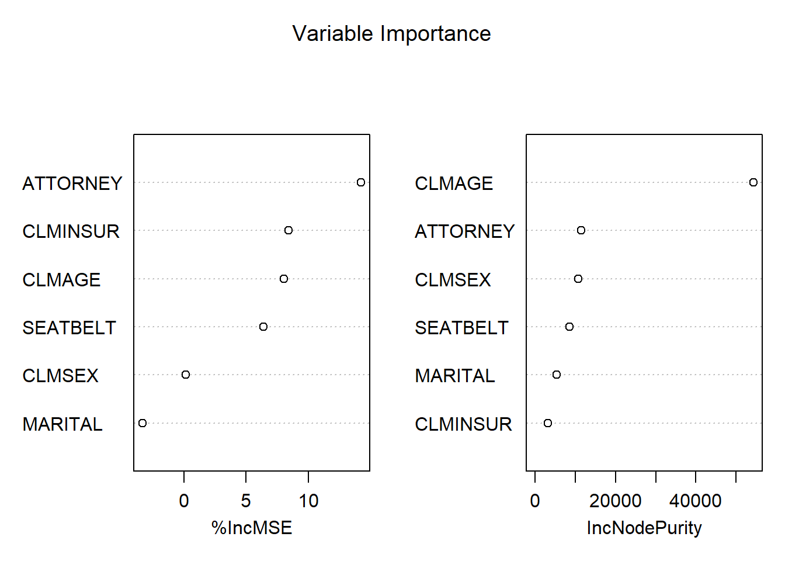

 > Previsión en _test_


```r
rf2.prediction <- as.data.frame(predict(rf2, newdata = dt_test))
dt_test$pred_rf2 <- rf2.prediction[[1]] 
```


```r
head(dt_test, 3)
```

```
##    ATTORNEY CLMSEX MARITAL CLMINSUR SEATBELT CLMAGE   LOSS Y  pred_rf1
## 6         1      2       1        2        1     35  0.309 0 0.2279703
## 12        1      1       1        2        1     42 29.620 1 0.2159590
## 18        1      1       1        2        1     58  0.758 0 0.2047155
##    pred_rf2
## 6  7.914295
## 12 8.539666
## 18 9.864992
```

```r
tail(dt_test, 3)
```

```
##      ATTORNEY CLMSEX MARITAL CLMINSUR SEATBELT CLMAGE  LOSS Y    pred_rf1
## 1336        2      1       2        2        1     NA 0.576 0          NA
## 1337        1      2       1        2        1     46 3.705 0 0.349066396
## 1339        1      2       2        1        1     18 3.277 0 0.004032191
##       pred_rf2
## 1336        NA
## 1337 36.877666
## 1339  3.963606
```

```r
summary(dt_test, 3)
```

```
##  ATTORNEY  CLMSEX       MARITAL    CLMINSUR   SEATBELT       CLMAGE     
##  1:214    1   :180   2      :195   1   : 43   1   :385   Min.   : 0.00  
##  2:188    2   :219   (Other):200   2   :346   2   :  5   1st Qu.:19.00  
##           NA's:  3   NA's   :  7   NA's: 13   NA's: 12   Median :29.00  
##                                                          Mean   :31.31  
##                                                          3rd Qu.:42.00  
##                                                          Max.   :78.00  
##                                                          NA's   :55     
##       LOSS                 Y             pred_rf1          pred_rf2     
##  Min.   :   0.0050   Min.   :0.0000   Min.   :0.00005   Min.   : 0.377  
##  1st Qu.:   0.5175   1st Qu.:0.0000   1st Qu.:0.00797   1st Qu.: 2.048  
##  Median :   2.1645   Median :0.0000   Median :0.03794   Median : 3.293  
##  Mean   :   7.0917   Mean   :0.1144   Mean   :0.12531   Mean   : 6.375  
##  3rd Qu.:   3.7782   3rd Qu.:0.0000   3rd Qu.:0.21666   3rd Qu.: 7.881  
##  Max.   :1067.6970   Max.   :1.0000   Max.   :0.75036   Max.   :56.904  
##                                       NA's   :70        NA's   :70
```


 > Graficamos la distribución de los valores estimados en el _train_
 

```r
plot(density(dt_test$pred_rf2[!is.na(dt_test$pred_rf2) & dt_test$pred_rf2 < 30]), ylim= c(0,.25) , col="red" , main="")
lines(density(dt_test$LOSS[dt_test$LOSS<30]),col="blue",lty=1)
```

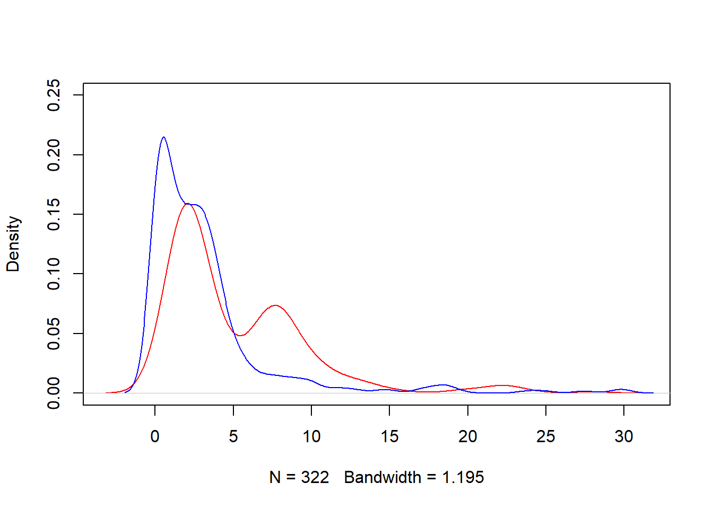


```r
modelchecktest1 <- as.data.frame( cbind(real=dt_test$LOSS , predicted=dt_test$pred_rf2) )
modelchecktest1[is.na(modelchecktest1)] <- 0

summary(modelchecktest1)
```

```
##       real             predicted     
##  Min.   :   0.0050   Min.   : 0.000  
##  1st Qu.:   0.5175   1st Qu.: 1.310  
##  Median :   2.1645   Median : 2.422  
##  Mean   :   7.0917   Mean   : 5.265  
##  3rd Qu.:   3.7782   3rd Qu.: 7.469  
##  Max.   :1067.6970   Max.   :56.904
```

 > Error de ajuste del modelo


```r
plot(modelchecktest1, xlim=c(0,100) , ylim=c(0,100) ,  pch="." , cex=1.5)
segments( 0, 0 , 100, 100 , col="red")
```

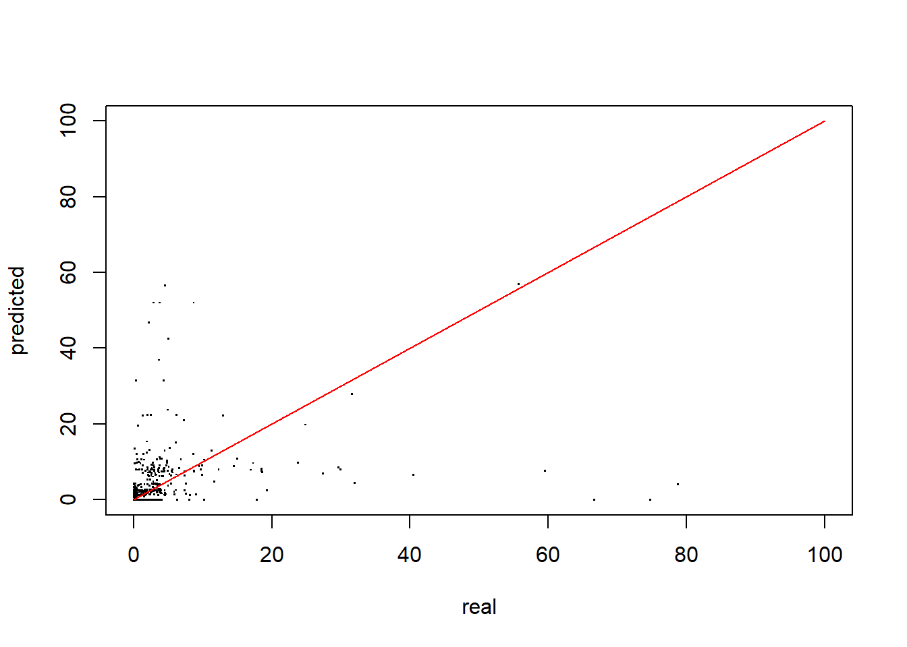

 > Resumiendo
 
Una función útil para medir el error:


```r
modelMetrics(real=modelchecktest1$real, pred=modelchecktest1$predicted )
```

```
##  Accuracy metrics (global):
```

```
## MAE(ref) = 8.9208
```

```
## MAE = 7.765
```

```
## RMSE = 54.5686
```

```
## MAPE = 127.01
```

```
## MAPE(sim) = 68.65
```

```
## WMAPE = 109.49
```
 

 * Commentario: El error de ajuste del modelo de regresión es demasiado alto: $RMSE= 54.57$ y el $MAPE=127.19%$
Con estos errores de predicción, es preferible utilizar a un modelo de clasificación en lugar de un     modelo de regresión.


<div class="rmdcomment">

 **Ejercicio sugerido**

 - Ajustar un Modelo de Regresión Logística para $Y$ y comparar los resultados con los proporcionados por el _Random Forest_

 - Ajustar un Modelo de Regresión Lineal para $LOSS$ y comparar los resultados con los proporcionados por el _Random Forest_


</div>
 
