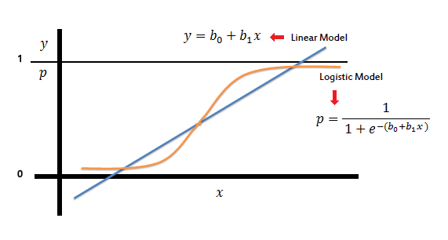

# Regresión Logística


<!--  -->



<br>
<!--  -->


Una aplicación muy conocida son los modelos de **churn**. Un modelo de churn es una herramienta que permite evaluar la **probabilidad de baja o fuga** de un cliente en función de sus características propias y del tipo de relación que tiene con la empresa.</p>


<br>
<div class ="info">
La variable que se analiza toma valor 1 ó 0. Para representar la relación entre esa **variable binaria** (output) y las variables explicativas (inputs), se utilizan modelos de tipo <font **logit** o **probit**.
</div>


## Modelos Lineales Generalizados {.tabset}

Los Modelos Lineales Generalizados son una extensión de los  modelos lineales
clásicos. Un modelo lineal se basa en un vector de observaciones  $\mathbf{Y}$ con $n$ componentes,
que son una realización de una variable aleatoria $\mathbf{Y}$ cuyas componentes están independientemente distribuidas con media  $\mu$. Un modelo lineal puede ser descrito
como:
$$\mathbf{Y} = \mathbf{\mu} + \mathbf{\epsilon}$$

La parte sistemática de un modelo es una especificación para $\mu$ en función de un número pequeño de parámetros, $\beta_1, \ldots, \beta_p.$ Esa especificación se hace de la siguiente manera:
$$
\mu_i = \sum_{j=1}^p  X_{ij}\beta_j;     i=1,\ldots,n.
$$

O en forma matricial,
$$
E(\mathbf{Y}) = \mathbf{\mu} = \mathbf{x} \mathbf{\beta}
$$

donde $\mathbf{X}$ es una matriz $n \times p$, con las covariables o regresoras del modelo. Para la parte aleatoria se supone independencia y varianza constante de los errores.

En un modelo lineal clásico, se tiene que:
$$
\mathbf{\epsilon} \sim N(0, \sigma^2 \mathbf{I})
$$

Por tanto un modelo lineal clásico puede ser resumido de la forma:
$$
\begin{align}
        \mathbf{Y} & \sim N(\mathbf{\mu}, \sigma^2 \mathbf{I}) \\
        E(\mathbf{Y}) & = \mathbf{X}\mathbf{\beta} \\
        Var(\mathbf{Y}) & =  \sigma^2\mathbf{I}
\end{align}
$$

La generalización de los modelos lineales incluye una especificación de tres aspectos principales:
 
 * Las componentes de $\mathbf{Y}$ tienen distribución normal con varianza constante y son independientes.
 * En la parte sistemática, las covariables, $x_1, x_2, ..., x_p$, producen un predictor
lineal $\eta$, dado por:

$$ \eta= \sum_{j=1}^p  X_{ij}\beta_j $$

 * La relación entre los componentes sistemáticos y aleatorios se hace a través de una función de manera que:

$$\mathbf{\mu}=\mathbf{\eta}$$


Los Modelos Lineales Generalizados o MLGs permiten dos extensiones. La primera extensión está en la función de enlace, que es la parte del modelo que determina la relación entre la media de la variable respuesta y las covariables. Esta función de enlace, ahora, podrá ser cualquier función monótona diferenciable y generalmente denotada por $g(\mu)$. La segunda extensión reside en la distribución especificada para la componente aleatoria. En los MLGs esta puede ser de la familia exponencial, de la cual la distribución normal forma parte.

Se supone que si $\mathbf{Y}$ tiene una distribución de la familia exponencial para unos específicos $a(\cdot), b(\cdot)$ y $c(\cdot)$ se asume la siguiente forma:

$$
f_Y ( \mathbf{Y} | \eta,\phi) = \exp \left\{ \dfrac{\mathbf{\eta} - b(\eta)}{a(\phi)} + c(\mathbf{Y},\phi) \right\}
$$

El parámetro $\phi$ es llamado parámetro de dispersión y, si es conocido, llamamos a su familia ``de familia exponencial lineal de parámetro canónico $\theta$''. Utilizando la ecuación anterior y algunas relaciones, se puede obtener expresiones para la media y la varianza de $\mathbf{Y}$  de la siguiente manera:

$$
\begin{align}
        E(\mathbf{Y}) & = b'(\eta) \\
        Var(\mathbf{Y}) & =  a(\phi)b''(\eta)
\end{align}
$$


## Modelo Logit

<div class="rmdcomment">

Cuando la variable respuesta es continua, se utilizan métodos de regresión lineal o de otro tipo; en cambio, cuando la **variable respuesta es cualitativa** se utilizan los llamados **Modelos de Regresión Logística**.
 
</div> 
 
 
El objetivo de los  modelos de regresión logística es encontrar el mejor ajuste para describir las relaciones entre las variables respuesta (dicotómica o cualitativa) y un grupo de variables explicativas. Esta diferencia (respecto a los modelos con variable respuesta cuantitativa) da lugar a distintos modelos paramétricos y a distintas hipótesis para estos modelos, pero, una vez salvada esta diferencia, los métodos empleados en Regresión Logística siguen los principios generales de los métodos de Regresión Lineal.

La primera razón por la cual un Modelo de Regresión Lineal no es adecuado para este tipo de datos es que la **variable respuesta sólo puede tomar 2 valores (0 y 1)**, de modo que si pretendiésemos elaborar una relación entre una variable explicativa y esta, tendríamos que condicionar la probabilidad de alguno de los valores de la variable respuesta a cada valor de la variable explicativa, es decir
$E(Y= 1 | X = x_1)$ y obtendríamos la **curva logística**: 


<br>


<!--html_preserve--><div id="htmlwidget-f9280a6a81c6c9fd68cc" style="width:600px;height:450px;" class="highchart html-widget"></div>
<script type="application/json" data-for="htmlwidget-f9280a6a81c6c9fd68cc">{"x":{"hc_opts":{"title":{"text":null},"yAxis":{"title":{"text":null}},"credits":{"enabled":true,"text":"Elaborado por Innova-tsn","href":"https://www.innova-tsn.com/"},"exporting":{"enabled":false},"plotOptions":{"series":{"label":{"enabled":false},"turboThreshold":0},"treemap":{"layoutAlgorithm":"squarified"},"line":{"marker":{"enabled":false}}},"chart":{"type":"line"},"legend":{"enabled":false},"tooltip":{"valueDecimals":2},"xAxis":{"categories":[0,0.25,0.5,0.75,1,1.25,1.5,1.75,2,2.25,2.5,2.75,3,3.25,3.5,3.75,4,4.25,4.5,4.75,5,5.25,5.5,5.75,6,6.25,6.5,6.75,7,7.25,7.5,7.75,8,8.25,8.5,8.75,9,9.25,9.5,9.75,10],"tickInterval":10},"series":[{"data":[null,-3.66356164612965,-2.94443897916644,-2.51230562397611,-2.19722457733622,-1.94591014905531,-1.73460105538811,-1.55059741241117,-1.38629436111989,-1.23676262714893,-1.09861228866811,-0.969400557188103,-0.847297860387204,-0.730887508542792,-0.619039208406224,-0.510825623765991,-0.405465108108164,-0.302280871872934,-0.200670695462151,-0.100083458556983,0,0.100083458556983,0.200670695462151,0.302280871872934,0.405465108108164,0.510825623765991,0.619039208406224,0.730887508542793,0.847297860387203,0.969400557188103,1.09861228866811,1.23676262714893,1.38629436111989,1.55059741241117,1.73460105538811,1.94591014905531,2.19722457733622,2.51230562397612,2.94443897916644,3.66356164612965,null],"name":"Curva Logit"}]},"theme":{"chart":{"backgroundColor":"transparent"}},"conf_opts":{"global":{"Date":null,"VMLRadialGradientURL":"http =//code.highcharts.com/list(version)/gfx/vml-radial-gradient.png","canvasToolsURL":"http =//code.highcharts.com/list(version)/modules/canvas-tools.js","getTimezoneOffset":null,"timezoneOffset":0,"useUTC":true},"lang":{"contextButtonTitle":"Chart context menu","decimalPoint":".","downloadJPEG":"Download JPEG image","downloadPDF":"Download PDF document","downloadPNG":"Download PNG image","downloadSVG":"Download SVG vector image","drillUpText":"Back to {series.name}","invalidDate":null,"loading":"Loading...","months":["January","February","March","April","May","June","July","August","September","October","November","December"],"noData":"No data to display","numericSymbols":["k","M","G","T","P","E"],"printChart":"Print chart","resetZoom":"Reset zoom","resetZoomTitle":"Reset zoom level 1:1","shortMonths":["Jan","Feb","Mar","Apr","May","Jun","Jul","Aug","Sep","Oct","Nov","Dec"],"thousandsSep":" ","weekdays":["Sunday","Monday","Tuesday","Wednesday","Thursday","Friday","Saturday"]}},"type":"chart","fonts":[],"debug":false},"evals":[],"jsHooks":[]}</script><!--/html_preserve-->


<br>    
       
La relación existente no es lineal, sino que puede asociarse con la función de distribución de cierta variable aleatoria. Al utilizar la distribución Logística, representaremos la media de $Y$, dado un valor $x$ de la variable $X$, por $\pi(X)=E(Y/x)$.

El modelo de Regresión Logística es:
$$
\pi(x) = \frac{e^{\beta_0+\beta_1x}}{1+e^{\beta_0+\beta_1x}}
$$
o de forma equivalente:
$$ \pi(x) = \frac{1}{1 + e^{-(\beta_0 + \beta_1 x)}} $$ 


Aplicando la transformación Logit:
$$
g(x)=\ln\Big[\frac{\pi(x)}{1-\pi(x)}\Big]= \beta_0+\beta_1x
$$

Hemos llegado a $g(x)$, que tiene las propiedades que se desea que tenga un Modelo de Regresión Lineal; es lineal en sus parámetros; puede ser continua y su rango está entre $-\infty$ y $\infty$ dependiendo del rango de X.

Como hemos dicho antes, también tenemos que tener clara la distribución de la parte aleatoria de nuestro modelo. En el Modelo Lineal Generalizado suponemos que un valor de la variable dependiente puede expresarse como $y=E(Y/x)+\epsilon.$   Donde $\epsilon\sim N(0,\sigma^2)$, con varianza constante para los distintos niveles de la variable independiente. Pero esto no ocurre así en el caso de una variable dicotómica.


Si expresamos nuestro modelo como $Y = \pi(x) + \epsilon,$   $\epsilon$ toma dos posibles valores:

 
 * Si $Y=1,$ con probabilidad $\pi(x)$, $\epsilon= 1-\pi(x)$, con probabilidad $\pi(x)$.
 * Si $Y=0, \epsilon = -\pi(x)$, con probabilidad $1-\pi(x)$.


Por tanto:
$$
E(\epsilon)= (1-\pi(x))\pi(x)-\pi(x)(1-\pi(x))=0
$$

$$
V(\epsilon) = (1-\pi(x))^2\pi(x)-\pi(x))^2(1-\pi(x))=\pi(x)(1-\pi(x))
$$

La distribución de la variable dependiente $Y$, dado un valor de $x$ de la variable $X$, sigue una distribución Binomial con probabilidad $\pi(x)$.


<br>
<div class="info">
Al no ser una relación lineal, no es posible interpretar directamente el valor de los parámetros estimados.
Para ello se utilizan los _'ODDS Ratios'_.
</div>


A través de un ratio de ODDS se puede calcular qué influencia genera en el target el incremento de una unidad en el valor de la variable explicativa.

- Si $\beta_i > 0$ el efecto de la variable explicativa $X_i$ sobre la respuesta $Y$ es de incremento: aumenta la probabilidad del target.
- Si $\beta_i < 0$ el efecto que produce la variable explicativa $X_i$ sobre la respuesta $Y$ es decremento: disminuye la probabilidad del target.


## Modelo Probit


La relación existente entre $E(Y= 1/X=x_1)$ y $X$, que como dicho anteriormente no es linea, se asocia también con la curva de distribución normal.Este enfoque utiliza la inversa de la función de distribución normal para obtener una relación lineal entre $E(Y= 1/X=x_1)$ y $X$. Y una vez hayamos tenido los valores en forma de relación lineal del tipo $g(x) = B_0+B_1x_1$ volveremos a transformarlo en una curva que se asemeje a una distribución aleatoria de la siguiente manera:

$$
E(Y=1/X) = \int_{-\infty}^{B_0+B_1 x_1}\frac{1}{\sqrt{2\pi}}e^{\frac{-z^2}{2}}
$$

Así estimando los valores de $B_0$ y $B_1$, siguiendo el proceso anteriormente mencionado, obtendremos estimaciones de las probabilidades de un determinado valor de la variable respuesta $(Y)$ condicionada a unos determinados valores de las variables explicativas $(X_1,X_2,...X_n)$.


<!-- ## Modelos de regresión logística -->

<!-- Como ocurría en la regresión lineal, el objetivo es tratar de explicar/predecir el comportamiento de una variable $Y$ en función de otras variables $X_1, X_2, ... , X_K$. -->

<!-- La regresión logística se plantea de la siguiente manera: -->

<!-- $$ Y = \frac{1}{1 + e^{-\beta_0 - \beta_1 X_1 - ... -\beta_K X_K + \epsilon}} $$ -->

<!-- Los valores que devuelven se mueven en el rango $[0,1]$ -->

<!-- En general, permite establecer una relación de dependencia entre una variable categórica $Y$ (no necesariamente binaria) con un conjunto de variables independiente de cualquier tipo. -->

<!-- En función de la naturaleza de la variable dependiente se distinguen diferentes tipos de modelos: -->

<!-- - **Regresión Logística Binaria**: asociada a un target binario. Es la más utilizada y referenciada. -->
<!-- - **Regresión Logística Ordinal**: asociado a un target ordinal. -->
<!-- - **Regresión Logística Nominal**: asociada a un target nominal.  -->


## Práctica en R

Para este ejemplo cargamos la librería `ISLR` y utilizamos el conjunto de datos de `Smarket`.


Veamos información sobre los datos `Smarket`

```r
?Smarket
```

```
## starting httpd help server ... done
```

```r
head(Smarket)
```

```
##   Year   Lag1   Lag2   Lag3   Lag4   Lag5 Volume  Today Direction
## 1 2001  0.381 -0.192 -2.624 -1.055  5.010 1.1913  0.959        Up
## 2 2001  0.959  0.381 -0.192 -2.624 -1.055 1.2965  1.032        Up
## 3 2001  1.032  0.959  0.381 -0.192 -2.624 1.4112 -0.623      Down
## 4 2001 -0.623  1.032  0.959  0.381 -0.192 1.2760  0.614        Up
## 5 2001  0.614 -0.623  1.032  0.959  0.381 1.2057  0.213        Up
## 6 2001  0.213  0.614 -0.623  1.032  0.959 1.3491  1.392        Up
```

```r
summary(Smarket)
```

```
##       Year           Lag1                Lag2          
##  Min.   :2001   Min.   :-4.922000   Min.   :-4.922000  
##  1st Qu.:2002   1st Qu.:-0.639500   1st Qu.:-0.639500  
##  Median :2003   Median : 0.039000   Median : 0.039000  
##  Mean   :2003   Mean   : 0.003834   Mean   : 0.003919  
##  3rd Qu.:2004   3rd Qu.: 0.596750   3rd Qu.: 0.596750  
##  Max.   :2005   Max.   : 5.733000   Max.   : 5.733000  
##       Lag3                Lag4                Lag5         
##  Min.   :-4.922000   Min.   :-4.922000   Min.   :-4.92200  
##  1st Qu.:-0.640000   1st Qu.:-0.640000   1st Qu.:-0.64000  
##  Median : 0.038500   Median : 0.038500   Median : 0.03850  
##  Mean   : 0.001716   Mean   : 0.001636   Mean   : 0.00561  
##  3rd Qu.: 0.596750   3rd Qu.: 0.596750   3rd Qu.: 0.59700  
##  Max.   : 5.733000   Max.   : 5.733000   Max.   : 5.73300  
##      Volume           Today           Direction 
##  Min.   :0.3561   Min.   :-4.922000   Down:602  
##  1st Qu.:1.2574   1st Qu.:-0.639500   Up  :648  
##  Median :1.4229   Median : 0.038500             
##  Mean   :1.4783   Mean   : 0.003138             
##  3rd Qu.:1.6417   3rd Qu.: 0.596750             
##  Max.   :3.1525   Max.   : 5.733000
```


En este caso la variable `Y` que queremos predecir/explicar es la variable `Direction`, y las variables independientes son `Lag1`, `Lag2`, `Lag3`, `Lag4`, `Lag5` y `Volume`.

Veamos que valores toma la variable `Direction` 

```r
levels(Smarket$Direction)
```

```
## [1] "Down" "Up"
```

Vemos que es una variable binaria que toma valores `Down`o `Up`.
Antes de continuar pasamos esos valores a `0` o `1`, respectivamente.

```r
Smarket$Direction <- ifelse(Smarket$Direction == 'Up', 1, 0)
```

Para realizar la regresión logística en R utilizaremos la función `glm`.
Se puede observar en el código siguiente, que como nuestro Target es binario, el parámetro `family` lo debemos fijar a binomial.


```r
reg_logis <- glm(Direction~Lag1 + Lag2 + Lag3 + Lag4 + Lag5 + Volume,
                 data = Smarket,
                 family = binomial)
```

Veamos que hemos obtenido

```r
summary(reg_logis)
```

```
## 
## Call:
## glm(formula = Direction ~ Lag1 + Lag2 + Lag3 + Lag4 + Lag5 + 
##     Volume, family = binomial, data = Smarket)
## 
## Deviance Residuals: 
##    Min      1Q  Median      3Q     Max  
## -1.446  -1.203   1.065   1.145   1.326  
## 
## Coefficients:
##              Estimate Std. Error z value Pr(>|z|)
## (Intercept) -0.126000   0.240736  -0.523    0.601
## Lag1        -0.073074   0.050167  -1.457    0.145
## Lag2        -0.042301   0.050086  -0.845    0.398
## Lag3         0.011085   0.049939   0.222    0.824
## Lag4         0.009359   0.049974   0.187    0.851
## Lag5         0.010313   0.049511   0.208    0.835
## Volume       0.135441   0.158360   0.855    0.392
## 
## (Dispersion parameter for binomial family taken to be 1)
## 
##     Null deviance: 1731.2  on 1249  degrees of freedom
## Residual deviance: 1727.6  on 1243  degrees of freedom
## AIC: 1741.6
## 
## Number of Fisher Scoring iterations: 3
```

Los coeficientes de la regresión logística obtenida serán:

```r
coef(reg_logis)
```

```
##  (Intercept)         Lag1         Lag2         Lag3         Lag4 
## -0.126000257 -0.073073746 -0.042301344  0.011085108  0.009358938 
##         Lag5       Volume 
##  0.010313068  0.135440659
```

Como se hace en los otros modelos, la función `predict` la utilizaremos para predecir un nuevo conjunto de datos a partir de nuestro modelo de regresión logística ajustado.

Para un modelo binomial predeterminado, las predicciones serán de log-odds (probabilidades en la escala logit). Como vemos en el código a continuación, utilizamos el argumento `type = response` para guardar la predicción de las probabilidades.

```r
glm.probs <- predict(reg_logis,
                     type =  "response")
```

Lo que hacemos a continuación es dar a una observación el valor del target $1$ o $0$ en función a la probabilidad obtenida. El corte en la probabilidad en este caso lo ponemos en $0.5$, es decir, si la predicción que se ha obtenido de la probabilidad es menor que 0.5, le damos el valor $0$, y sino el valor $1$. El código que hace esto es de la siguiente manera:

```r
glm.pred <- rep(1, nrow(Smarket))
glm.pred[glm.probs < .5] <- 0
```

Ahora, obtenemos la **matriz de confusión**, en el que podemos comparar el valor de la predicción obtenida (filas) con el verdadero valor (columnas). De esta manera, lo que está en la diagonal principal será lo que se ha predecido correctamente.

```r
table(glm.pred, Smarket$Direction) 
```

```
##         
## glm.pred   0   1
##        0 145 141
##        1 457 507
```

observamos la media de los valores que se ha predecido bien:

```r
mean(glm.pred == Smarket$Direction)
```

```
## [1] 0.5216
```
y la media de los que se han predecido mal:

```r
mean(glm.pred != Smarket$Direction)
```

```
## [1] 0.4784
```

Podemos ver de manera gráfica como han sido clasificados por nuestro modelo (en función de la probabilidad obtenida) frente a su valor real.


```r
nuevo <- data.frame(glm.probs, glm.pred, Smarket$Direction)
names(nuevo)[1] <- "probs"
names(nuevo)[2] <- "pred"
names(nuevo)[3] <- "direction"

nuevo$direction <- ifelse(nuevo$direction == 1, 'Up', 'Down')
nuevo$pred <- ifelse(nuevo$pred == 1, 'Up', 'Down')
library(ggplot2)
ggplot(data = nuevo, 
       aes(x = pred, y = probs, col = direction)) + geom_point() +
       labs(x = 'Prediccion', y = 'Probabilidades') +  
       ggtitle('Prediccion vs Valor Real') +
       theme(legend.title=element_blank()) +
       scale_colour_manual(values=c("blue", "red"))
```


### Otros ejemplos


  - [How to perform a Logistic Regression in R](https://www.r-bloggers.com/how-to-perform-a-logistic-regression-in-r/)

  - [Logit Regression | R Data Analysis Examples](https://stats.idre.ucla.edu/r/dae/logit-regression/)

  - [Practical Guide to Logistic Regression Analysis in R](
https://www.hackerearth.com/practice/machine-learning/machine-learning-algorithms/logistic-regression-analysis-r/tutorial/)

  - [Customer Churn – Logistic Regression with R](http://www.treselle.com/blog/customer-churn-logistic-regression-with-r/ )


