# Series Temporales


`


<br>

 > Ejemplo A:

<!--html_preserve--><div id="htmlwidget-adb19e9af7521802e009" style="width:100%;height:500px;" class="highchart html-widget"></div>
<script type="application/json" data-for="htmlwidget-adb19e9af7521802e009">{"x":{"hc_opts":{"title":{"text":"Monthly Airline Passenger Numbers 1949-1960","style":{"fontSize":"14px"}},"yAxis":{"title":{"text":null}},"credits":{"enabled":true,"text":"Elaborado por Innova-tsn","href":"http://www.innova-tsn.com"},"exporting":{"enabled":true},"plotOptions":{"series":{"label":{"enabled":false},"turboThreshold":0},"treemap":{"layoutAlgorithm":"squarified"}},"chart":{"type":"line","zoomType":"x"},"legend":{"enabled":true},"tooltip":{"valueDecimals":2,"shared":true,"crosshairs":true},"xAxis":{"type":"datetime","tickInterval":100,"labels":{"format":"{value:%Y-%m-%d}","rotation":-90}},"series":[{"data":[[-662688000000,112],[-660009600000,118],[-657590400000,132],[-654912000000,129],[-652320000000,121],[-649641600000,135],[-647049600000,148],[-644371200000,148],[-641692800000,136],[-639100800000,119],[-636422400000,104],[-633830400000,118],[-631152000000,115],[-628473600000,126],[-626054400000,141],[-623376000000,135],[-620784000000,125],[-618105600000,149],[-615513600000,170],[-612835200000,170],[-610156800000,158],[-607564800000,133],[-604886400000,114],[-602294400000,140],[-599616000000,145],[-596937600000,150],[-594518400000,178],[-591840000000,163],[-589248000000,172],[-586569600000,178],[-583977600000,199],[-581299200000,199],[-578620800000,184],[-576028800000,162],[-573350400000,146],[-570758400000,166],[-568080000000,171],[-565401600000,180],[-562896000000,193],[-560217600000,181],[-557625600000,183],[-554947200000,218],[-552355200000,230],[-549676800000,242],[-546998400000,209],[-544406400000,191],[-541728000000,172],[-539136000000,194],[-536457600000,196],[-533779200000,196],[-531360000000,236],[-528681600000,235],[-526089600000,229],[-523411200000,243],[-520819200000,264],[-518140800000,272],[-515462400000,237],[-512870400000,211],[-510192000000,180],[-507600000000,201],[-504921600000,204],[-502243200000,188],[-499824000000,235],[-497145600000,227],[-494553600000,234],[-491875200000,264],[-489283200000,302],[-486604800000,293],[-483926400000,259],[-481334400000,229],[-478656000000,203],[-476064000000,229],[-473385600000,242],[-470707200000,233],[-468288000000,267],[-465609600000,269],[-463017600000,270],[-460339200000,315],[-457747200000,364],[-455068800000,347],[-452390400000,312],[-449798400000,274],[-447120000000,237],[-444528000000,278],[-441849600000,284],[-439171200000,277],[-436665600000,317],[-433987200000,313],[-431395200000,318],[-428716800000,374],[-426124800000,413],[-423446400000,405],[-420768000000,355],[-418176000000,306],[-415497600000,271],[-412905600000,306],[-410227200000,315],[-407548800000,301],[-405129600000,356],[-402451200000,348],[-399859200000,355],[-397180800000,422],[-394588800000,465],[-391910400000,467],[-389232000000,404],[-386640000000,347],[-383961600000,305],[-381369600000,336],[-378691200000,340],[-376012800000,318],[-373593600000,362],[-370915200000,348],[-368323200000,363],[-365644800000,435],[-363052800000,491],[-360374400000,505],[-357696000000,404],[-355104000000,359],[-352425600000,310],[-349833600000,337],[-347155200000,360],[-344476800000,342],[-342057600000,406],[-339379200000,396],[-336787200000,420],[-334108800000,472],[-331516800000,548],[-328838400000,559],[-326160000000,463],[-323568000000,407],[-320889600000,362],[-318297600000,405],[-315619200000,417],[-312940800000,391],[-310435200000,419],[-307756800000,461],[-305164800000,472],[-302486400000,535],[-299894400000,622],[-297216000000,606],[-294537600000,508],[-291945600000,461],[-289267200000,390],[-286675200000,432]],"name":"Passengers","color":"#004379","lineWidth":1}]},"theme":{"chart":{"backgroundColor":"transparent"}},"conf_opts":{"global":{"Date":null,"VMLRadialGradientURL":"http =//code.highcharts.com/list(version)/gfx/vml-radial-gradient.png","canvasToolsURL":"http =//code.highcharts.com/list(version)/modules/canvas-tools.js","getTimezoneOffset":null,"timezoneOffset":0,"useUTC":true},"lang":{"contextButtonTitle":"Chart context menu","decimalPoint":".","downloadJPEG":"Download JPEG image","downloadPDF":"Download PDF document","downloadPNG":"Download PNG image","downloadSVG":"Download SVG vector image","drillUpText":"Back to {series.name}","invalidDate":null,"loading":"Loading...","months":["January","February","March","April","May","June","July","August","September","October","November","December"],"noData":"No data to display","numericSymbols":["k","M","G","T","P","E"],"printChart":"Print chart","resetZoom":"Reset zoom","resetZoomTitle":"Reset zoom level 1:1","shortMonths":["Jan","Feb","Mar","Apr","May","Jun","Jul","Aug","Sep","Oct","Nov","Dec"],"thousandsSep":" ","weekdays":["Sunday","Monday","Tuesday","Wednesday","Thursday","Friday","Saturday"]}},"type":"chart","fonts":[],"debug":false},"evals":[],"jsHooks":[]}</script><!--/html_preserve-->


<br>

 > Ejemplo B:


<!--html_preserve--><div id="htmlwidget-6df3a4a38726a602e2aa" style="width:100%;height:500px;" class="highchart html-widget"></div>
<script type="application/json" data-for="htmlwidget-6df3a4a38726a602e2aa">{"x":{"hc_opts":{"title":{"text":"Number of births per month in New York city, from Jan 1946 to Dec 1959","style":{"fontSize":"14px"}},"yAxis":{"title":{"text":null}},"credits":{"enabled":true,"text":"Elaborado por Innova-tsn","href":"http://www.innova-tsn.com"},"exporting":{"enabled":true},"plotOptions":{"series":{"label":{"enabled":false},"turboThreshold":0},"treemap":{"layoutAlgorithm":"squarified"}},"chart":{"type":"line","zoomType":"x"},"legend":{"enabled":true},"tooltip":{"valueDecimals":2,"shared":true,"crosshairs":true},"xAxis":{"type":"datetime","tickInterval":100,"labels":{"format":"{value:%Y-%m-%d}","rotation":-90}},"series":[{"data":[[-757382400000,26.663],[-754704000000,23.598],[-752284800000,26.931],[-749606400000,24.74],[-747014400000,25.806],[-744336000000,24.364],[-741744000000,24.477],[-739065600000,23.901],[-736387200000,23.175],[-733795200000,23.227],[-731116800000,21.672],[-728524800000,21.87],[-725846400000,21.439],[-723168000000,21.089],[-720748800000,23.709],[-718070400000,21.669],[-715478400000,21.752],[-712800000000,20.761],[-710208000000,23.479],[-707529600000,23.824],[-704851200000,23.105],[-702259200000,23.11],[-699580800000,21.759],[-696988800000,22.073],[-694310400000,21.937],[-691632000000,20.035],[-689126400000,23.59],[-686448000000,21.672],[-683856000000,22.222],[-681177600000,22.123],[-678585600000,23.95],[-675907200000,23.504],[-673228800000,22.238],[-670636800000,23.142],[-667958400000,21.059],[-665366400000,21.573],[-662688000000,21.548],[-660009600000,20],[-657590400000,22.424],[-654912000000,20.615],[-652320000000,21.761],[-649641600000,22.874],[-647049600000,24.104],[-644371200000,23.748],[-641692800000,23.262],[-639100800000,22.907],[-636422400000,21.519],[-633830400000,22.025],[-631152000000,22.604],[-628473600000,20.894],[-626054400000,24.677],[-623376000000,23.673],[-620784000000,25.32],[-618105600000,23.583],[-615513600000,24.671],[-612835200000,24.454],[-610156800000,24.122],[-607564800000,24.252],[-604886400000,22.084],[-602294400000,22.991],[-599616000000,23.287],[-596937600000,23.049],[-594518400000,25.076],[-591840000000,24.037],[-589248000000,24.43],[-586569600000,24.667],[-583977600000,26.451],[-581299200000,25.618],[-578620800000,25.014],[-576028800000,25.11],[-573350400000,22.964],[-570758400000,23.981],[-568080000000,23.798],[-565401600000,22.27],[-562896000000,24.775],[-560217600000,22.646],[-557625600000,23.988],[-554947200000,24.737],[-552355200000,26.276],[-549676800000,25.816],[-546998400000,25.21],[-544406400000,25.199],[-541728000000,23.162],[-539136000000,24.707],[-536457600000,24.364],[-533779200000,22.644],[-531360000000,25.565],[-528681600000,24.062],[-526089600000,25.431],[-523411200000,24.635],[-520819200000,27.009],[-518140800000,26.606],[-515462400000,26.268],[-512870400000,26.462],[-510192000000,25.246],[-507600000000,25.18],[-504921600000,24.657],[-502243200000,23.304],[-499824000000,26.982],[-497145600000,26.199],[-494553600000,27.21],[-491875200000,26.122],[-489283200000,26.706],[-486604800000,26.878],[-483926400000,26.152],[-481334400000,26.379],[-478656000000,24.712],[-476064000000,25.688],[-473385600000,24.99],[-470707200000,24.239],[-468288000000,26.721],[-465609600000,23.475],[-463017600000,24.767],[-460339200000,26.219],[-457747200000,28.361],[-455068800000,28.599],[-452390400000,27.914],[-449798400000,27.784],[-447120000000,25.693],[-444528000000,26.881],[-441849600000,26.217],[-439171200000,24.218],[-436665600000,27.914],[-433987200000,26.975],[-431395200000,28.527],[-428716800000,27.139],[-426124800000,28.982],[-423446400000,28.169],[-420768000000,28.056],[-418176000000,29.136],[-415497600000,26.291],[-412905600000,26.987],[-410227200000,26.589],[-407548800000,24.848],[-405129600000,27.543],[-402451200000,26.896],[-399859200000,28.878],[-397180800000,27.39],[-394588800000,28.065],[-391910400000,28.141],[-389232000000,29.048],[-386640000000,28.484],[-383961600000,26.634],[-381369600000,27.735],[-378691200000,27.132],[-376012800000,24.924],[-373593600000,28.963],[-370915200000,26.589],[-368323200000,27.931],[-365644800000,28.009],[-363052800000,29.229],[-360374400000,28.759],[-357696000000,28.405],[-355104000000,27.945],[-352425600000,25.912],[-349833600000,26.619],[-347155200000,26.076],[-344476800000,25.286],[-342057600000,27.66],[-339379200000,25.951],[-336787200000,26.398],[-334108800000,25.565],[-331516800000,28.865],[-328838400000,30],[-326160000000,29.261],[-323568000000,29.012],[-320889600000,26.992],[-318297600000,27.897]],"name":"Births","color":"##34a4e7ff","lineWidth":1}]},"theme":{"chart":{"backgroundColor":"transparent"}},"conf_opts":{"global":{"Date":null,"VMLRadialGradientURL":"http =//code.highcharts.com/list(version)/gfx/vml-radial-gradient.png","canvasToolsURL":"http =//code.highcharts.com/list(version)/modules/canvas-tools.js","getTimezoneOffset":null,"timezoneOffset":0,"useUTC":true},"lang":{"contextButtonTitle":"Chart context menu","decimalPoint":".","downloadJPEG":"Download JPEG image","downloadPDF":"Download PDF document","downloadPNG":"Download PNG image","downloadSVG":"Download SVG vector image","drillUpText":"Back to {series.name}","invalidDate":null,"loading":"Loading...","months":["January","February","March","April","May","June","July","August","September","October","November","December"],"noData":"No data to display","numericSymbols":["k","M","G","T","P","E"],"printChart":"Print chart","resetZoom":"Reset zoom","resetZoomTitle":"Reset zoom level 1:1","shortMonths":["Jan","Feb","Mar","Apr","May","Jun","Jul","Aug","Sep","Oct","Nov","Dec"],"thousandsSep":" ","weekdays":["Sunday","Monday","Tuesday","Wednesday","Thursday","Friday","Saturday"]}},"type":"chart","fonts":[],"debug":false},"evals":[],"jsHooks":[]}</script><!--/html_preserve-->


<br>
<br>

<div class="info">

Una **serie temporal** es una secuencia de datos, medidos a intervalos de tiempo sucesivos regularmente espaciados.

</div>


**Ejemplos** de series temporales son:

 - tasa de cambio diario, 
 - tasa de desempleo mensual, 
 - PIB trimestral, 
 - volumen de lluvia diario, 
 - etc.

 
<br>

<div class="rmdcomment">

Una de las características más importantes de una serie temporal es que las observaciones vecinas son generalmente dependientes. Así, mientras que en los modelos de regresión, por ejemplo, el orden de las observaciones es irrelevante para el análisis, en las series temporales **el orden de los datos es crucial**.

</div>
 
 


## ¿Qué es una Serie Temporal?

<div class="info">
Una **serie temporal** (o simplemente una serie) es una secuencia de $N$ observaciones ordenadas y equidistantes cronológicamente sobre una característica o varias características de una unidad observable en diferentes momentos. </div>


 * Si la serie es sobre una característica se dice que es univariante o **escalar**. 
 * Si la serie es sobre dos o más características se dice que es multivariante o **vectorial**.


El estudio de las series temporales permite: 

 - **entender** mejor el mecanismo de generación de los datos, que puede no ser claro inicialmente en una investigación y/o 
 - hacer pronósticos sobre el futuro, es decir: **previsiones**. 
 
 
Las previsiones se utilizan en forma constante en diversos campos: economía, finanzas, marketing, medio ambiente, ingeniería, etc. En general, las previsiones proporcionan una guía para las decisiones que deben tomarse.

Algunos ejemplos de uso de las previsiones son:

 * En **Planeamiento y Control de Operaciones**. Las decisiones de producción de un artículo con base en los pronósticos de ventas. Es posible por ejemplo, detectar una disminución en la tendencia de ventas que conlleve a reducir la producción, o al contrario.
 
 * En Marketing. La decisión de invertir en publicidad puede depender de prever las ventas.
 
 * En **Economía**. Las decisiones del Banco de España, por ejemplo para el control de la inflación, requieren la previsión y el examen del comportamiento de ciertas variables macroeconómicas, como el PIB, la tasa de desempleo, el IPC, las tasas de inter?s a distintos plazos, activas y pasivas.
 
 * En **Turismo**. La previsión del de número de turistas mensuales para determinar la demanda hotelera.
 
 * En **Epidemiología** y **Medio Ambiente**. La vigilancia de los niveles de contaminantes en el aire tiene como herramienta fundamental las series de tiempo. Pero adicionalmente el efecto de estos niveles sobre la salud.


<br>


<div class="rmdcomment">

Todas las series temporales tienen características particulares. Asi por ejemplo, las series pueden:

 * evolucionar alrededor de un **nivel** constante o tienen **tendencias** crecientes o decrecientes, 
 * evolucionar alrededor de un nivel que cambia sin seguir aparentemente un patrón concreto - tienen tendencia estocástica - 
 * presentar reducciones (en invierno) y aumentos (en verano) sistemáticos en su nivel cada 12 meses - son **estacionales** -
 * presentar variabilidad constante alrededor de su nivel
 * presentar variabilidad condicional o alta **volatilidad**,
 * moverse conjuntamente con otras series - tendencia común -
 * etc.
</div> 


<br>

 > Ejemplo: Caudal Anual del Río Nilo. 1871–1970. Anual.


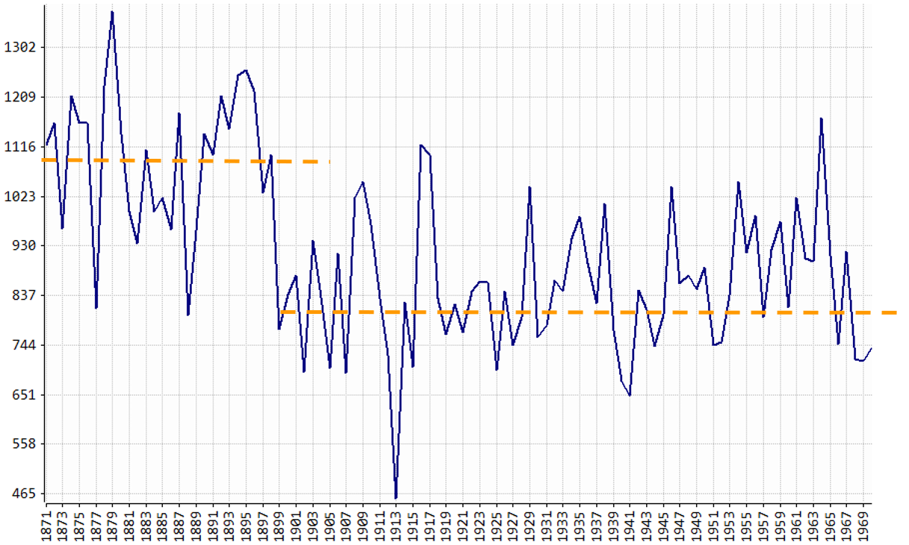


<br>

 > Ejemplo: España: Viviendas Iniciadas. Ene-1989/Jun-2012. Mensual. Miles de Viviendas


<br>

 > Ejemplo: Madrid: Temperatura Media en el Parque del Retiro. Ene-1989/Dic-2011. Mensual. 


En las secciones siguiente se describen brevemente algunos conceptos necesarios para la modelación básica de series temporales.


## Herramientas de Análisis

### Autocorrelación (acf y pacf)

 > Los **correlogramas** permiten representar las funciones de autocorrelación simple (fas) y parcial (fap).


<br>
<div class="info">
El coeficiente de **correlación simple** (y así la fas) refleja la correlación entre la variable $Y$ y el valor retardado de la misma en $k$ instantes anteriores (_lags_).
</div>

<!--html_preserve--><div id="htmlwidget-702057a598725ed2742b" style="width:100%;height:500px;" class="highchart html-widget"></div>
<script type="application/json" data-for="htmlwidget-702057a598725ed2742b">{"x":{"hc_opts":{"title":{"text":null},"yAxis":{"title":{"text":null},"plotLines":[{"width":1,"value":0.15121450430979,"color":"gray"},{"width":1,"value":-0.15121450430979,"color":"gray"}]},"credits":{"enabled":false},"exporting":{"enabled":false},"plotOptions":{"series":{"label":{"enabled":false},"turboThreshold":0},"treemap":{"layoutAlgorithm":"squarified"}},"series":[{"data":[{"x":1,"y":1},{"x":2,"y":0.783397088486988},{"x":3,"y":0.797674175095493},{"x":4,"y":0.70094913998832},{"x":5,"y":0.628516973454341},{"x":6,"y":0.621069208549086},{"x":7,"y":0.545329986345518},{"x":8,"y":0.594114591717929},{"x":9,"y":0.562803718796614},{"x":10,"y":0.628630937958141},{"x":11,"y":0.675507452800804},{"x":12,"y":0.632540229151492},{"x":13,"y":0.778050866506525},{"x":14,"y":0.614559263635705},{"x":15,"y":0.660621821243294},{"x":16,"y":0.586713444785467},{"x":17,"y":0.516053002073007},{"x":18,"y":0.499790913086736},{"x":19,"y":0.415497437094928},{"x":20,"y":0.459484826893105},{"x":21,"y":0.434303423855208},{"x":22,"y":0.492765177199711},{"x":23,"y":0.534870725372779},{"x":24,"y":0.490711053351621},{"x":25,"y":0.618257011408169},{"x":26,"y":0.456774454281538},{"x":27,"y":0.500826571605589},{"x":28,"y":0.424241233891209},{"x":29,"y":0.348200688225802},{"x":30,"y":0.334473864988686},{"x":31,"y":0.258639994180786},{"x":32,"y":0.289463746938356},{"x":33,"y":0.248775391714725},{"x":34,"y":0.30078638112667},{"x":35,"y":0.323969761145356},{"x":36,"y":0.291029643118559},{"x":37,"y":0.422696301586496}],"type":"column","groupPadding":1,"name":"ACF"}]},"theme":{"chart":{"backgroundColor":"transparent"}},"conf_opts":{"global":{"Date":null,"VMLRadialGradientURL":"http =//code.highcharts.com/list(version)/gfx/vml-radial-gradient.png","canvasToolsURL":"http =//code.highcharts.com/list(version)/modules/canvas-tools.js","getTimezoneOffset":null,"timezoneOffset":0,"useUTC":true},"lang":{"contextButtonTitle":"Chart context menu","decimalPoint":".","downloadJPEG":"Download JPEG image","downloadPDF":"Download PDF document","downloadPNG":"Download PNG image","downloadSVG":"Download SVG vector image","drillUpText":"Back to {series.name}","invalidDate":null,"loading":"Loading...","months":["January","February","March","April","May","June","July","August","September","October","November","December"],"noData":"No data to display","numericSymbols":["k","M","G","T","P","E"],"printChart":"Print chart","resetZoom":"Reset zoom","resetZoomTitle":"Reset zoom level 1:1","shortMonths":["Jan","Feb","Mar","Apr","May","Jun","Jul","Aug","Sep","Oct","Nov","Dec"],"thousandsSep":" ","weekdays":["Sunday","Monday","Tuesday","Wednesday","Thursday","Friday","Saturday"]}},"type":"chart","fonts":[],"debug":false},"evals":[],"jsHooks":[]}</script><!--/html_preserve-->


<br>
<div class="info">
El **coeficiente de correlación parcial (y así la fap) calcula la correlación directa eliminando posibles dependencias asociadas a retardos intermedios.
</div>


<!--html_preserve--><div id="htmlwidget-3ebb3a5c9536006ffa94" style="width:100%;height:500px;" class="highchart html-widget"></div>
<script type="application/json" data-for="htmlwidget-3ebb3a5c9536006ffa94">{"x":{"hc_opts":{"title":{"text":null},"yAxis":{"title":{"text":null},"plotLines":[{"width":1,"value":0.15121450430979,"color":"gray"},{"width":1,"value":-0.15121450430979,"color":"gray"}]},"credits":{"enabled":false},"exporting":{"enabled":false},"plotOptions":{"series":{"label":{"enabled":false},"turboThreshold":0},"treemap":{"layoutAlgorithm":"squarified"}},"series":[{"data":[{"x":1,"y":0.783397088486987},{"x":2,"y":0.476231981786033},{"x":3,"y":0.00190855932243036},{"x":4,"y":-0.131266950703901},{"x":5,"y":0.153379921553969},{"x":6,"y":-0.00279502904739451},{"x":7,"y":0.216010525427943},{"x":8,"y":0.0872074767562217},{"x":9,"y":0.219279208702651},{"x":10,"y":0.249536686795185},{"x":11,"y":-0.136602524812037},{"x":12,"y":0.425969661025725},{"x":13,"y":-0.406746234367209},{"x":14,"y":-0.00710300734815154},{"x":15,"y":0.0624763664681598},{"x":16,"y":-0.216134250446931},{"x":17,"y":-0.0319999233767096},{"x":18,"y":-0.0457374051903199},{"x":19,"y":-0.00797778476108283},{"x":20,"y":0.182683244070538},{"x":21,"y":-0.0581551437574748},{"x":22,"y":0.0897654721812806},{"x":23,"y":-0.0262257575949851},{"x":24,"y":0.0222503690315024},{"x":25,"y":-0.198916617976328},{"x":26,"y":-0.0572524631372196},{"x":27,"y":0.0217489791288166},{"x":28,"y":-0.135333692582043},{"x":29,"y":-0.0112037641541242},{"x":30,"y":0.0649417484442096},{"x":31,"y":-0.120418906808004},{"x":32,"y":0.0102196267865365},{"x":33,"y":0.0216780611084543},{"x":34,"y":-0.069725742054035},{"x":35,"y":0.0714776190911739},{"x":36,"y":0.0967782743403928}],"type":"column","groupPadding":1,"name":"Partial ACF"}]},"theme":{"chart":{"backgroundColor":"transparent"}},"conf_opts":{"global":{"Date":null,"VMLRadialGradientURL":"http =//code.highcharts.com/list(version)/gfx/vml-radial-gradient.png","canvasToolsURL":"http =//code.highcharts.com/list(version)/modules/canvas-tools.js","getTimezoneOffset":null,"timezoneOffset":0,"useUTC":true},"lang":{"contextButtonTitle":"Chart context menu","decimalPoint":".","downloadJPEG":"Download JPEG image","downloadPDF":"Download PDF document","downloadPNG":"Download PNG image","downloadSVG":"Download SVG vector image","drillUpText":"Back to {series.name}","invalidDate":null,"loading":"Loading...","months":["January","February","March","April","May","June","July","August","September","October","November","December"],"noData":"No data to display","numericSymbols":["k","M","G","T","P","E"],"printChart":"Print chart","resetZoom":"Reset zoom","resetZoomTitle":"Reset zoom level 1:1","shortMonths":["Jan","Feb","Mar","Apr","May","Jun","Jul","Aug","Sep","Oct","Nov","Dec"],"thousandsSep":" ","weekdays":["Sunday","Monday","Tuesday","Wednesday","Thursday","Friday","Saturday"]}},"type":"chart","fonts":[],"debug":false},"evals":[],"jsHooks":[]}</script><!--/html_preserve-->


<br>
<div class="rmdcomment">
Los correlogramas permiten representar las _acf_ y _pacf_ que solo tienen sentido dentro del ámbito de los procesos estacionarios porque asumen que **la correlación entre dos valores de la serie sólo depende de su distancia**, no del instante del tiempo al que van referidos.
</div>


<!--html_preserve--><div id="htmlwidget-80e824cb46957420784d" style="width:100%;height:500px;" class="highchart html-widget"></div>
<script type="application/json" data-for="htmlwidget-80e824cb46957420784d">{"x":{"hc_opts":{"title":{"text":null},"yAxis":{"title":{"text":null},"plotLines":[{"width":1,"value":0.156922707184431,"color":"gray"},{"width":1,"value":-0.156922707184431,"color":"gray"}]},"credits":{"enabled":false},"exporting":{"enabled":false},"plotOptions":{"series":{"label":{"enabled":false},"turboThreshold":0},"treemap":{"layoutAlgorithm":"squarified"}},"series":[{"data":[{"x":1,"y":1},{"x":2,"y":0.657797493706555},{"x":3,"y":0.421249710043682},{"x":4,"y":0.283936401564504},{"x":5,"y":0.258699451735003},{"x":6,"y":0.200171426688023},{"x":7,"y":0.172481009195921},{"x":8,"y":0.136143460187837},{"x":9,"y":0.0902290153722934},{"x":10,"y":0.0987705366299642},{"x":11,"y":0.037144129272639},{"x":12,"y":-0.0635246096424366},{"x":13,"y":-0.203174612444474},{"x":14,"y":-0.0749219245848846},{"x":15,"y":-0.0209418899395135},{"x":16,"y":0.0289085490675056},{"x":17,"y":0.0315712270131747},{"x":18,"y":0.0150200928125578},{"x":19,"y":-0.0328440934570089},{"x":20,"y":0.0166745971308946},{"x":21,"y":0.0906534357743549},{"x":22,"y":0.0759023066939319},{"x":23,"y":0.126911807716364},{"x":24,"y":0.0929214655291028},{"x":25,"y":0.0353284349868526},{"x":26,"y":0.0208357820607895},{"x":27,"y":0.0772373211466757},{"x":28,"y":0.0527070530283465},{"x":29,"y":0.0178715506454067},{"x":30,"y":-0.00178571726814478},{"x":31,"y":0.0285578308975456},{"x":32,"y":-0.00412593961162829},{"x":33,"y":-0.0415614079512498},{"x":34,"y":-0.0295168002284256},{"x":35,"y":-0.125383661507524},{"x":36,"y":-0.135572012385884},{"x":37,"y":-0.10303413356668}],"type":"column","groupPadding":1,"name":"ACF"}]},"theme":{"chart":{"backgroundColor":"transparent"}},"conf_opts":{"global":{"Date":null,"VMLRadialGradientURL":"http =//code.highcharts.com/list(version)/gfx/vml-radial-gradient.png","canvasToolsURL":"http =//code.highcharts.com/list(version)/modules/canvas-tools.js","getTimezoneOffset":null,"timezoneOffset":0,"useUTC":true},"lang":{"contextButtonTitle":"Chart context menu","decimalPoint":".","downloadJPEG":"Download JPEG image","downloadPDF":"Download PDF document","downloadPNG":"Download PNG image","downloadSVG":"Download SVG vector image","drillUpText":"Back to {series.name}","invalidDate":null,"loading":"Loading...","months":["January","February","March","April","May","June","July","August","September","October","November","December"],"noData":"No data to display","numericSymbols":["k","M","G","T","P","E"],"printChart":"Print chart","resetZoom":"Reset zoom","resetZoomTitle":"Reset zoom level 1:1","shortMonths":["Jan","Feb","Mar","Apr","May","Jun","Jul","Aug","Sep","Oct","Nov","Dec"],"thousandsSep":" ","weekdays":["Sunday","Monday","Tuesday","Wednesday","Thursday","Friday","Saturday"]}},"type":"chart","fonts":[],"debug":false},"evals":[],"jsHooks":[]}</script><!--/html_preserve-->


### Operadores (del Tiempo)


 > Operador de **Retardo** Simple

El **operador de retardo simple** se define como
$$Bz_t=z_{t-1}$$


Si aplicamos el operador de retardo dos veces:
$$BBz_t=Bz_{t-1}=z_{t-2}$$
Del mismo modo, si aplicamos $n$ veces el operador de retardo, obtenemos:
$$ BB \ldots Bz_t=z_{t-n} $$
Definimos, por tanto
$$ B^n z_t=z_{t-n} $$

 > Operador de **Adelanto** simple
 
De modo análogo, definimos el **operador de adelanto simple**
$$
\begin{align}
    Fz_t&=z_{t+1}\\
    F^n z_t&=z_{t+n}
\end{align}
$$

El operador $F$ es el inverso del operador $B$ ya que:
$$
FBz_t=BFz_t=z_t
$$
Por tanto, $BF=FB=1,$ lo que implica que $F=B^{-1}$.

 > Polinomios en $B$

Sea el polinomio en el operador de retardo $B$:
$$
\phi_0 - \phi_1 B - \ldots - \phi_pB^p
$$
La operación de este polinomio se define como:
$$
(\phi_0 - \phi_1 B - \ldots - \phi_pB^p)z_t=\phi_0z_t+\phi_1z_{t-1}+\ldots+\phi_pz_{t-p}
$$
Llamamos **polinomio autorregresivo** de orden $p$ al polinomio de grado $p$
$$
1-\phi_1B-\dots-\phi_pB^p
$$
La razón de esta nomenclatura es que si tenemos una serie cuyo comportamiento puede expresarse como
$$
(1-\phi_1B-\dots-\phi_pB^p)z_t=e_t
$$
donde $e_t$ es un término de error, la anterior expresión puede escribirse como:
$$
    z_t=\phi_1 z_{t-1}+ \ldots + \phi_p z_{t-p} + e_t
$$

Es decir, como una regresión donde la serie $z_t$ es el *output* y los propios retardos $1,2,\ldots,p$ de la variable actúan como *inputs* o regresores construyendo una **autorregresión**.

En muchas ocasiones emplearemos las formas $\phi(B), \psi(B), \varphi(B)$ u otras semejantes para denotar polinomios en $B$. Notaremos más adelante que asociaremos ciertas formas de expresar polinomios en $B$ como $\phi(B)$ a clases de polinomios en $B$ que juegan cierto papel especial. Por ejemplo, reservaremos la expresi?n $\phi(B)$ a polinomios autorregresivos.

 > Operador **Diferencia**

El operador diferencia respecto al pasado, en lo sucesivo simplemente **operador diferencia**, se define como:
$$
\bigtriangledown z_t = z_t - z_{t-1},
$$
que puede expresarse como:
$$
\bigtriangledown z_t = z_t - z_{t-1},
$$
que puede expresarse como
$$
(1-B)z_t=\bigtriangledown z_t.
$$
Por lo tanto: $\bigtriangledown =1-B$.
El operador de \textbf{diferencia peri?dica}, usualmente **diferencia estacional**, se define como
$$
\bigtriangledown_s z_t=z_t-z_{t-s}=(1-B^s)z_t.
$$
Luego, $\bigtriangledown_s=(1-B^s).$

Debe observarse que cuando aplicamos el operador $B$ a una serie $S$ lo que hacemos en realidad es **adelantar** la serie un periodo. Análogamente, cuando aplicamos el operador $F$ a una serie $S$ **retrasamos** la serie un periodo.


## Alisado Exponencial


  <br>
  <div class="info">
  El alisado exponencial es una técnica aplicada a series de tiempo, para **suavizarlas** u obtener previsiones.
  </div>
 
 * Mientras que, con la media móvil, las observaciones pasadas se ponderan por igual, en el alisado exponencial se asignan ponderaciones exponencialmente decrecientes en el tiempo.
 
 * La fórmula utilizada es:
 
   $$ y_1 = x_0  $$
   $$ y_t = (1-\theta)x_{t-1}+\theta y_{t-1},  t > 1 $$

donde $\{x_t\}$ son las observaciones reales, $\{y_t\}$ son las estimaciones y  $\theta$ es el factor de alisamiento, $0 < \theta < 1$.
        
En otras palabras, con este método, la previsión para el periodo $t$ (valor esperado) como la suma ponderada de todas la observaciones anteriores, dando mayor importancia a las observaciones más recientes que a las más antiguas. Como puede verse en:
 
$$ y_t = (1-\theta) x_{t-1} +\theta y_{t-1} $$ 
$$ y_t = (1-\theta)x_{t-1}+(1-\theta)\theta x_{t-2}+(1-\theta) \theta^2 y_{t-2} $$
$$ y_t = (1-\theta)[x_{t-1}+\theta x_{t-2}+\theta x_{t-3}+\theta x_{t-4}+ ...] + \theta^{t-1} x_0 $$ 
Así, los pesos asignados a las observaciones previas pertenecen a una proporción de la progresión geométrica: $\{1, \theta, \theta^2, \theta^3, ..\}$.
            
 * Por otro lado, si la ecuación arriba se expresa como: 

$$
                y_t = x_{t-1} + \theta(y_{t-1} - x_{t-1}) ,  
$$
            
Se aprecia que $y_t$ está formada por la suma de la observación en el periodo anterior ($x_{t-1}$) más una proporción ($\theta$) del error cometido ($y_{t-1} - x_{t-1}$). Por lo tanto el valor de $\theta$ controla la rapidez con que la previsión se adapta a los cambios del nivel de la serie (estado).
            
 * Si $\theta$ es grande (próximo a 1), la previsión se adapta rápidamente a los cambios, por lo tanto se debe utilizar en series poco estables.
 * Si $\theta$ es pequeño (próximo a 0), se consigue eliminar el efecto de las fluctuaciones, por lo tanto se debe utilizar en series estables.
 * El valor de $\theta$ se puede optimizar minimizando la suma de cuadrados del error de previsión, es decir, resolviendo: $min(x_{t-1} - y_{t-1})^2$.
 * El alisado exponencial, técnicamente, es equivalente a un modelo *ARIMA (0,1,1)* sin constante. En otras palabras, se puede representar por:

$$\hat{y} = (1-\theta)(1 + \theta B + \theta^2 B^2 + \theta^3 B^3 + ...)x_{t-1}$$


donde $B$ es el operador retardo y $\theta$ es el parámetro de amortiguamiento. Esta representación no implica recargar el último término con un peso mayor a los valores más recientes.

Si existe un número finito de periodos observados, la ecuación anterior se reescribe como:
            
$$ \hat{y} = \alpha (1 + \theta B + \theta^2 B^2 + ... + \theta^p B^p)x_{t-1}$$
donde $p$ es el número de periodos disponibles y $\alpha <1 $ es un término que asegura que los coeficientes de la ecuación sumen la unidad. Eso permite que el peso relativo de cada uno de los datos del pasado se mantenga constante y, al mismo tiempo, el resultado siga siendo una media.
            
 * En la tabla abajo  se muestran los pesos que toman los términos, en el caso de contar con 6.

 |                   | I    | II      | III       | IV      | V   |
 | :-------------             |:----------:| ----------:| ----------:| ----------:| ----------:|
 | $\theta$                   | 0.70      | 0.65       | 0.60       | 0.55        | 0.50    |
 | $(1- \theta)$              | 0.30      | 0.35      | 0.40       | 0.45        | 0.50    |
 | $(1- \theta)\theta$       | 0.21      | 0.23      |    0.24      |    0.25   |    0.25    |
 | $(1- \theta)\theta^2$     | 0.15      | 0.15      |    0.14      |    0.14   |    0.13    |
 | $(1- \theta)\theta^3$     | 0.10      | 0.10      |    0.09      |    0.07   |    0.06    |
 | $(1- \theta)\theta^4$     | 0.07      | 0.06      |    0.05      |    0.04   |    0.03    |
 | $(1- \theta)\theta^5$     | 0.05      | 0.04      |    0.03      |    0.02   |    0.02    |
 
 
 
 
 
<!-- ------- -->

## ARIMA


 > Un proceso estocástico es un mecanismo generador de un número aleatorio de series. Una serie temporal es una realización particular de un proceso estocástico.
 


El objetivo que se plantea es **inferir el proceso estocástico que ha generado el conjunto de observaciones** que definen la serie temporal.


Para caracterizar un proceso estocástico $F(y(t_1),\ldots,y(t_N))$, se requiere de la distribución conjunta de $F(y_t), \forall t$, las distribuciones marginales  $F(y_t,y_{t+1}), \forall t$, etc.

 - **Problema**. Como sólo se dispone de una observación por instante temporal, no es posible obtener dichas distribuciones.
 
 - **Solución**. Asumir qe las distribuiones son estables (estacionarias) en el tiempo para que las distribuciones asociadas a diferentes instantes sean comparables.
 
 > Un proceso es **estacionario** en sentido estricto si el comportamiento de una colección de variables aleatórias sólo depende de su posición relativa, no del instante $t$.
 
 
 <div class="rmdcomment">
 Dada una serie temporal, el objetivo es hacerla estacionaria para asumir esa estabilidad que permita hacer que todos los instantes sean comparables.
 </div>
 
 
Una vez que el proceso (serie) es estacionario, se busca algún tipo de modelo adecuado para su caracterización: **los procesos ARMA son modelizables mediante modelos ARMA**.


$$ARMA(p,q) = (1-\phi_1 B - \ldots - \phi_p B^p)X_t = (1- \theta_1 B - \ldots - \theta_q B^q)a_t$$

### Parte AR (Autorregresiva)

 > La parte autogresica del modelos muestra la dependencia del dato real con su propio pasado. Se trata de una regresión de la variable en sí misma (autoregresión).
 
 $$AR(p): X_t= \mu_t + \phi_1X_{t-1} + \ldots + \phi_1X_{t-p} + a_t$$
 


### Parte MA (Medias Móviles)

 > La parte de medias moviles muestra la dependencia del dato real con el pasado del proceso de error (media móvil  de la serie de los errores)

Los procesos $MA$ siempre son estacionarios.


$$MA(q): X_t= \mu - \theta_1 a_{t-1} - \ldots - \theta_q a_{t-q} + a_t$$

<br>
<div class="rmdcomment">
Se requiere identificar el proceso que buyace bajo los datos, lo cual consiste en **identicar los órdenes** $p$ y $q$ del modelo ARMA que generó la serie temporal.
</div>

Las herramientas para identificar esos procesos son las funciones de autocorrelación simple y parcial.

> Ejemplo AR(2): $Y_t = 0.6Y_{t-1}+0.2Y_{t-2}+A_t$

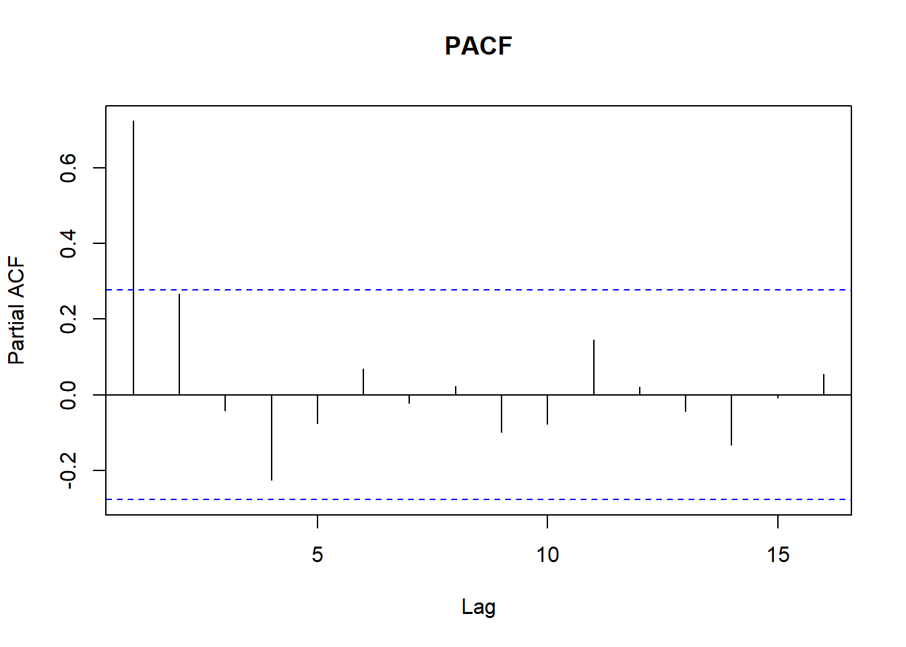

> Ejemplo MA(2): $X_t=A_t-0.6A_{t-1}-0.2A_{t-2}$

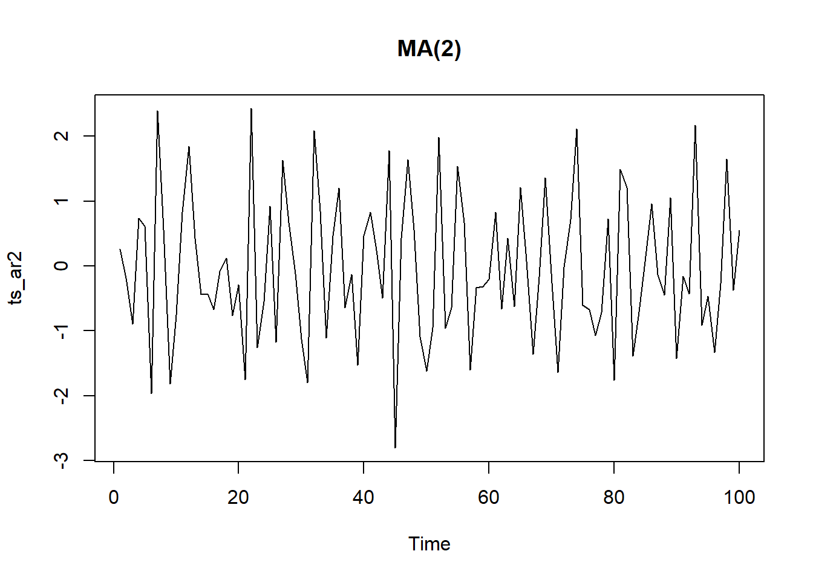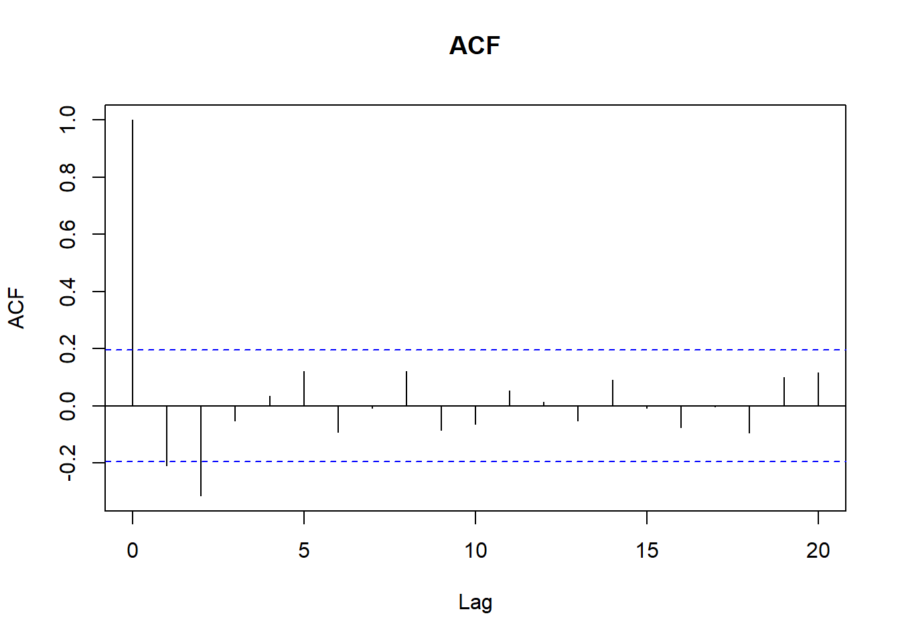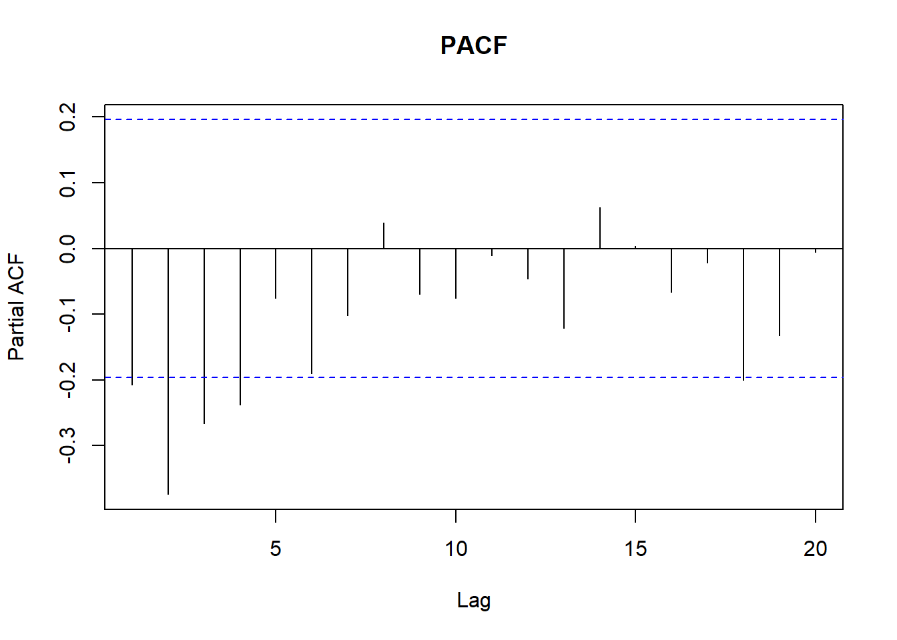

> Ejemplo ARIMA(1,1):$Y_t = -0.8 Y_{t-1} + A_t -0.8A_{t-1}$

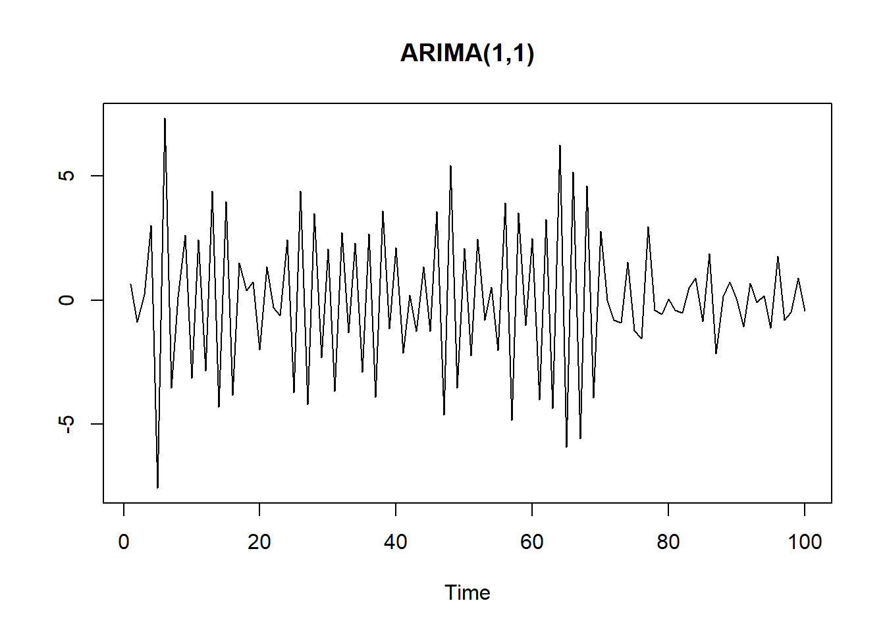


## Funciones de Transferencia

Algunos ejemplos^[Fuente de los gráficos](https://www.xycoon.com/tf_identification.htm):

<br>


## Práctica en R

Un ejemplo sencillo sobre el manejo de series temporales que puede realizarse con algunos paquetes de R.

 > Datos

Los datos utilizados corresponden a las **ventas mensuales** para una tienda de souvenirs en un balneario de Queensland, Australia, de enero de 1987 a diciembre de 1993 (Ver [aquí](http://robjhyndman.com/tsdldata/data/fancy.dat). Datos originales de Wheelwright y Hyndman, 1998).


<!--html_preserve--><div id="htmlwidget-c633aba4c69c4f1a9670" style="width:100%;height:500px;" class="highchart html-widget"></div>
<script type="application/json" data-for="htmlwidget-c633aba4c69c4f1a9670">{"x":{"hc_opts":{"title":{"text":"Monthly sales for a souvenir shop at a beach resort town in Queensland, Australia, for January 1987-December 1993","style":{"fontSize":"12px"}},"yAxis":{"title":{"text":null}},"credits":{"enabled":true,"text":"Elaborado por Innova-tsn","href":"https://www.innova-tsn.com"},"exporting":{"enabled":true},"plotOptions":{"series":{"label":{"enabled":false},"turboThreshold":0},"treemap":{"layoutAlgorithm":"squarified"}},"chart":{"type":"line","zoomType":"x"},"legend":{"enabled":true},"tooltip":{"valueDecimals":0,"shared":true,"crosshairs":true},"xAxis":{"type":"datetime","tickInterval":10,"labels":{"format":"{value:%m-%Y}","rotation":-90}},"series":[{"data":[[536457600000,7.41746628178892],[539136000000,7.78219431971372],[541555200000,7.95180929991046],[544233600000,8.17393921066467],[546825600000,8.23030014093807],[549504000000,8.22006396816164],[552096000000,8.37784146489105],[554774400000,8.17929513880233],[557452800000,8.52154769678127],[560044800000,8.76771530589945],[562723200000,8.93598247052666],[565315200000,9.89122315128614],[567993600000,7.82397000796815],[570672000000,8.55607538574002],[573177600000,8.88532188995553],[575856000000,8.47762665847418],[578448000000,8.68285677131405],[581126400000,8.5074135259989],[583718400000,8.72893114549063],[586396800000,8.46635242620086],[589075200000,8.61185406956077],[591667200000,8.67164668253439],[594345600000,9.44145844212576],[596937600000,10.2591221555078],[599616000000,8.45893252325831],[602294400000,8.64868275091755],[604713600000,9.20608934916864],[607392000000,8.57636357987714],[609984000000,8.77839216180762],[612662400000,8.79948073955071],[615254400000,8.90240389019008],[617932800000,9.00903414127095],[620611200000,9.05639283818004],[623203200000,9.1789013031408],[625881600000,9.62587725570802],[628473600000,10.4359086073296],[631152000000,8.68627752142817],[633830400000,8.66812383534513],[636249600000,9.42716399454557],[638928000000,8.75931864116395],[641520000000,8.9371028068499],[644198400000,8.88526791030584],[646790400000,9.0022356681753],[649468800000,8.98459970106459],[652147200000,8.99876218328263],[654739200000,9.04507650210367],[657417600000,9.79337465104933],[660009600000,10.3127590737202],[662688000000,8.48190585239446],[665366400000,8.77496693554935],[667785600000,9.17354878610287],[670464000000,9.08490979326442],[673056000000,9.07364626896591],[675734400000,9.23107197940138],[678326400000,9.33048062720624],[681004800000,9.43765282134659],[683683200000,9.36197846933872],[686275200000,9.51833156108381],[688953600000,9.99067895498687],[691545600000,10.7157655267851],[694224000000,8.93787920491441],[696902400000,9.19519526158966],[699408000000,9.58592342560243],[702086400000,9.35766753878483],[704678400000,9.14126463991353],[707356800000,9.4789993981795],[709948800000,9.72512494873588],[712627200000,9.89790248504199],[715305600000,10.083029416227],[717897600000,10.1421638438248],[720576000000,10.4919628691521],[723168000000,11.298762839144],[725846400000,9.2343732547976],[728524800000,9.32962272753498],[730944000000,9.99089568414157],[733622400000,9.76177017454231],[736214400000,9.68020586668178],[738892800000,9.8309991143828],[741484800000,10.1718013908294],[744163200000,10.2606905570263],[746841600000,10.3256593239152],[749433600000,10.3359622617392],[752112000000,10.7500933163369],[754704000000,11.5584786815873]],"name":"Ventas","color":"#004379","lineWidth":1}]},"theme":{"chart":{"backgroundColor":"transparent"}},"conf_opts":{"global":{"Date":null,"VMLRadialGradientURL":"http =//code.highcharts.com/list(version)/gfx/vml-radial-gradient.png","canvasToolsURL":"http =//code.highcharts.com/list(version)/modules/canvas-tools.js","getTimezoneOffset":null,"timezoneOffset":0,"useUTC":true},"lang":{"contextButtonTitle":"Chart context menu","decimalPoint":".","downloadJPEG":"Download JPEG image","downloadPDF":"Download PDF document","downloadPNG":"Download PNG image","downloadSVG":"Download SVG vector image","drillUpText":"Back to {series.name}","invalidDate":null,"loading":"Loading...","months":["January","February","March","April","May","June","July","August","September","October","November","December"],"noData":"No data to display","numericSymbols":["k","M","G","T","P","E"],"printChart":"Print chart","resetZoom":"Reset zoom","resetZoomTitle":"Reset zoom level 1:1","shortMonths":["Jan","Feb","Mar","Apr","May","Jun","Jul","Aug","Sep","Oct","Nov","Dec"],"thousandsSep":" ","weekdays":["Sunday","Monday","Tuesday","Wednesday","Thursday","Friday","Saturday"]}},"type":"chart","fonts":[],"debug":false},"evals":[],"jsHooks":[]}</script><!--/html_preserve-->


 > Librerías

A lo largo de esta práctica se utilizan las siguientes librerías: 

 * XTS: *eXtensible Time Series* y
 * HIGHCHARTER: *a R wrapper for Highcharts javascript libray and its modules. *. 

Los manual de usuario de ambos paquetes esta disponibles en la siguientes enlaces: [Manual de XTS](http://cran.r-project.org/web/packages/xts/xts.pdf) y [Manual de HIGHCHARTER](https://cran.r-project.org/web/packages/highcharter/highcharter.pdf)

Para instalar un paquete de R, se puede usar el comando: `install.packages("nombre del paquete")`. Por ejemplo, `install.packages("xts")`. De forma alternativa:


```r
# Get xts
if (!require("xts")) {install.packages("xts");    library(xts)}
# Get highcharter
if (!require("highcharter")) {install.packages("highcharter");    library(highcharter)}
# Get tseries
if (!require("tseries")) {install.packages("tseries");    library(tseries)}
```


 > Lectura y Visualización


<!-- Definimos la carpeta de trabajo y leemos el fichero de los datos con la función `read.zoo`. En este ejemplo, los datos están en el fichero `ClientesTotalesXTS.csv` que tiene formato `CSV`. Leer los datos de esta manera tiene como ventaja que las fechas son reconocidas como tal. Al usar una función como `read.csv` entienden las fechas como textos y no siempre son bien entendidas por las funciones que necesitan series temporales como input. -->

Obtenemos los datos en el site de la _Time Series Data Library_ (TSDL). (Los datos están [aquí](http://robjhyndman.com/tsdldata/data/fancy.dat). 


```r
datos = scan("http://robjhyndman.com/tsdldata/data/fancy.dat")
datos = log(datos) #transformación opcional

head(datos,5) #primeros 5 datos
```

```
FALSE [1] 7.41747 7.78219 7.95181 8.17394 8.23030
```

```r
tail(datos,5) #últimos 5 datos
```

```
FALSE [1] 10.2607 10.3257 10.3360 10.7501 11.5585
```

 >  Objeto XTS
 
La forma más conocida para la creación de un objeto de la clase serie temporal, es el uso de la función `ts`. En este ejemplo, creamos la serie temporal `sales.ts` a partir de `datos`.


Sin embargo, la manipulación de la serie es bastante más natural y amigable utilizando un objeto de la clase `xts`. En este ejemplo se crea el objeto `sales` a partir de `datos` y se hacen consultas básicas sobre su contenido (fechado, primer dato, últimas semanas, número de semanas en la muestra, etc.)


```r
sales = as.xts(sales.ts) #creación del objeto XTS
is.xts(sales) #debe devolver TRUE
```

```
FALSE [1] TRUE
```

```r
periodicity(sales) #fechado de los datos
```

```
FALSE Monthly periodicity from ene. 1987 to dic. 1993
```

```r
first(sales) #primer dato
```

```
FALSE              [,1]
FALSE ene. 1987 7.41747
```

```r
last(sales) #último dato
```

```
FALSE              [,1]
FALSE dic. 1993 11.5585
```

```r
first(sales, '7 months') #primeros 7 dias
```

```
FALSE              [,1]
FALSE ene. 1987 7.41747
FALSE feb. 1987 7.78219
FALSE mar. 1987 7.95181
FALSE abr. 1987 8.17394
FALSE may. 1987 8.23030
FALSE jun. 1987 8.22006
FALSE jul. 1987 8.37784
```

```r
last(sales, '2 quarters') #últimas dos semanas
```

```
FALSE              [,1]
FALSE jul. 1993 10.1718
FALSE ago. 1993 10.2607
FALSE sep. 1993 10.3257
FALSE oct. 1993 10.3360
FALSE nov. 1993 10.7501
FALSE dic. 1993 11.5585
```

```r
nmonths(sales) #número de meses en la muestra
```

```
FALSE [1] 84
```

```r
nquarters(sales) #número de trimestres en la muestra
```

```
FALSE [1] 28
```

```r
nyears(sales) #número de años en la muestra
```

```
FALSE [1] 7
```

> Selección de datos usando las fechas

Una funcionalidad interesante es la obtención de sub-muestras, utilizando la(s) fecha(s) como criterio(s) de selección.

```r
sales['1990-01-01/1990-05-01'] #todos los datos del 01 al 05 de Febrero de 1990
```

```
FALSE              [,1]
FALSE ene. 1990 8.68628
FALSE feb. 1990 8.66812
FALSE mar. 1990 9.42716
FALSE abr. 1990 8.75932
FALSE may. 1990 8.93710
```

```r
first(sales['1991'], '5 month') #primeros 5 meses desde Febrero de 1989
```

```
FALSE              [,1]
FALSE ene. 1991 8.48191
FALSE feb. 1991 8.77497
FALSE mar. 1991 9.17355
FALSE abr. 1991 9.08491
FALSE may. 1991 9.07365
```

```r
last(sales['1990'], '1 quarter') #datos último mes de 1990
```

```
FALSE               [,1]
FALSE oct. 1990  9.04508
FALSE nov. 1990  9.79337
FALSE dic. 1990 10.31276
```

```r
rbind(sales['1987-10/1988-03'],sales['1988-10/1989-03']) #todos los datos del 01 al 05 de Febrero de 2011 y 2012
```

```
FALSE               [,1]
FALSE oct. 1987  8.76772
FALSE nov. 1987  8.93598
FALSE dic. 1987  9.89122
FALSE ene. 1988  7.82397
FALSE feb. 1988  8.55608
FALSE mar. 1988  8.88532
FALSE oct. 1988  8.67165
FALSE nov. 1988  9.44146
FALSE dic. 1988 10.25912
FALSE ene. 1989  8.45893
FALSE feb. 1989  8.64868
FALSE mar. 1989  9.20609
```


 > Cambios de Fechado
 
El cambio de fechado o periodicidad es una operación muy útil durante el trabajo con series temporales. En este ejemplo, como la variable analizada corresponde a las ventas mensuales, se utiliza la función `sum` para obtener las ventas trimestrales y anuales.


```r
sales.qua=apply.quarterly(sales, sum) # datos trimestrales
 first(sales.qua, '3 quarters')
```

```
FALSE              [,1]
FALSE mar. 1987 23.1515
FALSE jun. 1987 24.6243
FALSE sep. 1987 25.0787
```

```r
sales.yea=apply.yearly(sales, sum) # datos anuales
 first(sales.yea, '3 years')
```

```
FALSE              [,1]
FALSE dic. 1987 100.449
FALSE dic. 1988 105.113
FALSE dic. 1989 108.676
```


 > Imputación de Datos Faltantes
 
La falta de algunos datos y/o la presencia de datos errones suele tratarse con procedimientos de imputación - para no perder histórico de la muestra disponible. El paquete `xts` posee funciones que permiten extender hacia adelante o hacia atrás, valores observados en la misma serie temporal.


```r
aux=sales['1990-01-01/1990-03-01']
sales['1990-01-01/1990-03-01']=NA
sales['1990-01-01/1990-03-01']
```

```
FALSE           [,1]
FALSE ene. 1990   NA
FALSE feb. 1990   NA
FALSE mar. 1990   NA
```

```r
(isna=which(is.na(sales))) #identifica las líneas con NA
```

```
FALSE [1] 37 38 39
```

```r
sales.na01=na.locf(sales) #repite el ultimo anterior a NA
 sales.na01[isna,]
```

```
FALSE              [,1]
FALSE ene. 1990 10.4359
FALSE feb. 1990 10.4359
FALSE mar. 1990 10.4359
```

```r
sales.na02=na.locf(sales, fromLast=TRUE) # repite el primero despues de NA
 sales.na02[isna,]
```

```
FALSE              [,1]
FALSE ene. 1990 8.75932
FALSE feb. 1990 8.75932
FALSE mar. 1990 8.75932
```

```r
sales.na03=na.locf(sales, na.rm=TRUE, fromLast=TRUE)
 sales.na03[isna,]
```

```
FALSE              [,1]
FALSE ene. 1990 8.75932
FALSE feb. 1990 8.75932
FALSE mar. 1990 8.75932
```

```r
sales[isna,]=aux
```

 > Estadísticos en diferentes fechados
 
El paquete `xts`permite trabajar con series de estadísticos en fechado agregado. Por ejemplo, el máximo del mes, el mínimo del trimestre, etc. El ingrediente indispensable es el vector que indica los puntos de quiebre de la serie. Este vector se obtiene con la función `endpoints`.


```r
aux.qq=endpoints(sales,"quarters") #indica los finales de trimestre
par(mfrow=c(1,3), cex.lab=0.8,cex.axis=0.8,las=2)
plot(period.sum(sales,aux.qq), main="Total") 
plot(period.min(sales,aux.qq), main="Mínimo")
plot(period.max(sales,aux.qq), main="Máximo")
```

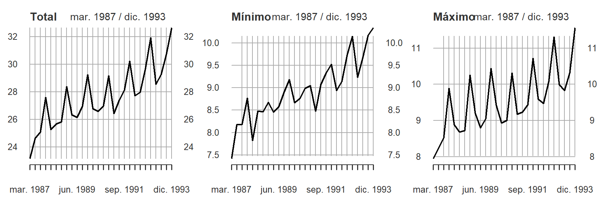

```r
aux.yy=endpoints(sales,"years") #indica los finales de año
par(mfrow=c(1,3),cex.lab=0.8,cex.axis=0.8,las=2)
plot(period.sum(sales,aux.yy), main="Total")
plot(period.min(sales,aux.yy), main="Mínimo")
plot(period.max(sales,aux.yy), main="Máximo")
```

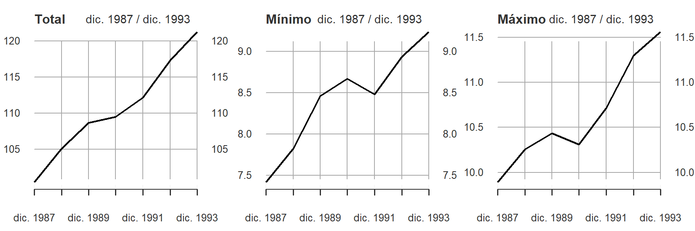

 > División del conjunto de datos usando fechas

Otra funcionalidad útil es `split`. Permite dividir el objeto original en sub-conjuntos, teniendo en cuenta un fechado y un horizonte. En este caso, se divide el objeto `sales` en sub-muestras de 4 meses cada una.

```r
sales.by.4months=split(sales, f="months",k=4) 
sales.by.4months
```

```
## [[1]]
##              [,1]
## ene. 1987 7.41747
## feb. 1987 7.78219
## mar. 1987 7.95181
## abr. 1987 8.17394
## 
## [[2]]
##              [,1]
## may. 1987 8.23030
## jun. 1987 8.22006
## jul. 1987 8.37784
## ago. 1987 8.17930
## 
## [[3]]
##              [,1]
## sep. 1987 8.52155
## oct. 1987 8.76772
## nov. 1987 8.93598
## dic. 1987 9.89122
## 
## [[4]]
##              [,1]
## ene. 1988 7.82397
## feb. 1988 8.55608
## mar. 1988 8.88532
## abr. 1988 8.47763
## 
## [[5]]
##              [,1]
## may. 1988 8.68286
## jun. 1988 8.50741
## jul. 1988 8.72893
## ago. 1988 8.46635
## 
## [[6]]
##               [,1]
## sep. 1988  8.61185
## oct. 1988  8.67165
## nov. 1988  9.44146
## dic. 1988 10.25912
## 
## [[7]]
##              [,1]
## ene. 1989 8.45893
## feb. 1989 8.64868
## mar. 1989 9.20609
## abr. 1989 8.57636
## 
## [[8]]
##              [,1]
## may. 1989 8.77839
## jun. 1989 8.79948
## jul. 1989 8.90240
## ago. 1989 9.00903
## 
## [[9]]
##               [,1]
## sep. 1989  9.05639
## oct. 1989  9.17890
## nov. 1989  9.62588
## dic. 1989 10.43591
## 
## [[10]]
##              [,1]
## ene. 1990 8.68628
## feb. 1990 8.66812
## mar. 1990 9.42716
## abr. 1990 8.75932
## 
## [[11]]
##              [,1]
## may. 1990 8.93710
## jun. 1990 8.88527
## jul. 1990 9.00224
## ago. 1990 8.98460
## 
## [[12]]
##               [,1]
## sep. 1990  8.99876
## oct. 1990  9.04508
## nov. 1990  9.79337
## dic. 1990 10.31276
## 
## [[13]]
##              [,1]
## ene. 1991 8.48191
## feb. 1991 8.77497
## mar. 1991 9.17355
## abr. 1991 9.08491
## 
## [[14]]
##              [,1]
## may. 1991 9.07365
## jun. 1991 9.23107
## jul. 1991 9.33048
## ago. 1991 9.43765
## 
## [[15]]
##               [,1]
## sep. 1991  9.36198
## oct. 1991  9.51833
## nov. 1991  9.99068
## dic. 1991 10.71577
## 
## [[16]]
##              [,1]
## ene. 1992 8.93788
## feb. 1992 9.19520
## mar. 1992 9.58592
## abr. 1992 9.35767
## 
## [[17]]
##              [,1]
## may. 1992 9.14126
## jun. 1992 9.47900
## jul. 1992 9.72512
## ago. 1992 9.89790
## 
## [[18]]
##              [,1]
## sep. 1992 10.0830
## oct. 1992 10.1422
## nov. 1992 10.4920
## dic. 1992 11.2988
## 
## [[19]]
##              [,1]
## ene. 1993 9.23437
## feb. 1993 9.32962
## mar. 1993 9.99090
## abr. 1993 9.76177
## 
## [[20]]
##               [,1]
## may. 1993  9.68021
## jun. 1993  9.83100
## jul. 1993 10.17180
## ago. 1993 10.26069
## 
## [[21]]
##              [,1]
## sep. 1993 10.3257
## oct. 1993 10.3360
## nov. 1993 10.7501
## dic. 1993 11.5585
```

```r
 #divide el conjunto de datos en partes de 4 meses cada una
summary(sales.by.4months) #indica el número de elemento que hay en cada parte
```

```
##       Length Class Mode   
##  [1,] 4      xts   numeric
##  [2,] 4      xts   numeric
##  [3,] 4      xts   numeric
##  [4,] 4      xts   numeric
##  [5,] 4      xts   numeric
##  [6,] 4      xts   numeric
##  [7,] 4      xts   numeric
##  [8,] 4      xts   numeric
##  [9,] 4      xts   numeric
## [10,] 4      xts   numeric
## [11,] 4      xts   numeric
## [12,] 4      xts   numeric
## [13,] 4      xts   numeric
## [14,] 4      xts   numeric
## [15,] 4      xts   numeric
## [16,] 4      xts   numeric
## [17,] 4      xts   numeric
## [18,] 4      xts   numeric
## [19,] 4      xts   numeric
## [20,] 4      xts   numeric
## [21,] 4      xts   numeric
```


 > Otras operaciones con los datos

Finalmente, se presenta un ejemplo de una serie obtenida a partir del uso de operaciones básicas de R como `diff` y `log`.

```r
sales.inc <- diff(log(sales), lag = 1) #Tasa de incremento mensual
sales.inc <- sales.inc[-1] #Eliminamos el primer dato por ser NA
par(mfrow=c(1,1),cex.lab=0.8,cex.axis=0.8,las=2)
plot(sales.inc, main = "Nuevas Ventas",
     col = "grey", xlab = "Date", ylab = "Variación", major.ticks='years',
     minor.ticks=FALSE)
```

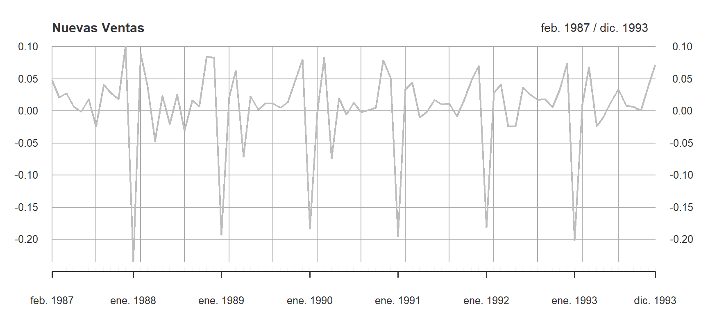


 > Gráficos con xts

Los gráficos de objetos `xts` son bastante más visuales o legibles que los objetos `ts`. La principal diferencia está en el reconocimiento de las fechas y su visualización en el eje horizontal.


```r
par(mfrow=c(1,1),cex.lab=0.8,cex.axis=0.8,las=2)
plot(sales, main = "Ventas Mensuales",
     col = innCol[1],xlab = "Date", ylab = "Ventas", major.ticks='quarters',
     minor.ticks=FALSE)
```


 > Gráficos con  highcharter

Los gráficos generados con [highcharter](http://jkunst.com/highcharter/index.html) utilizan la biblioteca [Highcharts](http://www.highcharts.com/demo)


```r
highchart() %>% 
  hc_chart(type="line",zoomType="x")%>%
  hc_title(text = "Ventas Mensuales") %>%
  hc_subtitle(text = "Gráfico Tipo Línea") %>% 
  hc_legend(enabled = T) %>%
  hc_tooltip(valueDecimals= 2,shared=T, crosshairs=T) %>%
  hc_xAxis(type = 'datetime',
           tickInterval=10,
           labels = list(format = '{value:%m-%Y}',rotation=-90)) %>% 
  hc_add_series(data=sales.ts, 
                name = "Ventas",
                color = innCol[1],
                lineWidth= 1) %>%
  hc_credits(enabled = TRUE, # add credits
             text = "Elaborado por Innova-tsn",
             href = "https://www.innova-tsn.com") %>% 
  hc_exporting(enabled = TRUE)
```

<!--html_preserve--><div id="htmlwidget-e04508283bd7dda0fd35" style="width:100%;height:500px;" class="highchart html-widget"></div>
<script type="application/json" data-for="htmlwidget-e04508283bd7dda0fd35">{"x":{"hc_opts":{"title":{"text":"Ventas Mensuales"},"yAxis":{"title":{"text":null}},"credits":{"enabled":true,"text":"Elaborado por Innova-tsn","href":"https://www.innova-tsn.com"},"exporting":{"enabled":true},"plotOptions":{"series":{"label":{"enabled":false},"turboThreshold":0},"treemap":{"layoutAlgorithm":"squarified"}},"chart":{"type":"line","zoomType":"x"},"subtitle":{"text":"Gráfico Tipo Línea"},"legend":{"enabled":true},"tooltip":{"valueDecimals":2,"shared":true,"crosshairs":true},"xAxis":{"type":"datetime","tickInterval":10,"labels":{"format":"{value:%m-%Y}","rotation":-90}},"series":[{"data":[[536457600000,7.41746628178892],[539136000000,7.78219431971372],[541555200000,7.95180929991046],[544233600000,8.17393921066467],[546825600000,8.23030014093807],[549504000000,8.22006396816164],[552096000000,8.37784146489105],[554774400000,8.17929513880233],[557452800000,8.52154769678127],[560044800000,8.76771530589945],[562723200000,8.93598247052666],[565315200000,9.89122315128614],[567993600000,7.82397000796815],[570672000000,8.55607538574002],[573177600000,8.88532188995553],[575856000000,8.47762665847418],[578448000000,8.68285677131405],[581126400000,8.5074135259989],[583718400000,8.72893114549063],[586396800000,8.46635242620086],[589075200000,8.61185406956077],[591667200000,8.67164668253439],[594345600000,9.44145844212576],[596937600000,10.2591221555078],[599616000000,8.45893252325831],[602294400000,8.64868275091755],[604713600000,9.20608934916864],[607392000000,8.57636357987714],[609984000000,8.77839216180762],[612662400000,8.79948073955071],[615254400000,8.90240389019008],[617932800000,9.00903414127095],[620611200000,9.05639283818004],[623203200000,9.1789013031408],[625881600000,9.62587725570802],[628473600000,10.4359086073296],[631152000000,8.68627752142817],[633830400000,8.66812383534513],[636249600000,9.42716399454557],[638928000000,8.75931864116395],[641520000000,8.9371028068499],[644198400000,8.88526791030584],[646790400000,9.0022356681753],[649468800000,8.98459970106459],[652147200000,8.99876218328263],[654739200000,9.04507650210367],[657417600000,9.79337465104933],[660009600000,10.3127590737202],[662688000000,8.48190585239446],[665366400000,8.77496693554935],[667785600000,9.17354878610287],[670464000000,9.08490979326442],[673056000000,9.07364626896591],[675734400000,9.23107197940138],[678326400000,9.33048062720624],[681004800000,9.43765282134659],[683683200000,9.36197846933872],[686275200000,9.51833156108381],[688953600000,9.99067895498687],[691545600000,10.7157655267851],[694224000000,8.93787920491441],[696902400000,9.19519526158966],[699408000000,9.58592342560243],[702086400000,9.35766753878483],[704678400000,9.14126463991353],[707356800000,9.4789993981795],[709948800000,9.72512494873588],[712627200000,9.89790248504199],[715305600000,10.083029416227],[717897600000,10.1421638438248],[720576000000,10.4919628691521],[723168000000,11.298762839144],[725846400000,9.2343732547976],[728524800000,9.32962272753498],[730944000000,9.99089568414157],[733622400000,9.76177017454231],[736214400000,9.68020586668178],[738892800000,9.8309991143828],[741484800000,10.1718013908294],[744163200000,10.2606905570263],[746841600000,10.3256593239152],[749433600000,10.3359622617392],[752112000000,10.7500933163369],[754704000000,11.5584786815873]],"name":"Ventas","color":"#004379","lineWidth":1}]},"theme":{"chart":{"backgroundColor":"transparent"}},"conf_opts":{"global":{"Date":null,"VMLRadialGradientURL":"http =//code.highcharts.com/list(version)/gfx/vml-radial-gradient.png","canvasToolsURL":"http =//code.highcharts.com/list(version)/modules/canvas-tools.js","getTimezoneOffset":null,"timezoneOffset":0,"useUTC":true},"lang":{"contextButtonTitle":"Chart context menu","decimalPoint":".","downloadJPEG":"Download JPEG image","downloadPDF":"Download PDF document","downloadPNG":"Download PNG image","downloadSVG":"Download SVG vector image","drillUpText":"Back to {series.name}","invalidDate":null,"loading":"Loading...","months":["January","February","March","April","May","June","July","August","September","October","November","December"],"noData":"No data to display","numericSymbols":["k","M","G","T","P","E"],"printChart":"Print chart","resetZoom":"Reset zoom","resetZoomTitle":"Reset zoom level 1:1","shortMonths":["Jan","Feb","Mar","Apr","May","Jun","Jul","Aug","Sep","Oct","Nov","Dec"],"thousandsSep":" ","weekdays":["Sunday","Monday","Tuesday","Wednesday","Thursday","Friday","Saturday"]}},"type":"chart","fonts":[],"debug":false},"evals":[],"jsHooks":[]}</script><!--/html_preserve-->

<br>


```r
hc <- highchart(type="stock") %>%
  hc_title(text = "Ventas Mensuales") %>%
  hc_subtitle(text = "Gráfico tipo Stock") %>% 
  hc_legend(enabled = T) %>%
  hc_tooltip(valueDecimals= 0) %>%
  hc_add_series(data=sales.ts, 
                name = "Ventas",
                color = innCol[1]) %>%
  hc_credits(enabled = TRUE, # add credits
             text = "Elaborado por Innova-tsn",
             href = "https://www.innova-tsn.com")
hc
```

<!--html_preserve--><div id="htmlwidget-7d556a466b30f5171030" style="width:100%;height:500px;" class="highchart html-widget"></div>
<script type="application/json" data-for="htmlwidget-7d556a466b30f5171030">{"x":{"hc_opts":{"title":{"text":"Ventas Mensuales"},"yAxis":{"title":{"text":null}},"credits":{"enabled":true,"text":"Elaborado por Innova-tsn","href":"https://www.innova-tsn.com"},"exporting":{"enabled":false},"plotOptions":{"series":{"label":{"enabled":false},"turboThreshold":0},"treemap":{"layoutAlgorithm":"squarified"}},"subtitle":{"text":"Gráfico tipo Stock"},"legend":{"enabled":true},"tooltip":{"valueDecimals":0},"series":[{"data":[[536457600000,7.41746628178892],[539136000000,7.78219431971372],[541555200000,7.95180929991046],[544233600000,8.17393921066467],[546825600000,8.23030014093807],[549504000000,8.22006396816164],[552096000000,8.37784146489105],[554774400000,8.17929513880233],[557452800000,8.52154769678127],[560044800000,8.76771530589945],[562723200000,8.93598247052666],[565315200000,9.89122315128614],[567993600000,7.82397000796815],[570672000000,8.55607538574002],[573177600000,8.88532188995553],[575856000000,8.47762665847418],[578448000000,8.68285677131405],[581126400000,8.5074135259989],[583718400000,8.72893114549063],[586396800000,8.46635242620086],[589075200000,8.61185406956077],[591667200000,8.67164668253439],[594345600000,9.44145844212576],[596937600000,10.2591221555078],[599616000000,8.45893252325831],[602294400000,8.64868275091755],[604713600000,9.20608934916864],[607392000000,8.57636357987714],[609984000000,8.77839216180762],[612662400000,8.79948073955071],[615254400000,8.90240389019008],[617932800000,9.00903414127095],[620611200000,9.05639283818004],[623203200000,9.1789013031408],[625881600000,9.62587725570802],[628473600000,10.4359086073296],[631152000000,8.68627752142817],[633830400000,8.66812383534513],[636249600000,9.42716399454557],[638928000000,8.75931864116395],[641520000000,8.9371028068499],[644198400000,8.88526791030584],[646790400000,9.0022356681753],[649468800000,8.98459970106459],[652147200000,8.99876218328263],[654739200000,9.04507650210367],[657417600000,9.79337465104933],[660009600000,10.3127590737202],[662688000000,8.48190585239446],[665366400000,8.77496693554935],[667785600000,9.17354878610287],[670464000000,9.08490979326442],[673056000000,9.07364626896591],[675734400000,9.23107197940138],[678326400000,9.33048062720624],[681004800000,9.43765282134659],[683683200000,9.36197846933872],[686275200000,9.51833156108381],[688953600000,9.99067895498687],[691545600000,10.7157655267851],[694224000000,8.93787920491441],[696902400000,9.19519526158966],[699408000000,9.58592342560243],[702086400000,9.35766753878483],[704678400000,9.14126463991353],[707356800000,9.4789993981795],[709948800000,9.72512494873588],[712627200000,9.89790248504199],[715305600000,10.083029416227],[717897600000,10.1421638438248],[720576000000,10.4919628691521],[723168000000,11.298762839144],[725846400000,9.2343732547976],[728524800000,9.32962272753498],[730944000000,9.99089568414157],[733622400000,9.76177017454231],[736214400000,9.68020586668178],[738892800000,9.8309991143828],[741484800000,10.1718013908294],[744163200000,10.2606905570263],[746841600000,10.3256593239152],[749433600000,10.3359622617392],[752112000000,10.7500933163369],[754704000000,11.5584786815873]],"name":"Ventas","color":"#004379"}]},"theme":{"chart":{"backgroundColor":"transparent"}},"conf_opts":{"global":{"Date":null,"VMLRadialGradientURL":"http =//code.highcharts.com/list(version)/gfx/vml-radial-gradient.png","canvasToolsURL":"http =//code.highcharts.com/list(version)/modules/canvas-tools.js","getTimezoneOffset":null,"timezoneOffset":0,"useUTC":true},"lang":{"contextButtonTitle":"Chart context menu","decimalPoint":".","downloadJPEG":"Download JPEG image","downloadPDF":"Download PDF document","downloadPNG":"Download PNG image","downloadSVG":"Download SVG vector image","drillUpText":"Back to {series.name}","invalidDate":null,"loading":"Loading...","months":["January","February","March","April","May","June","July","August","September","October","November","December"],"noData":"No data to display","numericSymbols":["k","M","G","T","P","E"],"printChart":"Print chart","resetZoom":"Reset zoom","resetZoomTitle":"Reset zoom level 1:1","shortMonths":["Jan","Feb","Mar","Apr","May","Jun","Jul","Aug","Sep","Oct","Nov","Dec"],"thousandsSep":" ","weekdays":["Sunday","Monday","Tuesday","Wednesday","Thursday","Friday","Saturday"]}},"type":"stock","fonts":[],"debug":false},"evals":[],"jsHooks":[]}</script><!--/html_preserve-->


> Tendencia (anual)


```r
plot(sales.ts,main="Venta", type="l")
abline(lm(sales.ts ~ time(sales.ts)),col="#9d9fa0",lty=3)
```

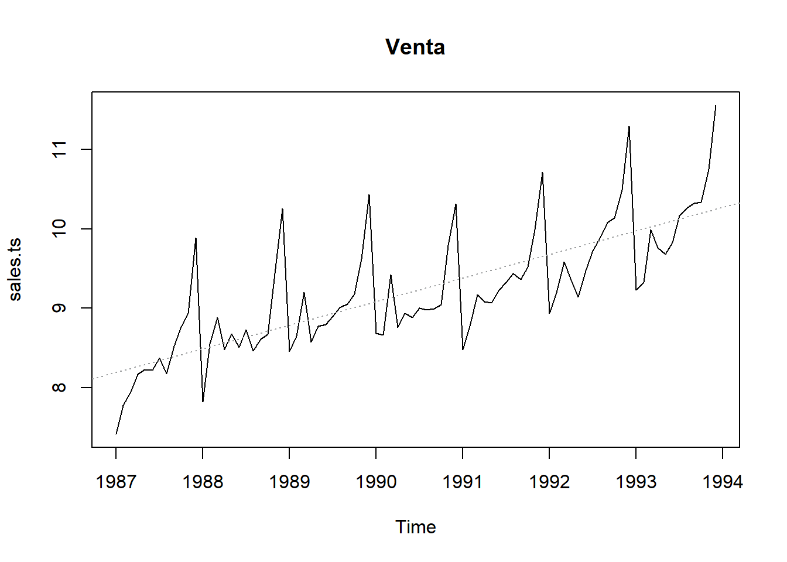


> Tendencia (anual)


```r
plot(aggregate(sales.ts,FUN=mean),main="Venta media por Año", type="h")
```

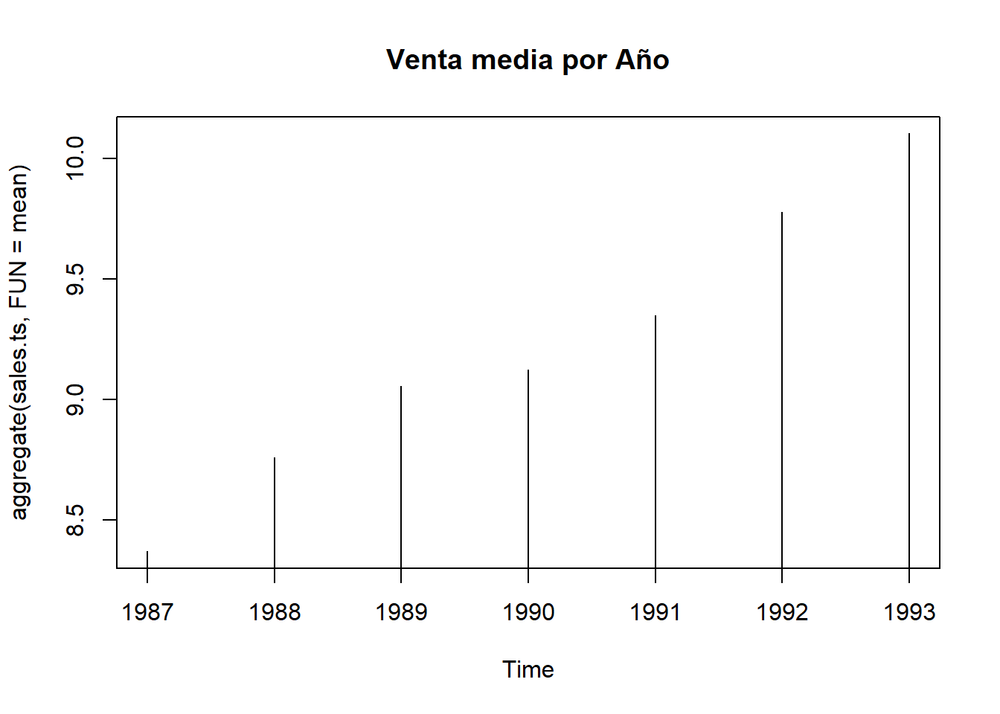


> Estacionalidad


```r
boxplot(sales.ts~cycle(sales.ts), main="Ventas por Mes")
```


> Variacion anual (diferencia)


```r
sales.ts.diff = diff(sales.ts, differences = 12)
plot(sales.ts.diff)
```


> Test de Estacionariedad


```r
adf.test(diff(sales.ts,12), alternative="stationary", k=0)
```


	Augmented Dickey-Fuller Test

data:  diff(sales.ts, 12)
Dickey-Fuller = -4.705, Lag order = 0, p-value = 0.01
alternative hypothesis: stationary


> ACF


```r
acf(sales.ts.diff)
```


```r
pacf(sales.ts.diff)
```


> Ajuste Modelo ARIMA


```r
(fit <- arima(sales.ts, c(1, 1, 0),seasonal = list(order = c(0, 1, 1), period = 12)))
```


Call:
arima(x = sales.ts, order = c(1, 1, 0), seasonal = list(order = c(0, 1, 1), 
    period = 12))

Coefficients:
         ar1    sma1
      -0.502  -0.511
s.e.   0.101   0.154

sigma^2 estimated as 0.0311:  log likelihood = 20.49,  aic = -34.99

> Previsión


```r
pred <- predict(fit, n.ahead = 5*12)
ts.plot(sales.ts,pred$pred, log = "y", lty = c(1,3), main="Previsión 5 años")
```


### Ver también

 - [Using R for Time Series Analysis](http://a-little-book-of-r-for-time-series.readthedocs.io/en/latest/src/timeseries.html#selecting-a-candidate-arima-model)
 
 - [TSA: Start to Finish Examples](https://rpubs.com/ryankelly/ts6)
 
 - [A Complete Tutorial on Time Series Modeling in R](https://www.analyticsvidhya.com/blog/2015/12/complete-tutorial-time-series-modeling/)
 
 - [Business Science Demo Week](http://www.business-science.io/code-tools/2017/10/23/demo_week_tidyquant.html)
 
 -  [TimeKit: Time Series Forecast Applications Using Data Mining](http://www.business-science.io/code-tools/2017/05/02/timekit-0-2-0.html)


 - [Time Series Data Library](https://datamarket.com/data/list/?q=provider:tsdl)

## A manera de nota final

<br>

<!--  -->


[Ver Fuente de la imagen](http://berkeleysciencereview.com/how-to-become-a-data-scientist-before-you-graduate/)
