# (PART) Machine Learning {-} 


# Introducción

Los modelos analíticos se dividen en dos grandes grupos: 

- **modelos supervisados**
- **modelos no supervisados**

## Aprendizaje supervisado

En el **aprendizaje supervisado** existen una serie de **características** *(o variables, variables independientes, variables predictoras, columnas, features)* que vamos a utilizar para decir algo de otra **variable objetivo** *(o target, variable respuesta, variable dependiente)*. Ese *decir algo* puede ser **predecir** el valor que puede tomar la variable objetivo en función de las características disponibles o intentar **explicar** porqué se comporta como se comporta.

Pongamos dos ejemplos. En una empresa eléctrica quieren desarrollar un modelo que les permita **detectar el fraude en los contadores**. En este caso, tendremos disponibles una serie de características como información del contrato del cliente (fecha de alta, datos demográficos), consumos, etcétera. También tendremos disponible la información obtenida de una campaña de inspecciones que han realizado para una muestra de los clientes y lo que se busca es **extraer un patrón de fraude** de tal forma que dadas las características de un cliente  concreto, el modelo sea capaz de devolver una probabilidad de que el cliente esté cometiendo fraude. Es decir, sea $X = (X_1, X_2, \ldots, X_n)$ el vector de las características e $Y$ el valor de la variable objetivo que, en este caso, toma valores $0$ y $1$, estamos buscando 

$$
P(Y = 1|X)
$$

En este caso, lo que interesa es **detectar el fraude con la mayor precisión posible**.

Otro ejemplo podría ser el de que se quiera desarrollar un modelo para **conceder o no un crédito** pero que seamos capaces de **saber porqué el modelo acepta o deniega un crédito.**

En el **primer ejemplo**, buscaremos un **modelo muy preciso** aunque no seamos capaces entender porqué da las predicciones que da y sería conveniente el uso de modelos propios del **Machine Learning**. En el **segundo ejemplo**, el interés es justo al contrario, queremos **entender el comportamiento** del modelo aunque esto suponga un detrimento de la capacidad predictiva y podríamos utilizar **modelos más clásicos**.

Este tipo de aprendizaje está conformado por técnicas en las que tanto las características como la variable objetivo pueden ser de diversa naturaleza (variables binarias, reales, categóricas, etcétera).

### Una reflexión

La crítica principal que se hace a los algoritmos de Machine Learning es que es complicado entender la naturaleza de las predicciones. En los últimos años están surgiendo iniciativas que permiten darle una capa explicativa a este tipo de modelos. La iniciativa con más repercusión es [LIME](https://shiring.github.io/machine_learning/2017/04/23/lime).

Ahora bien, el éxito de los modelos de machine learning frente a otros más clásicos se basa en que son capaces de adaptarse y detectar patrones complejos. Pero en la realidad, **no siempre se tiene porqué dar un patrón complejo** y podría ser suficiente con un modelo clásico. 

> Es fundamental entender la estructura de los datos y probar distintos modelos para escoger el más útil para el problema.


## Aprendizaje no supervisado

En el **aprendizaje no supervisado**, la naturaleza del problema es distinta. En estos modelos **no existe una target** y el objetivo es tratar de descubrir una estructura con las características presentes. Por ejemplo, si yo quisiese conocer qué tipología de clientes existen en mi empresa, utilizaría este tipo de técnicas para poder **segmentarlos**. 

¿Cuál es la dificultad? Al no haber una variable objetivo, es difícil saber si la agrupación realizada es correcta o no, ni siquiera podemos definir en qué grado es correcta. En los modelos supervisados, al conocer la variable objetivo, somos capaces de dar una tasa error que comete un modelo y poder así elegir aquél modelo que me proporciona una mejor tasa (el que es capaz de detectar un mayor número de los fraudes realizados, en el ejemplo de la empresa eléctrica). Por este motivo, **las técnicas no supervisadas tienen un componente de subjetividad.**


# Aprendizaje no supervisado
 
Para la resolución de los problemas suelen existir un gran número de modelos disponibles que difieren entre ellos de las hipótesis utilizadas para la construcción del modelo matemático. 

Para el caso del **aprendizaje no supervisado** discutiremos el comportamiento de las siguientes técnicas:

 - k-medias (*k-means*).
 - clustering jerárquico.

## K-medias (*k-means*)

El algoritmo de clustering de las **k-medias** es uno de los algoritmos más utilizados por su simplicidad teórica y por su eficiencia computacional. No obstante, tiene algunas limitaciones que es necesario tener en cuenta.

###  El modelo

El algoritmo trata de dividir el espacio en regiones (*clusters*) de tal forma que **toda observación pertenezca a un y solo un cluster**. Es decir, cualquier observación estará contenida en uno de los clusters que se definan y no podrá pertenecer a ningún otro.

La $k$ que aparece en el nombre de la técnica hace referencia a que el algoritmo **necesita que se especifique previamente el número de clusters $k$ que se desean obtener**. La forma de proceder del algoritmo es la siguiente:

 1. Se definen $k$ puntos aleatorios en el espacio conocidos como **centroides** y que serán los representantes de cada cluster.
 2. Se calcula la distancia -euclídea- de cada punto a cada uno de los $k$ centroides y se asigna cada punto aquel cluster cuya distancia a su centroide sea mínima.
 3. Se recalculan los $k$ centroides como **la media de las observaciones que componen cada cluster**.
 4. Se vuelve al paso 2.

El algoritmo termina cuando se satisface algún criterio de parada como, por ejemplo, que ningún punto cambie de cluster de una iteración a la siguiente.

El problema que estamos tratando de resolver mediante el algoritmo se puede ver como un **problema de optimización**. Matemáticamente, dado un conjunto de $n$ observaciones, $x_1, \ldots, x_n$ queremos buscar aquellos clusters $S^* = {S_{1}, S_{2}, ., S_{k}}$ con $k \leq n$ que minimicen la expresión

$$
S^* = \underset{S}{argmin} \sum_{i=1}^{k}\sum_{x_{j}\in S_{j}} d(x_{j}, c_{i}),
$$
donde $c_i$ es el centroide de $S_i$.

Se suele usar la distancia euclidea, pero podemos buscar otras distancias que se adecuen mejor a los datos, como por ejemplo, la norma infinita o la distancia de Manhattan.


### Un ejemplo gráfico

Para comprender mejor el comportamiento del algoritmo, veamos su funcionamiento en un ejemplo de juguete:

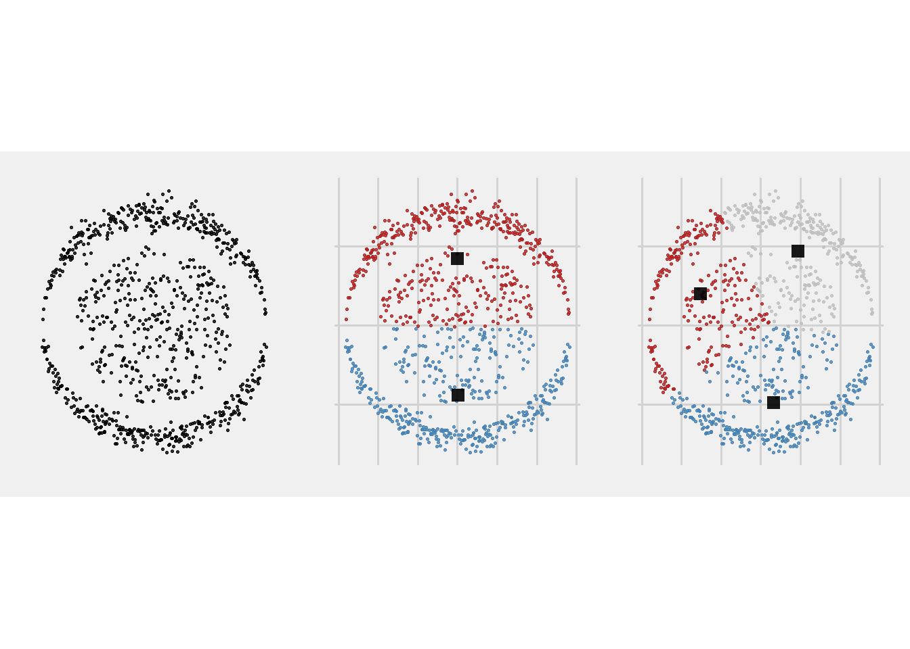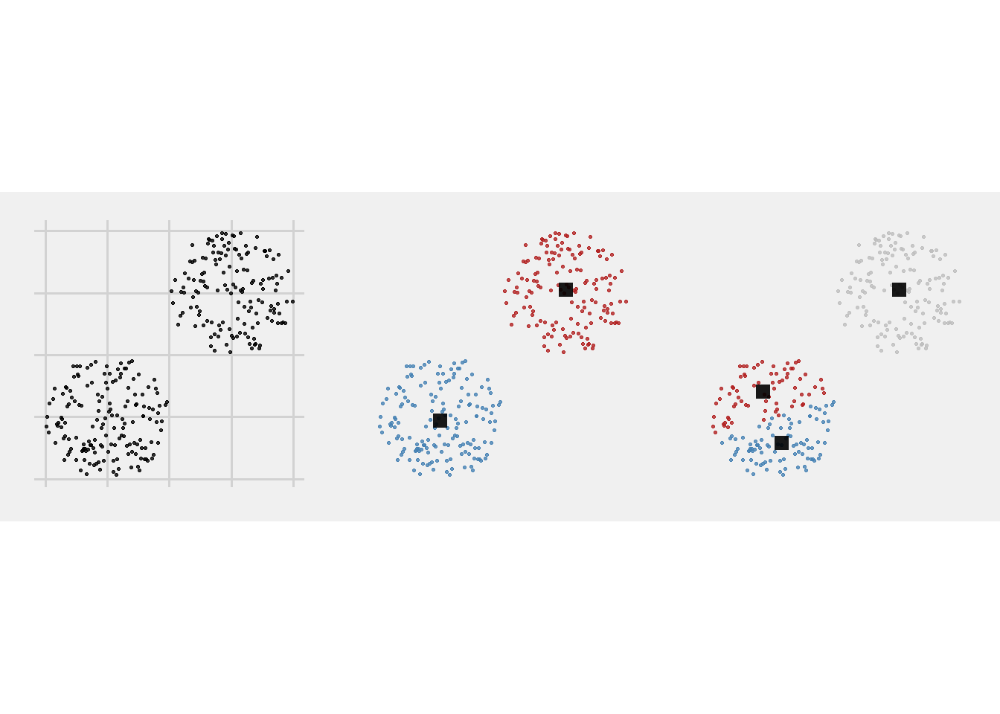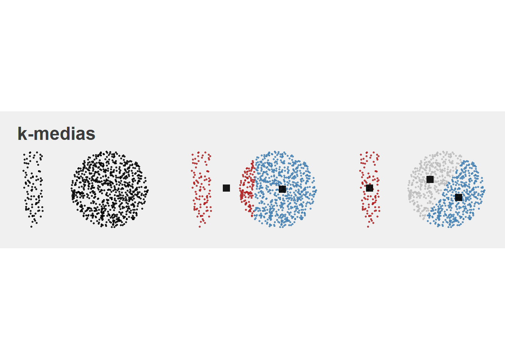


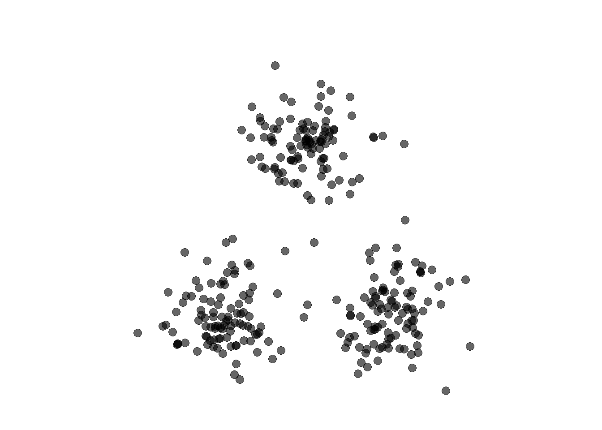

Los grupos están claramente diferenciados; es un ejemplo de clustering de libro.

El primer paso es inicializar los $k$ centroides *aleatoriamente* y asignar cada punto a su centroide más cercano.

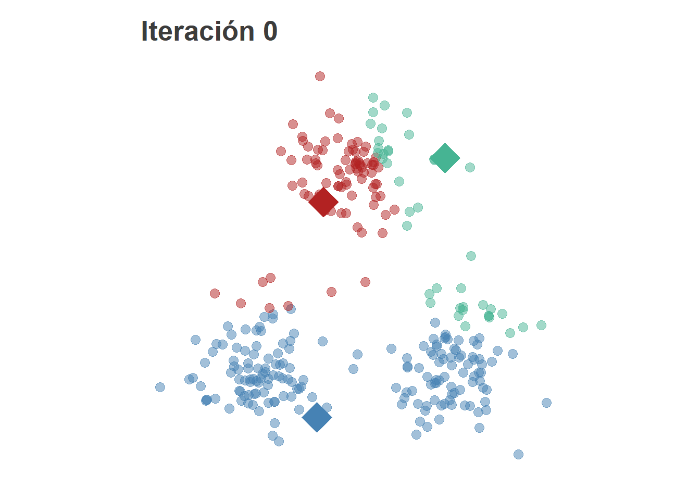

A continuación se recalculan los centroides como el punto medio de loas observaciones asignadas a un mismo cluster, es decir, 

$$
  c^{(n)}_i = \frac{1}{|g_i|} \sum_{x_j \in g_i} x_j
$$


```
## Warning: funs() is soft deprecated as of dplyr 0.8.0
## please use list() instead
## 
##   # Before:
##   funs(name = f(.))
## 
##   # After: 
##   list(name = ~ f(.))
## This warning is displayed once per session.
```


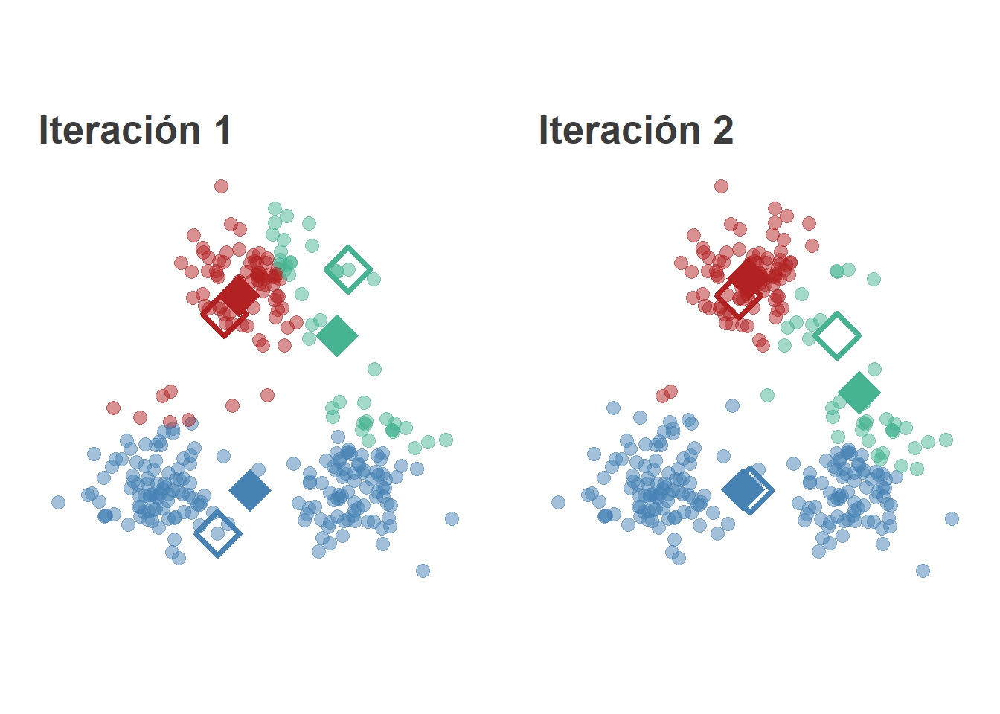

E iteramos hasta que se satisfaga la condición de parada. Llegaremos a una solución de este estilo

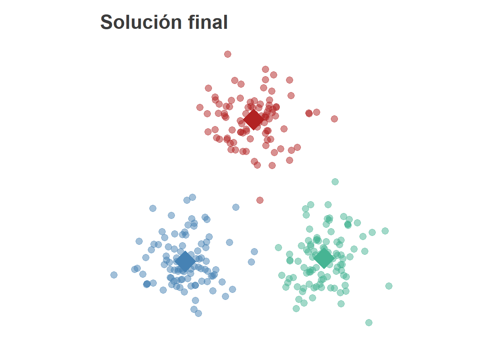

Cada uno de los **centroides** puede tomarse como **un representante de cada grupo** y será útil en la caracterización de la agrupación propuesta.

### Limitaciones del algoritmo

El ejemplo anterior es propicio para las k-medias ya que la estructura de grupos es muy simple. Sin embargo, el algoritmo se comporta peor con estructuras más complejas. Por ejemplo,


En función de la $k$ elegida, el resultado puede ser muy distinto.


Pero a un k-medias no podemos exigirle que ajuste bien este tipo de estructuras de datos. Pensemos un momento en qué es lo que intenta hacer. Más allá del algoritmo iterativo que se implementa para resolver el problema, en el fondo no es más que, dados unos centros, asignar las observaciones a aquél centro que esté más cerca. Esta partición del espacio también se conoce como **teselación de Voronoi**.


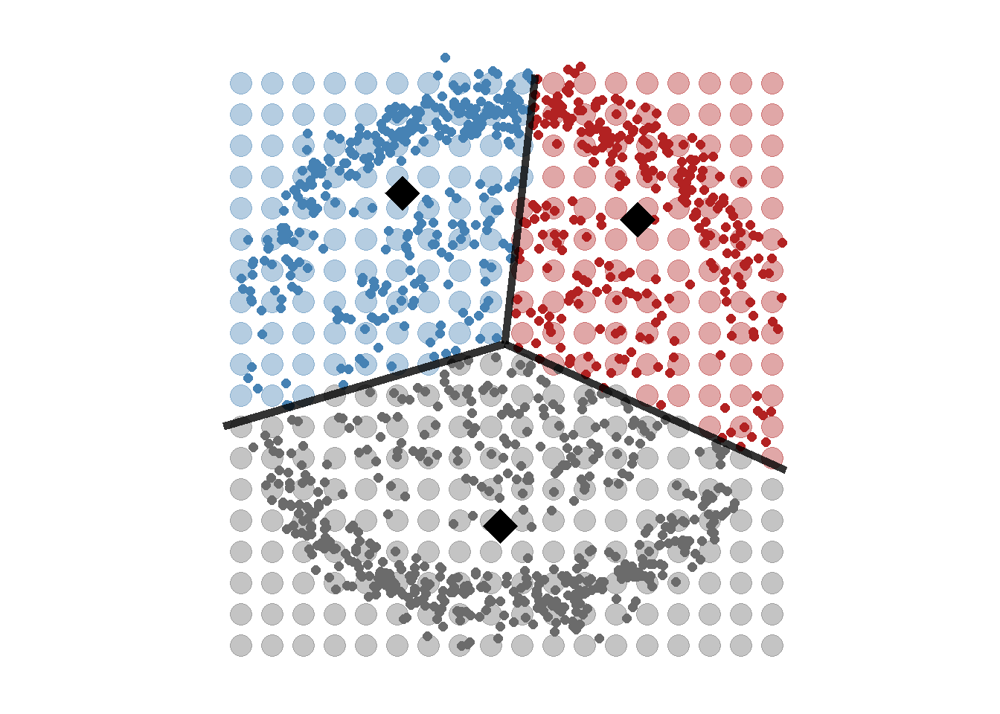

### Ventajas y desventajas

Las **ventajas** de la técnica de las k-medias son:

- Rapidez computacional.
- La existencia de un centroide ayuda a describir la solución.
- Todo punto pertenece a un cluster.
- Hay que explicitar el número de grupos a buscar.

Las **desventajas**:

- Depende mucho la semilla inicial (difícil de replicar)
- Sensible a outliers.
- Separación lineal entre clusters.
- No existe el concepto de pertenencia a un cluster.
- Todo punto pertence a un cluster.
- Hay que explicitar el número de grupos a buscar.


Los dos últimos puntos de las ventajas y desventajas son idénticos ya que se pueden ver desde los dos puntos de vista. Que todo punto pertenezca a un cluster nos asegura que vamos a ser capaces de asignarle un grupo a todos los clientes de nuestra cartera, por ejemplo. Sin embargo, pueden existir clientes cuyo comportamiento sea muy diferente al resto y podría ser que no tuviese sentido asignarlos a ningún cluster, cosa que el algoritmo de las K-medias no es capaz de hacer. 

La necesidad de explicitar el número de grupos que se quieran buscar (la $k$ del nombre del algoritmo) hace que, si se tiene claro el número de grupos que se quieren obtener, sea una ventaja, pero que si no se tiene claro, hay que actuar por ensayo-error lanzando el algoritmo variando la $k$ para obtener la mejor agrupación.


### Implementación en R

Para esta sección usaremos el data set de iris, donde tenemos datos sobre las dimensiones de pétalos y sépalos de distintas especies de flores.


```r
data(iris)
head(iris)
```

```
##   Sepal.Length Sepal.Width Petal.Length Petal.Width Species
## 1          5.1         3.5          1.4         0.2  setosa
## 2          4.9         3.0          1.4         0.2  setosa
## 3          4.7         3.2          1.3         0.2  setosa
## 4          4.6         3.1          1.5         0.2  setosa
## 5          5.0         3.6          1.4         0.2  setosa
## 6          5.4         3.9          1.7         0.4  setosa
```

Nos centraremos en las dimensiones de los pétalos.


```r
library(ggplot2)
p = ggplot(iris, aes(Petal.Length, Petal.Width, color = Species)) + geom_point()
p
```

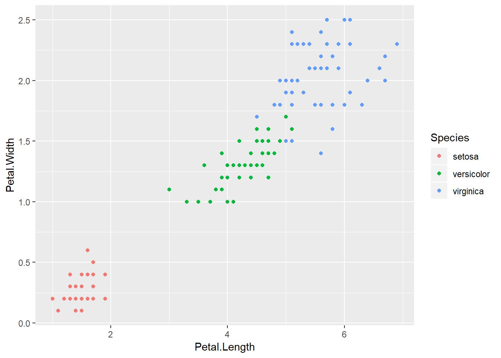

Ahora aplicamos K-means con $k=3$ y $nstart=20$. Esto significa que agrupará los datos en tres grupos y el algoritmo probará 20 distintas formas de empezar y se quedará con la mejor, es decir, seleccionará aquella con menor variación de los clústers.


```r
set.seed(20)
irisCluster = kmeans(iris[, 3:4], 3, nstart = 20)
irisCluster
```

```
## K-means clustering with 3 clusters of sizes 50, 52, 48
## 
## Cluster means:
##   Petal.Length Petal.Width
## 1     1.462000    0.246000
## 2     4.269231    1.342308
## 3     5.595833    2.037500
## 
## Clustering vector:
##   [1] 1 1 1 1 1 1 1 1 1 1 1 1 1 1 1 1 1 1 1 1 1 1 1 1 1 1 1 1 1 1 1 1 1 1 1
##  [36] 1 1 1 1 1 1 1 1 1 1 1 1 1 1 1 2 2 2 2 2 2 2 2 2 2 2 2 2 2 2 2 2 2 2 2
##  [71] 2 2 2 2 2 2 2 3 2 2 2 2 2 3 2 2 2 2 2 2 2 2 2 2 2 2 2 2 2 2 3 3 3 3 3
## [106] 3 2 3 3 3 3 3 3 3 3 3 3 3 3 2 3 3 3 3 3 3 2 3 3 3 3 3 3 3 3 3 3 3 2 3
## [141] 3 3 3 3 3 3 3 3 3 3
## 
## Within cluster sum of squares by cluster:
## [1]  2.02200 13.05769 16.29167
##  (between_SS / total_SS =  94.3 %)
## 
## Available components:
## 
## [1] "cluster"      "centers"      "totss"        "withinss"    
## [5] "tot.withinss" "betweenss"    "size"         "iter"        
## [9] "ifault"
```

A continuación, hacemos una comprobación de si el algoritmo funciona correctamente. 


```r
table(irisCluster$cluster, iris$Species)
```

```
##    
##     setosa versicolor virginica
##   1     50          0         0
##   2      0         48         4
##   3      0          2        46
```

Normalmente, esta comprobación no la podemos hacer, ya que al tratarse de aprendizaje no supervisado no tenemos las clases.


```r
p = ggplot() + geom_point(data = iris, aes(x = Petal.Length, y = Petal.Width, shape = iris$Species, color = as.factor(irisCluster$cluster))) + geom_point(data = as.data.frame(irisCluster$centers), aes(x = Petal.Length, y = Petal.Width), size = 3)
p
```

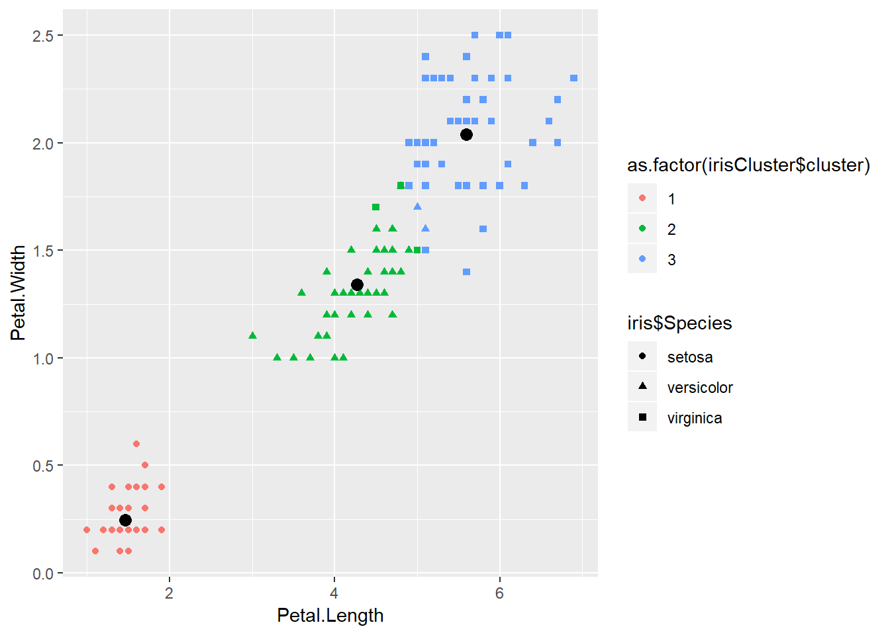


### Evaluación

Como hemos visto se puede hacer una evaluación visual del funcionamiento del algoritmo. En el caso anterior se puede plotear bien, ya que sólo usamos dos componentes. En caso de tener más componentes podemos usar un PCA y usar las dos componentes principales.


```r
library(cluster)
x = rbind(cbind(rnorm(10,0,0.5), rnorm(10,0,0.5)), cbind(rnorm(15,5,0.5), rnorm(15,5,0.5)))
clusplot(clara(x, 2))
```

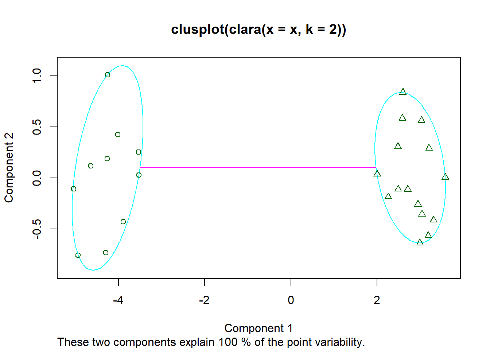

```r
x4 = cbind(x, rnorm(25), rnorm(25))
clusplot(pam(x4, 2))
```

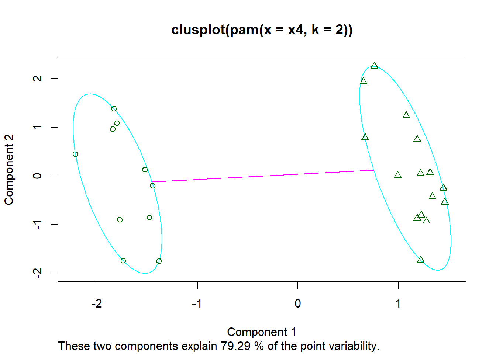

Hay que tener cuidado con estas visualizaciones, ya que reducir grandes dimensiones a dos componentes se pierde mucha información. Aunque visualmente parezca que no agrupa bien es posible que sí lo haga en una tercera componente.

Otro método más numérico es usar el coeficiente de **Silhouette**. El coeficiente de Silhouette contrasta la distancia media con los elementos en el mismo grupo con la distancia media a los elementos en otros grupos. Los objetos con un valor alto se consideran agrupados. 


```r
library(cluster)
irisCluster = clara(iris[, 3:4], k = 3, metric = "euclidean")
si = silhouette(irisCluster)
cat(paste("Cluster 1:", mean(si[, 3][si[, 1]==1]), 
          "\nCluster 2:", mean(si[, 3][si[, 1]==2]), 
          "\nCluster 3:", mean(si[, 3][si[, 1]==3])))
```

```
## Cluster 1: 0.932477754552061 
## Cluster 2: 0.647244785444017 
## Cluster 3: 0.549691563362595
```


Nota: **clara** es una variante de K-means que se suele usar cuando tienes una gran cantidad de datos. Véase también **pam**.


### Determinar el número de clústers óptimo

Hay varios criterios para determinar el número óptimo de clústers, como por ejemplo, el coeficiente de Silhouette entre otros. 

El siguiente método usa 26 criterios distintos para determinar el número óptimo de clústers.


```r
library(NbClust)
set.seed(4)
nc = NbClust(iris[, 3:4], min.nc=2, max.nc=15, method="kmeans")
```

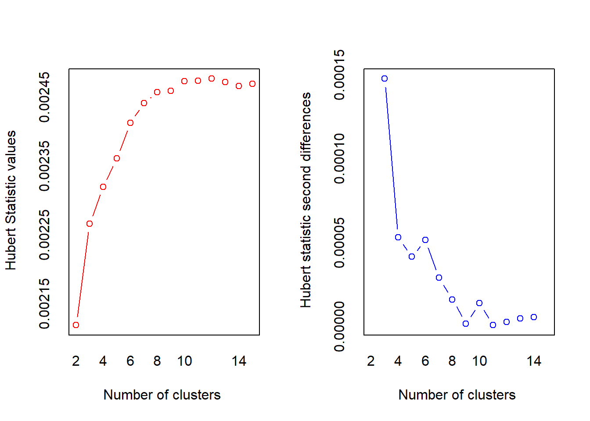

```
## *** : The Hubert index is a graphical method of determining the number of clusters.
##                 In the plot of Hubert index, we seek a significant knee that corresponds to a 
##                 significant increase of the value of the measure i.e the significant peak in Hubert
##                 index second differences plot. 
## 
```

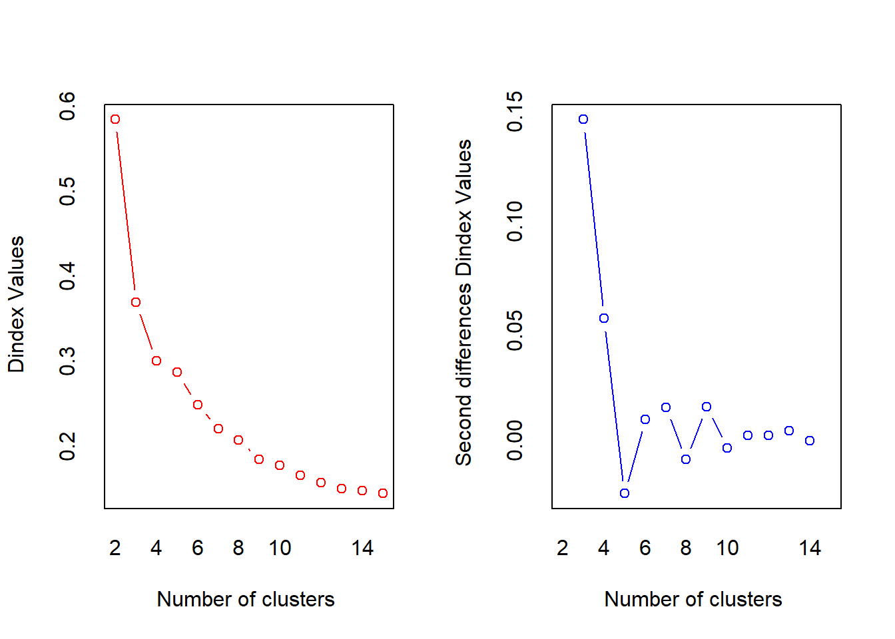

```
## *** : The D index is a graphical method of determining the number of clusters. 
##                 In the plot of D index, we seek a significant knee (the significant peak in Dindex
##                 second differences plot) that corresponds to a significant increase of the value of
##                 the measure. 
##  
## ******************************************************************* 
## * Among all indices:                                                
## * 10 proposed 2 as the best number of clusters 
## * 7 proposed 3 as the best number of clusters 
## * 1 proposed 4 as the best number of clusters 
## * 1 proposed 9 as the best number of clusters 
## * 2 proposed 11 as the best number of clusters 
## * 3 proposed 12 as the best number of clusters 
## 
##                    ***** Conclusion *****                            
##  
## * According to the majority rule, the best number of clusters is  2 
##  
##  
## *******************************************************************
```


```r
barplot(table(nc$Best.n[1,]), 
          xlab="Numer of Clusters", ylab="Number of Criteria",
          main="Number of Clusters Chosen by 26 Criteria")
```


Como podemos observar el número optimo de clúster es dos, aunque hay siete criterios que dicen que el número óptimo es tres. Esta conclusión tiene sentido observando los datos.


## Hierarchical clustering

### Modelo

El agrupamiento jerárquico es un método de análisis de grupos, el cual busca construir una jerarquía de grupos. Hoy dos tipos de estrategias para agrupamiento jerárquico:

* Aglomerativas: Este es un acercamiento ascendente. Cada observación comienza en su propio grupo y los pares de grupos son mezclados mientras uno sube en la jerarquía.

* Divisivas: Este es un acercamiento descendente. Todas las observaciones comienzan en un grupo y se realizan divisiones mientras uno baja en la jerarquía.

Es aconsejable usar los métodos **aglomerativos**, ya que tienen menor orden de complejidad. Por esta razón nos centraremos en los métodos aglomerativos.


El algoritmo funciona de la siguiente manera:

* Colocar cada punto en su propio clúster.
* Identificar los dos clústers más cercanos y combinarlos en un clúster.
* Repetir el paso anterior hasta que todos los puntos estén en un solo clúster.

Hay varios criterios de enlace:

* Agrupamiento de máximo o completo enlace.
* Agrupamiento de mínimo o simple enlace.
* Agrupamiento de enlace media o promedio (UPGMA).
* Agrupamiento de mínima energía.
* La suma de todas las varianzas intra-grupo.
* El decrecimiento en la varianza para los grupos que están siendo mezclados (criterio de Ward).
* La probabilidad de que grupos candidatos se produzcan desde la misma función de distribución (V-enlace).

### Implementación en R

Como en la sección anterior usaremos el data set de iris, así podremos comparar los métodos.

Los árboles jerárquicos se suelen representar con un dendograma.


```r
set.seed(44)
hclusters = hclust(dist(iris[, 3:4]), method = "complete")
plot(hclusters)
abline(h = 3, col = "red")
abline(h = 2, col = "red")
```

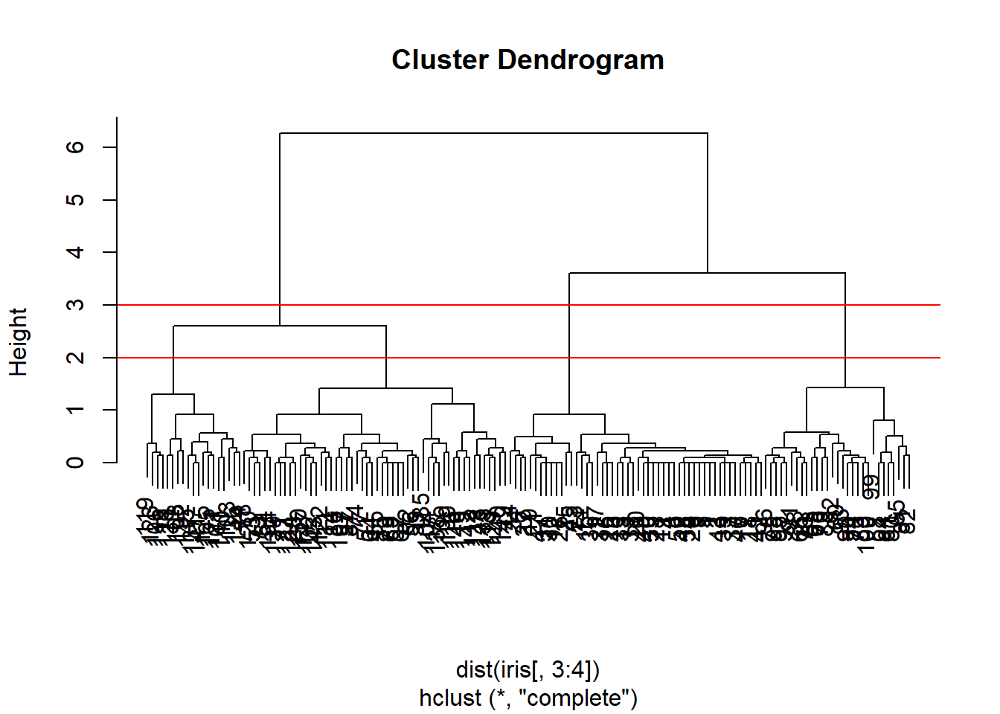

Como podemos observar en el dendograma el número óptimo de clusters es tres o cuatro. Seleccionamos tres para comparar con *Species*.


```r
clusterCut = cutree(hclusters, 3)
table(clusterCut, iris$Species)
```

```
##           
## clusterCut setosa versicolor virginica
##          1     50          0         0
##          2      0         21        50
##          3      0         29         0
```

```r
p = ggplot() + geom_point(data = iris, aes(x = Petal.Length, y = Petal.Width, shape = iris$Species, color = as.factor(clusterCut)))
p
```

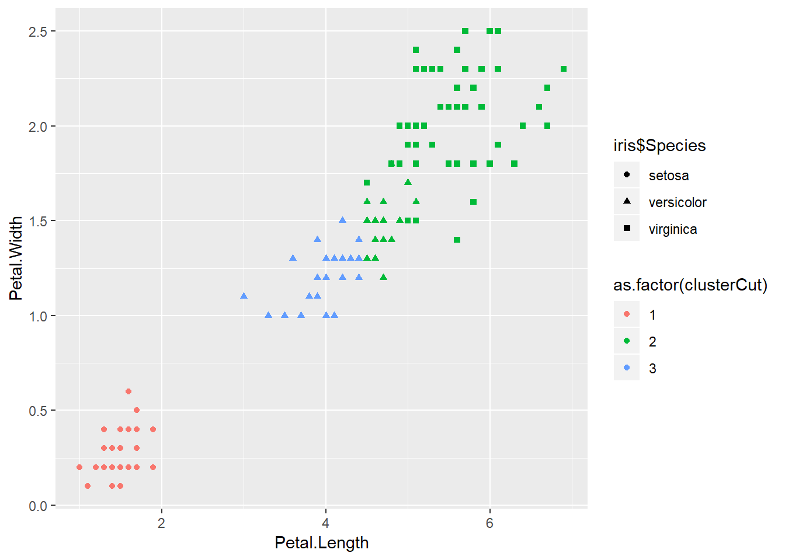

Parece que este método no va muy bien. Probamos ahora usando el criterio de agrupamiento de enlace media o promedio (UPGMA).


```r
hclusters <- hclust(dist(iris[, 3:4]), method = 'average')
plot(hclusters)
```

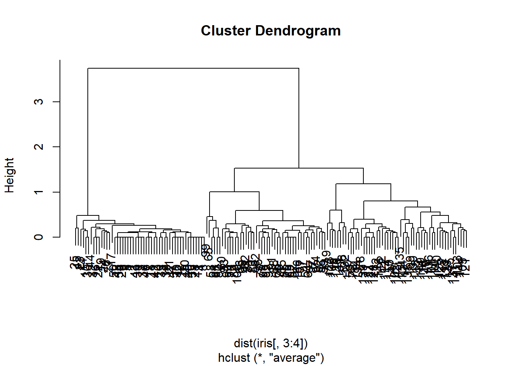


```r
clusterCut = cutree(hclusters, 3)
table(clusterCut, iris$Species)
```

```
##           
## clusterCut setosa versicolor virginica
##          1     50          0         0
##          2      0         45         1
##          3      0          5        49
```

```r
p = ggplot() + geom_point(data = iris, aes(x = Petal.Length, y = Petal.Width, shape = iris$Species, color = as.factor(clusterCut)))
p
```

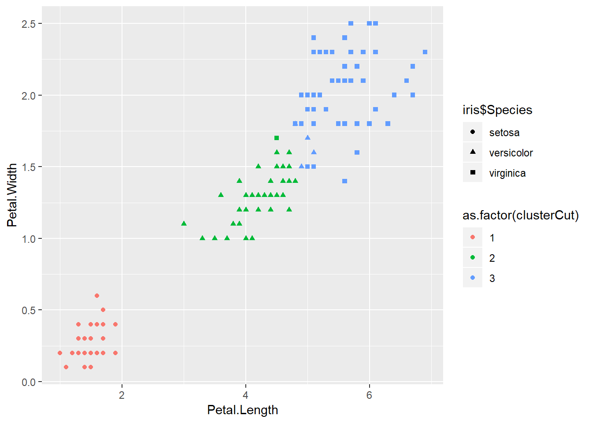

Estos resultados ya nos gustan más. Hay que recordar que normalment no podemos calcular la matriz de confusión en el aprendizaje no supervisado. 

La evaluación es análoga al método de K-means. La evaluación de los métodos no supervisados suele ser algo un poco subjetivo. Hay que buscar una métrica que se ajuste al problema y comparar distintos métodos y parámetros.

