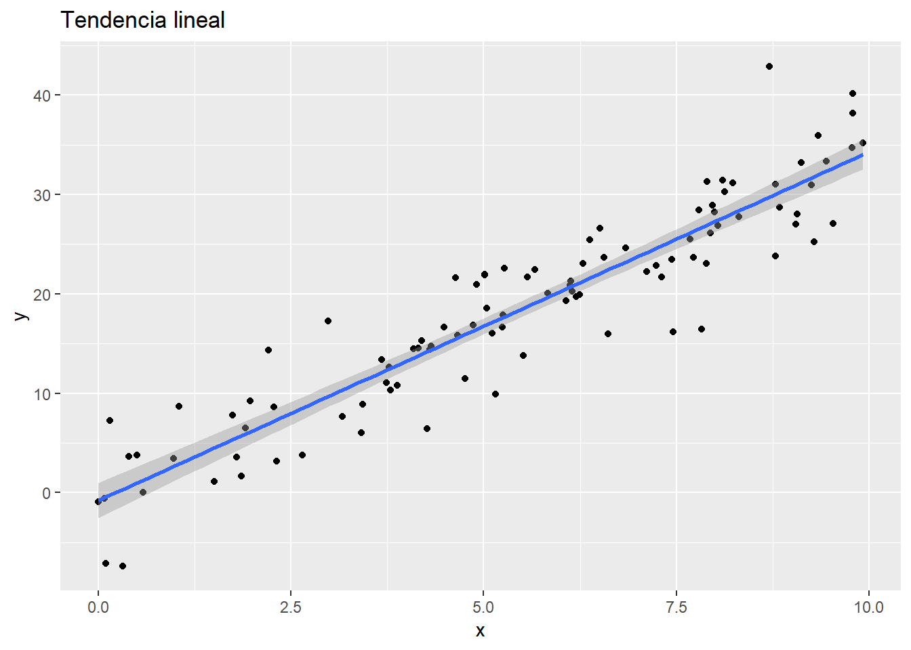
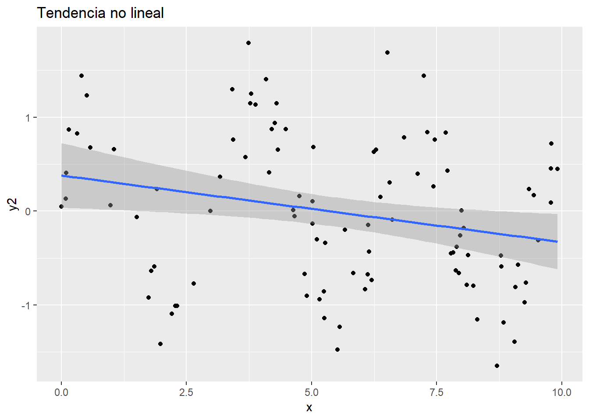
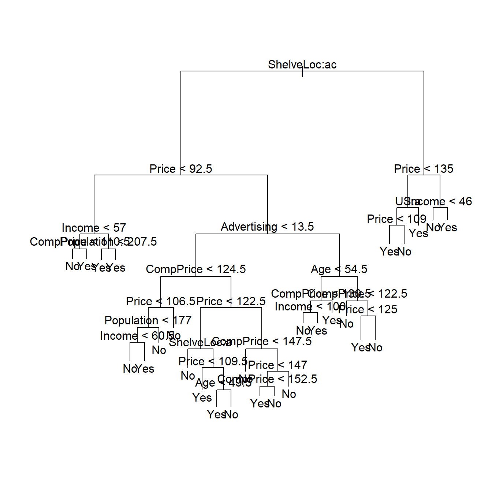

# Aprendizaje Supervisado


Los modelos de la estadística tradicional (regresiones lineales, por ejemplo) suelen ser poco flexibles por su naturaleza paramétrica, es decir, estos modelos se construyen partiendo de u
nas hipótesis y que, si estas no se cumplen, el modelo falla estrepitosamente. 

Por ejemplo, una regresión lineal supone que la estructura de los datos sigue una tendencia lineal. 



Si la estructura de los datos no sigue la hipótesis de linealidad, el modelo lineal es inservible en este caso



Los métodos propios del machine learning intentan ser **métodos flexibles** que permitan adaptarse a estructuras sin imponer hipótesis rígidas. 

Una de las ideas más potentes y que más éxito ha tenido es la de los **modelos ensamblados** Estos modelos consisten en utilizar algún tipo de modelo que a priori pueda ser débil (como un árbol de decisión) y *ensamblar* distintos modelos con algún tipo de modificación en el que cada uno enfatice alguna característica.

Los modelos ensamblados (*ensemble learning*) que más uso tienen son:

 - Bagging (bootstrap aggregating)
 - Random Forest
 - Boosting

Estos tres modelos utilizan los árboles de decisión como algoritmo base, así que primero vamos a hablar sobre ellos.

## Árboles de decisión


Los **árboles de decisión** particionan el espacio en un conjunto de rectángulos y ajustan un modelo simple (como una constante) en cada uno de ellos.


Formalmente, un árbol de decisión se puede expresar como

$$h(x; \Theta) = \sum_{j=1}^J  \gamma_J \cdot I(x\in R_j)$$

con parámetros $\Theta = \{ R_j, \gamma_j \}_1^J$. Los parámetros se buscan de forma que

$$\hat{\Theta} = \underset{\Theta}{\arg\min} \sum_{j=1}^J \sum_{x_i \in R_j} L(y_i, \gamma_j)$$

### En R

El siguiente ejemplo está sacado del libro [Introduction to statistical learning](http://www-bcf.usc.edu/~gareth/ISL/)


```r
library(tree)
library(ISLR)
datos <- Carseats
datos$High <- as.factor(ifelse(datos$Sales <= 8,
                     "No",
                     "Yes"))
names(datos)
```

```
##  [1] "Sales"       "CompPrice"   "Income"      "Advertising" "Population" 
##  [6] "Price"       "ShelveLoc"   "Age"         "Education"   "Urban"      
## [11] "US"          "High"
```

```r
tree.carseats <- tree(High ~ .-Sales, datos)
summary(tree.carseats)
```

```
## 
## Classification tree:
## tree(formula = High ~ . - Sales, data = datos)
## Variables actually used in tree construction:
## [1] "ShelveLoc"   "Price"       "Income"      "CompPrice"   "Population" 
## [6] "Advertising" "Age"         "US"         
## Number of terminal nodes:  27 
## Residual mean deviance:  0.4575 = 170.7 / 373 
## Misclassification error rate: 0.09 = 36 / 400
```

```r
plot(tree.carseats)
text(tree.carseats)
```



```r
tree.carseats
```

```
## node), split, n, deviance, yval, (yprob)
##       * denotes terminal node
## 
##   1) root 400 541.500 No ( 0.59000 0.41000 )  
##     2) ShelveLoc: Bad,Medium 315 390.600 No ( 0.68889 0.31111 )  
##       4) Price < 92.5 46  56.530 Yes ( 0.30435 0.69565 )  
##         8) Income < 57 10  12.220 No ( 0.70000 0.30000 )  
##          16) CompPrice < 110.5 5   0.000 No ( 1.00000 0.00000 ) *
##          17) CompPrice > 110.5 5   6.730 Yes ( 0.40000 0.60000 ) *
##         9) Income > 57 36  35.470 Yes ( 0.19444 0.80556 )  
##          18) Population < 207.5 16  21.170 Yes ( 0.37500 0.62500 ) *
##          19) Population > 207.5 20   7.941 Yes ( 0.05000 0.95000 ) *
##       5) Price > 92.5 269 299.800 No ( 0.75465 0.24535 )  
##        10) Advertising < 13.5 224 213.200 No ( 0.81696 0.18304 )  
##          20) CompPrice < 124.5 96  44.890 No ( 0.93750 0.06250 )  
##            40) Price < 106.5 38  33.150 No ( 0.84211 0.15789 )  
##              80) Population < 177 12  16.300 No ( 0.58333 0.41667 )  
##               160) Income < 60.5 6   0.000 No ( 1.00000 0.00000 ) *
##               161) Income > 60.5 6   5.407 Yes ( 0.16667 0.83333 ) *
##              81) Population > 177 26   8.477 No ( 0.96154 0.03846 ) *
##            41) Price > 106.5 58   0.000 No ( 1.00000 0.00000 ) *
##          21) CompPrice > 124.5 128 150.200 No ( 0.72656 0.27344 )  
##            42) Price < 122.5 51  70.680 Yes ( 0.49020 0.50980 )  
##              84) ShelveLoc: Bad 11   6.702 No ( 0.90909 0.09091 ) *
##              85) ShelveLoc: Medium 40  52.930 Yes ( 0.37500 0.62500 )  
##               170) Price < 109.5 16   7.481 Yes ( 0.06250 0.93750 ) *
##               171) Price > 109.5 24  32.600 No ( 0.58333 0.41667 )  
##                 342) Age < 49.5 13  16.050 Yes ( 0.30769 0.69231 ) *
##                 343) Age > 49.5 11   6.702 No ( 0.90909 0.09091 ) *
##            43) Price > 122.5 77  55.540 No ( 0.88312 0.11688 )  
##              86) CompPrice < 147.5 58  17.400 No ( 0.96552 0.03448 ) *
##              87) CompPrice > 147.5 19  25.010 No ( 0.63158 0.36842 )  
##               174) Price < 147 12  16.300 Yes ( 0.41667 0.58333 )  
##                 348) CompPrice < 152.5 7   5.742 Yes ( 0.14286 0.85714 ) *
##                 349) CompPrice > 152.5 5   5.004 No ( 0.80000 0.20000 ) *
##               175) Price > 147 7   0.000 No ( 1.00000 0.00000 ) *
##        11) Advertising > 13.5 45  61.830 Yes ( 0.44444 0.55556 )  
##          22) Age < 54.5 25  25.020 Yes ( 0.20000 0.80000 )  
##            44) CompPrice < 130.5 14  18.250 Yes ( 0.35714 0.64286 )  
##              88) Income < 100 9  12.370 No ( 0.55556 0.44444 ) *
##              89) Income > 100 5   0.000 Yes ( 0.00000 1.00000 ) *
##            45) CompPrice > 130.5 11   0.000 Yes ( 0.00000 1.00000 ) *
##          23) Age > 54.5 20  22.490 No ( 0.75000 0.25000 )  
##            46) CompPrice < 122.5 10   0.000 No ( 1.00000 0.00000 ) *
##            47) CompPrice > 122.5 10  13.860 No ( 0.50000 0.50000 )  
##              94) Price < 125 5   0.000 Yes ( 0.00000 1.00000 ) *
##              95) Price > 125 5   0.000 No ( 1.00000 0.00000 ) *
##     3) ShelveLoc: Good 85  90.330 Yes ( 0.22353 0.77647 )  
##       6) Price < 135 68  49.260 Yes ( 0.11765 0.88235 )  
##        12) US: No 17  22.070 Yes ( 0.35294 0.64706 )  
##          24) Price < 109 8   0.000 Yes ( 0.00000 1.00000 ) *
##          25) Price > 109 9  11.460 No ( 0.66667 0.33333 ) *
##        13) US: Yes 51  16.880 Yes ( 0.03922 0.96078 ) *
##       7) Price > 135 17  22.070 No ( 0.64706 0.35294 )  
##        14) Income < 46 6   0.000 No ( 1.00000 0.00000 ) *
##        15) Income > 46 11  15.160 Yes ( 0.45455 0.54545 ) *
```

Para puntuar nuevas observaciones, simplemente utilizamos la función `predict()` cuyos parámetros más importantes son:

 - `object`: el objeto resultante del ajuste del árbol.
 - `newdata`: el data.frame que contiene la información a puntuar.
 - `type`: el tipo de la predicción. Lo más recomendable es elegir `vector` que devuelve la probabilidad de cada clase.

### Ventajas y desventajas

Las **ventajas** son:

 - Fáciles de entender su funcionamiento.
 - Pueden ser interpretados gráficamente.
 - Pueden manejar variables cualitativas sin necesidad de crear variables *dummy*.

Las **desventajas** son:

 - No tienen un buen poder predictivo.
 - Poco robustos: un pequeño cambio en los datos suponen un gran cambio en el árbol estimado.


## Bagging y Random Forest

Uno de los problemas de los árboles de decisión es su alta varianza, es decir, un ligero cambio en los datos puede producir un gran cambio en la estructura del árbol. Para paliar este hecho, los **modelos de bagging** actúan de la siguiente forma:

 - Se obtienen **$n$ muestras bootstrap**.
 - Se ajusta un modelo para cada una de las muestras.
 - La predicción final será la media de las predicciones.

Las muestras bootstrap consisten en seleccionar **con reemplazamiento** muestras de las observaciones originales.

Esta idea se puede aplicar desde otro enfoque. Pueden existir variables que sean muy buenas predictoras y, aunque escojamos muestras bootstrap, puede que lso árboles siempre escojan estas variables haciendo que otras varaibles menos buenas no sean tenidas nunca en cuenta. Para ello, el **modelo random forest** actúa de la misma forma que el método de bagging pero **muestreando sobre las columnas en vez de las observaciones. Esto favorece que puedan intervenir variables que, a priori, no son tan buenas predictoras.

### En R


```
FALSE 
FALSE Call:
FALSE  randomForest(formula = medv ~ ., data = Boston, mtry = 13, importance = TRUE,      subset = train) 
FALSE                Type of random forest: regression
FALSE                      Number of trees: 500
FALSE No. of variables tried at each split: 13
FALSE 
FALSE           Mean of squared residuals: 10.80817
FALSE                     % Var explained: 86.91
```

```
FALSE           %IncMSE IncNodePurity
FALSE crim    12.042248    1083.56152
FALSE zn       2.144551      76.90258
FALSE indus    9.518353    1088.06694
FALSE chas     2.591068      77.14216
FALSE nox     12.346546    1002.78940
FALSE rm      32.409454    6134.55720
FALSE age     11.799314     530.13915
FALSE dis     15.362428    1309.52619
FALSE rad      3.468537      96.05578
FALSE tax      7.196484     361.87594
FALSE ptratio 10.103258    1018.55792
FALSE black    6.737108     384.53170
FALSE lstat   27.720132    7184.83340
```


## Boosting

Es una familia de algoritmos de *machine learning* cuya idea es la de utilizar **métodos de aprendizaje débiles** (*weak learners*) para crear un método de aprendizaje fuerte con alto poder predictivo. Es uno de los algoritmos de aprendizaje que **mayor impacto han tenido en los últimos 20 años.** Robert E. Schapire y Yoav Freund recibieron el **premio Gödel en 2003** por su trabajo sobre boosting. La mayoría de los **ganadores recientes en Kaggle**, utilizan boosting. Buscadores como *Yahoo* utilizan **versiones propias de algoritmos de boosting**.


El algoritmo sería 

- Inicializar: $\omega_1^{(i)}=\frac{1}{n} \text{ con } i = 1, \ldots , n$
-Repetir $t = 1, \ldots, T$:
    + Seleccionar un clasificador $h_t(x_i)$ para los datos de entrenamiento usando $\omega_t^{(i)}$ 
    + Calcular $\alpha_t$
    + Calcular  $\omega_{t+1}^{(i)} \text{ para } i = 1, \ldots, n$

- Modelo final:
  $$H(x) = sign\left(\sum_{t=1}^T\alpha_th_t(x)\right)$$
  

Lo descrito anteriormente se denomina AdaBoost y se aplica solamente para problema de tipo binario. Para poder aplicarlo a cualquier tipo de problema, tenemos el gradient boosting, donde se utiliza el algoritmo del descenso del gradiente:

El algoritmo gradient boosting queda de la siguiente forma

 * Inicializar: $H_0 \equiv 0$
 * Repetir para $t = 1, \ldots, T$:
     + Calcular para $i = 1, \ldots, n$
          $$r_{it}=-\left[ \frac{\partial L(y_i, H(x_i))}{\partial H(x_i)}\right]_{H=H_{t-1}}$$
     + Ajustar $h_t$ a $r_{it}$
     + Elegir $\alpha_t >0$ tal que
      $$\alpha_t = \underset{\alpha_t}{\arg\min} \sum_{i= 1}^n L(x_i, H_{t-1}(x_i)+\alpha_th_t(x_i))$$
  
### Optimización de parámetros

Como con cualquier otro modelo, lleva asociados una serie de parámetros que necesitan ser ajustados para encontrar el mejor modelo. Dos formas básicas de hacerlo son

 * Hacer un barrido con un número elevado de combinaciones.
 * Hacer una búsqueda orientada de los metaparámetros óptimos.

**Paso 1. Modelo inicial.**

Hacer un primer lanzamiento dejando las opciones por defecto o elegir una combinación inicial.

Por ejemplo,

 *   profundidad = 5.
 *   submuestra = 0.8.
 *   **shrinkage = 0.1.**


**Paso 2. Profundidad del árbol**

Una vez que tenemos un modelo base, realizamos pruebas con distintas profundidades de árbol.

Una buena idea suele ser elegir profundidades entre 2 y 10.

**Paso 3. Submuestra (y muestra de columnas)**

El siguiente paso es elegir un porcentaje de observaciones que se utilizarán, aleatoriamente, en cada iteración.

Se suelen elegir valores 0.6, 0.7, 0.8, 0.9.

A veces, si el volumen de datos es muy grande, se pueden elegir submuestras por debajo de 0.5 sin que se vea afectado el poder predictivo.

En caso de que el *software* lo permita, se puede probar a la vez el muestreo sobre columnas (idea de *random forest*)

**Paso 4. Shrinkage**

Por último, nos ocupamos del *shrinkage*, probablemente el valor que más puede ayudar a tener un mejor modelo.

En función de la estructura de los datos, podemos hacer un barrido inicial de, por ejemplo, 0.1, 0.01 y 0.001. En este caso es importante cambiar el número de iteraciones a un valor alto y elegir el número óptimo de estas mediante parada temprana.


### En R


```r
library(xgboost)

dtrain <- xgb.DMatrix(agaricus.train$data, label = agaricus.train$label)
dtest <- xgb.DMatrix(agaricus.test$data, label = agaricus.test$label)
watchlist <- list(eval = dtest, train = dtrain)

xgb_grid = expand.grid(
  eta                 = c(0.1, 0.05, 0.01, 0.001),
  max_depth           = c(3, 6, 8, 10),
  colsample_bytree    = 1,
  subsample  = c(0.6, 0.75, 1)
)


modelos.xgb <- data.frame()
tiempo.ini <- Sys.time()
for (model in 1:nrow(xgb_grid)){
  set.seed(1234)
  boosting <- xgb.train(data                = dtrain,
                        nrounds             = 10,
                        objective           = "binary:logistic", 
                        booster             = "gbtree",
                        eval_metric         = "auc",
                        params              = as.list(xgb_grid[model,]),
                        watchlist           = watchlist,
                        early_stopping_rounds    = 3
  )
  
  modelos.xgb <- rbind(modelos.xgb, data.frame( xgb_grid[model,],
                                                iteracion = boosting$best_iteration,
                                                ntree = boosting$best_ntreelimit,
                                                error = boosting$best_score))
  
  print(paste('modelo', model, ' de ', nrow(xgb_grid)))
  print(max(modelos.xgb$error))
  print(paste('Tiempo ',Sys.time() - tiempo.ini))
}

pred <- predict(boosting, agaricus.test$data, ntreelimit = 8)
```

## Explicación de predicción

Una crítica que se hace a los modelos de Machine Learning es que están muy orientados hacia la predicción lo que provoca que sean modelos muy complejos convirtiéndose en *cajas negras* y de los que perdemos la *"explicatividad"* del modelo. Esto conlleva que los usuarios finales para los que se desarrollan los modelos puedan perder el interés por el ya que no entienden la naturaleza de las predicciones. Esto es especialmente relevante en entornos médicos: si se construye un modelo para determinar si se debe hacer una intervención, para que el equipo médico pueda confiar en el modelo necesita entender qué soporta la decisión de intervenir al margen de indicadores formales.

Para solventar estos problemas surge una iniciativa relativamente novedosa conocida como **LIME**. La referencia se puede consultar en el siguiente paper: [https://arxiv.org/pdf/1602.04938v1.pdf].

La idea intuitiva que hay detrás de esta técnica es que, aunque un modelo pueda ser altamente complejo y flexible, se supone que es localmente estable:


Por ejemplo, si entrenasemos una red neuronal para intenar describir los elementos de una fotografía, nos interesaría saber **qué es lo que soporta la decisión**


### Un ejemplo en R


```r
library(lime)
library(MASS)
data(biopsy)

biopsy$ID <- NULL
biopsy <- na.omit(biopsy)
names(biopsy) <- c('clump thickness', 'uniformity of cell size', 
                   'uniformity of cell shape', 'marginal adhesion',
                   'single epithelial cell size', 'bare nuclei', 
                   'bland chromatin', 'normal nucleoli', 'mitoses',
                   'class')

set.seed(4)
test_set <- sample(seq_len(nrow(biopsy)), 100)
prediction <- biopsy$class
biopsy$class <- NULL
model <- lda(biopsy[-test_set, ], prediction[-test_set])

explainer <- lime(biopsy[-test_set,],
                  model)

explanation <- explain(biopsy[test_set[1:4], ], explainer, n_labels = 1, n_features = 4)


plot_features(explanation, ncol = 1)
```


